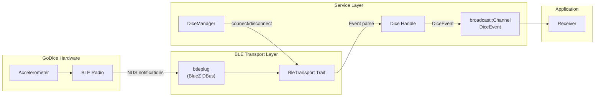

# Architecture

## Workspace Structure

```
dice-rs/
├── dice-rs/              # Core library
│   ├── src/
│   │   ├── ble/          # BLE transport layer (commands, events, transport trait)
│   │   ├── model/        # Domain types (FaceValue, LedColor, DiceType, etc.)
│   │   ├── service/      # High-level API (DiceManager, Dice, DiceEvent)
│   │   ├── error.rs      # Error types
│   │   └── lib.rs        # Re-exports
├── dice-rs-cli/          # CLI tool
├── dice-rs-controller/   # GTK 4 desktop app
└── dice-rs-ws/           # WebSocket server
```

## Module Layout

### `ble` - Protocol Layer

Handles raw BLE communication: encoding commands, decoding notification
events, and the `BleTransport` trait that abstracts the BLE backend.

- **`command`** - `Command` enum encoding host-to-dice byte sequences
- **`event`** - `Event` enum decoding dice-to-host notifications
- **`transport`** - `BleTransport` and `BlePeripheral` traits
- **`uuids`** - NUS service and characteristic UUIDs

### `model` - Domain Types

Type-safe wrappers for GoDice data:

- **`FaceValue`** - rolled face (1-based, rejects 0)
- **`Acceleration`** - raw XYZ accelerometer data with face interpretation
- **`LedColor`** - RGB color with named constants and hex parsing
- **`BatteryLevel`** - 0–100 percent
- **`ChargingState`** - charging or not charging
- **`DiceColor`** - physical shell color (Black, Red, Green, Blue, Yellow, Orange)
- **`DiceType`** - dice shell type (D6, D20, D10, D10X, D4, D8, D12)

### `service` - High-Level API

- **`DiceManager`** - manages BLE adapter and multiple dice connections
- **`Dice`** - handle to a connected die with LED, battery, and event methods
- **`DiceEvent`** - high-level events emitted via broadcast channel
- **`DiceScanner`** - device discovery with name-prefix filtering

## Data Flow



## BLE Backend

The primary BLE backend is [btleplug](https://docs.rs/btleplug/latest/btleplug/),
which uses BlueZ DBus on Linux. The `BleTransport` trait abstracts the backend,
enabling mock implementations for testing and future backends like
[bluer](https://docs.rs/bluer/latest/bluer/).
