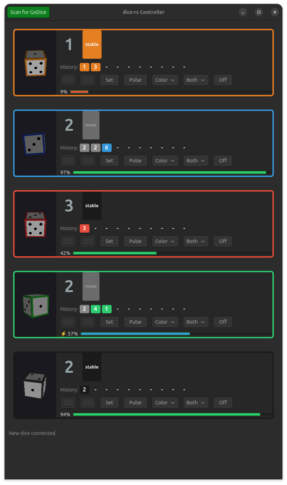
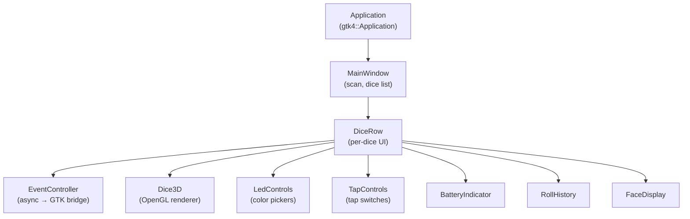

# Controller

The `dice-rs-controller` crate is a GTK 4 desktop application for managing
GoDice devices with a graphical interface and 3D dice rendering.



## Features

- **Auto-scan** on startup with manual rescan button
- **Dice list** showing all connected dice with face value, battery, and color
- **3D dice rendering** using OpenGL (`glow` + `glam`) with real-time
  orientation from accelerometer data
- **LED controls** - color pickers, set/pulse/off buttons
- **Tap controls** - enable/disable tap and double tap notifications
- **Battery indicator** with visual gauge
- **Roll history** showing recent face values
- **Tap indicator** flashing on tap events
- **Reconnect** support for dropped connections

## Building

The controller requires GTK 4 development libraries:

```sh
# Ubuntu/Debian
sudo apt install libgtk-4-dev

# Build
cargo build -p dice-rs-controller
```

## Running

```sh
cargo run -p dice-rs-controller
```

The application window appears with a scan button and an empty dice list.
Connected dice appear as rows with interactive controls.

## Architecture



### EventController

The `EventController` bridges async dice events into the GTK main loop. It
runs a background tokio task that receives `DiceEvent`s and sends UI updates
through an `mpsc` channel to the GTK main thread. This avoids blocking the
UI while waiting for BLE events.
