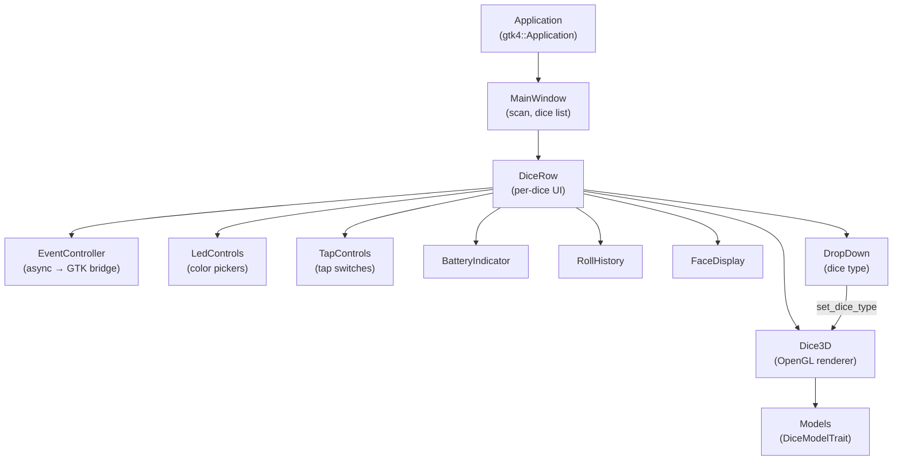

# Controller

The `dice-rs-controller` crate is a GTK 4 desktop application for managing
GoDice devices with a graphical interface and 3D dice rendering.


## Features

- **Auto-scan** on startup with manual rescan button
- **Dice list** showing all connected dice with face value, battery, and color
- **Dice type selector** - dropdown to choose between D6, D20, D10, D10X, D4, D8, D12
- **3D dice rendering** using OpenGL (`glow` + `glam`) with real-time
  orientation from accelerometer data and per-type geometry
- **LED controls** - color pickers, set/pulse/off buttons
- **Tap controls** - enable/disable tap and double tap notifications
- **Battery indicator** with visual gauge
- **Roll history** showing recent face values
- **Tap indicator** flashing on tap events
- **Reconnect** support for dropped connections

## Building

The controller requires GTK 4 development libraries:

```sh
# Ubuntu/Debian
sudo apt install libgtk-4-dev

# Build
cargo build -p dice-rs-controller
```

## Running

```sh
cargo run -p dice-rs-controller
```

The application window appears with a scan button and an empty dice list.
Connected dice appear as rows with interactive controls.

## Architecture



### EventController

The `EventController` bridges async dice events into the GTK main loop. It
runs a background tokio task that receives `DiceEvent`s and sends UI updates
through an `mpsc` channel to the GTK main thread. This avoids blocking the
UI while waiting for BLE events.

### Dice Type Selection

Each `DiceRow` includes a `DropDown` widget for selecting the dice type
(D6, D20, D10, D10X, D4, D8, D12). Changing the selection calls
`dice.set_dice_type()` on the `dice-rs` library handle (client-side setting,
no BLE command) and updates the 3D model geometry via `Dice3D::set_dice_type()`.

The dice type controls how accelerometer data is interpreted into face
values using vector tables and shell transforms. See
[Architecture](./architecture.md) for details on the interpretation pipeline.

### 3D Dice Models

The `DiceModelTrait` defines the interface for 3D geometry generation. Each
dice type has a dedicated model implementation:

| Type | Shape | Faces | Vertices |
|------|-------|-------|----------|
| D6 | Cube | 6 quads | 24 |
| D4 | Tetrahedron | 4 triangles | 12 |
| D8 | Octahedron | 8 triangles | 24 |
| D10/D10X | Pentagonal trapezohedron | 10 kites | 60 |
| D12 | Dodecahedron | 12 pentagons | 72 |
| D20 | Icosahedron | 20 triangles | 60 |

The `model_for_type()` factory function selects the appropriate model based
on `DiceType`. The `DiceRenderer` uploads vertex data (positions, normals,
UVs, face IDs) to OpenGL and renders with diffuse lighting and edge
highlighting. D6 faces additionally render procedural pips via the fragment
shader; other die types show face color with edges only.

When the dice type changes at runtime, the `Dice3D` widget discards the
existing renderer and re-initializes with the new model geometry on the
next render frame.
