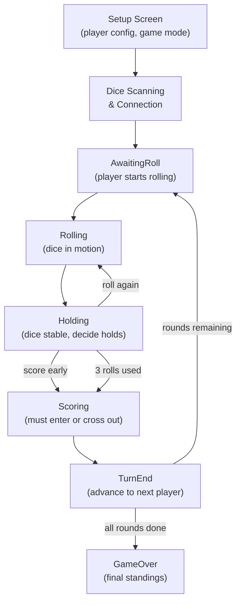
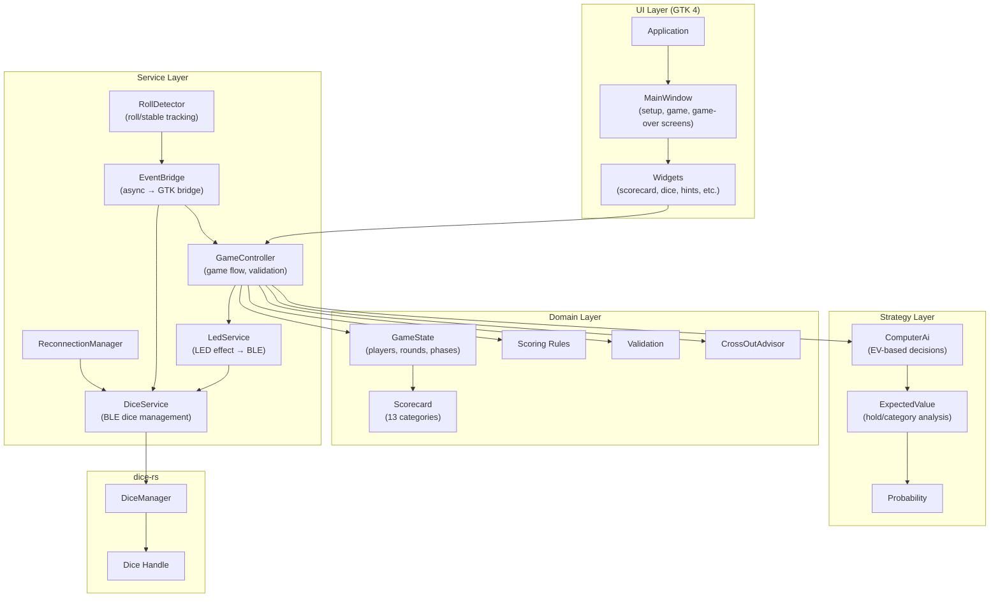

# Yatzy (Kniffel)

The `yatzy` crate is a full Kniffel (Yatzy) game for GoDice, built with
GTK 4 and the `dice-rs` library. It demonstrates a complete game loop with
physical dice integration: scan, connect, roll, score, and celebrate.

## Features

- **Full Kniffel scorecard** with all 13 categories in upper and lower sections
- **Game state machine** with turn phases: AwaitingRoll, Rolling, Holding,
  Scoring, TurnEnd
- **Single-player mode** with a computer AI opponent using expected-value
  calculations for optimal decisions
- **Multi-player pass-and-play** mode with turn transitions and hints
  disabled for fairness
- **Strategy hints** showing the best category and best hold decision via
  expected value analysis (single-player mode only)
- **Cross-out advisor** recommending the least-damaging category when no
  valid score is possible
- **LED celebration effects** for special rolls: Yatzy, Full House, Large
  Straight, Small Straight, Four-of-a-Kind
- **LED color assignment** per player for visual identification on the
  physical dice
- **Dice slot mapping** and roll detection for GoDice integration
- **Reconnection manager** for handling dropped dice connections during gameplay
- **Persistent highscore list** stored as JSON (top 20 entries)
- **Persistent game settings** (player names, colors, types, game mode)
- **Internationalization** with Fluent, German and English translations

## Building

The game requires GTK 4 development libraries, same as the controller:

```sh
# Ubuntu/Debian
sudo apt install libgtk-4-dev

# Build
cargo build -p yatzy
```

## Running

```sh
cargo run -p yatzy
```

The application starts with a setup screen for configuring players (names,
colors, human/computer type) and selecting the game mode. After setup, scan
for GoDice devices and connect. Each player rolls the physical dice, holds
dice between rolls, and enters scores in the scorecard.

## Game Flow



### Turn Phases

| Phase | Description |
|-------|-------------|
| `AwaitingRoll` | Waiting for the player to start rolling |
| `Rolling` | Dice are physically rolling (RollStart received, no Stable yet) |
| `Holding` | Dice are stable; player can hold dice and roll again, or proceed to scoring |
| `Scoring` | Player must select a category to enter or cross out |
| `TurnEnd` | Score has been entered, transitioning to the next player |

Each player has up to 3 rolls per turn. After the 3rd roll, the player must
enter a score or cross out a category.

## Scorecard Categories

The 13 categories are divided into an upper and lower section:

### Upper Section

| Category | Rule | Score |
|----------|------|-------|
| Ones | Sum of all 1s | Count × 1 |
| Twos | Sum of all 2s | Count × 2 |
| Threes | Sum of all 3s | Count × 3 |
| Fours | Sum of all 4s | Count × 4 |
| Fives | Sum of all 5s | Count × 5 |
| Sixes | Sum of all 6s | Count × 6 |

If the upper section total reaches 63 or more, a bonus of 35 points is awarded.

### Lower Section

| Category | Rule | Score |
|----------|------|-------|
| Three-of-a-Kind | At least 3 dice with same value | Sum of all dice |
| Four-of-a-Kind | At least 4 dice with same value | Sum of all dice |
| Full House | 3 of one value + 2 of another | 25 |
| Small Straight | 4 consecutive values | 30 |
| Large Straight | 5 consecutive values | 40 |
| Yatzy | All 5 dice same value | 50 |
| Chance | Any combination | Sum of all dice |

## Computer AI

The `ComputerAi` decision engine uses expected value (EV) calculations to
make optimal decisions:

1. **Roll or score**: Compares the current best category score against the
   EV of re-rolling. If the current score meets or exceeds the EV, the AI
   enters the score; otherwise, it re-rolls.
2. **Hold decision**: Enumerates all 32 possible hold masks (2^5) and
   selects the one with the highest EV across all empty categories.
3. **Category selection**: When scoring, picks the empty category with the
   highest score.
4. **Cross-out**: When no positive score is possible, the `CrossOutAdvisor`
   recommends the category with the lowest potential score to minimize
   lost points.

The EV calculation enumerates all possible re-roll outcomes (6^n where n is
the number of re-rolled dice) and accumulates the expected score for each
empty category.

## Strategy Hints

In single-player mode, strategy hints are shown to help the player learn
optimal play:

- **Best category hint**: Shows which category would yield the highest score
  with the current dice.
- **Best hold hint**: Shows which dice to hold for the highest EV on re-roll.

Hints are disabled in multi-player mode to ensure fair play between human
players.

## LED Effects

The game uses the physical dice LEDs for feedback:

| Event | Effect |
|-------|--------|
| Active player's turn | All dice glow in the player's color |
| Held dice | Held dice glow green, others off |
| Yatzy (5 of a kind) | 5 green pulses on all dice |
| Full House | 3 yellow pulses on all dice |
| Large Straight | 3 cyan pulses on all dice |
| Small Straight | 2 cyan pulses on all dice |
| Four-of-a-Kind | 2 orange pulses on all dice |
| Turn end / scoring | LEDs turned off |

## Architecture



### GameController

The `GameController` orchestrates the game flow. It wraps `GameState` and
validates all `TurnAction`s against the current state before executing them.
Actions that are invalid for the current phase or game status return an
error. The controller emits `ControllerEvent`s via a broadcast channel that
the UI layer subscribes to.

### EventBridge

The `EventBridge` bridges async dice events from `dice-rs` into the GTK main
loop. It runs a background tokio task that receives `DiceEvent`s, feeds them
to the `RollDetector` for roll/stable tracking, and sends UI updates through
a channel to the GTK main thread.

### RollDetector

The `RollDetector` tracks the state of each physical die across roll events.
It maps `RollStart` and `Stable` events from individual dice to a unified
roll state, accounting for dice that may report at slightly different times.
Once all dice in a slot are stable, it produces a `DiceSet` for the game
controller.

### Module Structure

```
games/yatzy/src/
├── models/          # Domain types (GameState, Scorecard, Player, etc.)
├── rules/           # Scoring rules, validation, cross-out advisor
├── services/        # GameController, DiceService, EventBridge, LED, etc.
├── strategy/        # ComputerAi, ExpectedValue, Probability
├── ui/              # GTK 4 application, window, widgets
├── i18n.rs          # Fluent internationalization
├── error.rs         # YatzyError types
└── lib.rs           # Re-exports
```

## Internationalization

The game uses the [Fluent](https://projectfluent.org/) localization system
via `i18n-embed`. The fallback language is German (`de`), with English
translations provided as well. Translation files are located in
`games/yatzy/i18n/{lang}/yatzy.ftl`.
