# dice-rs Concept Paper

> **Status**: Planned
> **Author**: Andreas Schaeffer
> **Created**: 2026-08-23

---

## Goal and Motivation

`dice-rs` is a Rust library for controlling and receiving data from
[GoDice](https://particula-tech.com/products/godice-full-pack) Bluetooth Low
Energy (BLE) dice. The library is published to crates.io and targets high
quality, thorough documentation, and idiomatic async Rust.

### Motivation

GoDice are physical Bluetooth dice that communicate over the Nordic UART
Service (NUS) BLE profile. Particula provides official JavaScript and Python
APIs, but no Rust library exists. `dice-rs` fills that gap and gives the Rust
ecosystem a clean, well-documented, async-first crate for integrating GoDice
into CLI tools, servers, and GUI applications.

### Scope

The library covers:

- BLE scanning, connecting, and disconnecting
- Multi-dice management
- Battery level, RSSI, and connection state queries
- Roll / stable event notifications with face value
- Raw 3-axis accelerometer data
- RGB LED color control
- Sensor calibration

Out of scope for the initial phases (see
[Limitations](#limitations)):

- Event-stream fine-grained control

### Target Users

- Rust developers building tabletop / RPG companion tools
- Educators and hobbyists experimenting with BLE peripherals
- Applications that need a reliable, typed, async GoDice abstraction

---

## Current State

The repository is freshly scaffolded. The following artifacts already exist:

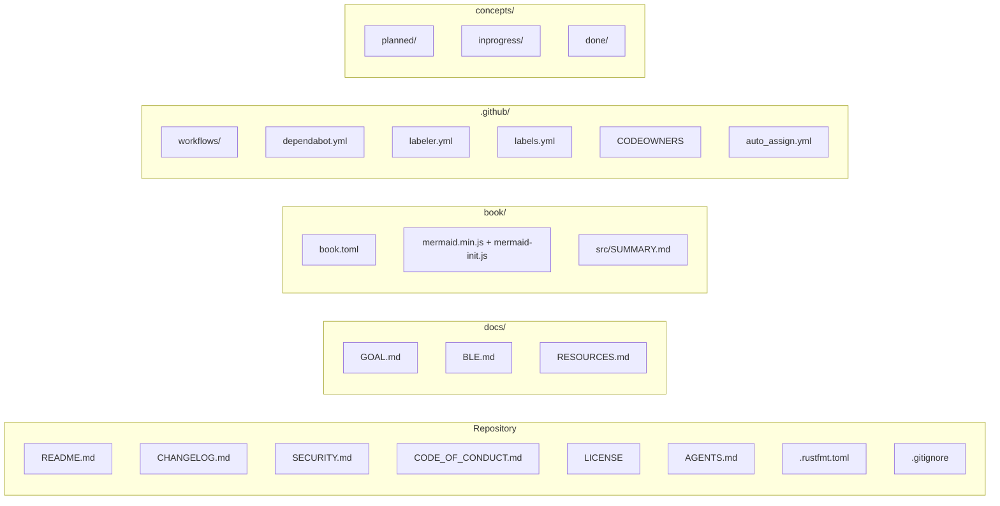
```mermaid
flowchart LR
    subgraph repo["Repository"]
        readme["README.md"]
        changelog["CHANGELOG.md"]
        security["SECURITY.md"]
        conduct["CODE_OF_CONDUCT.md"]
        license["LICENSE"]
        agents["AGENTS.md"]
        rustfmt[".rustfmt.toml"]
        gitignore[".gitignore"]
    end

    subgraph docs["docs/"]
        goal["GOAL.md"]
        ble["BLE.md"]
        resources["RESOURCES.md"]
    end

    subgraph book["book/"]
        bookToml["book.toml"]
        mermaid["mermaid.min.js + mermaid-init.js"]
        summary["src/SUMMARY.md"]
    end

    subgraph github[".github/"]
        workflows["workflows/"]
        dependabot["dependabot.yml"]
        labeler["labeler.yml"]
        labels["labels.yml"]
        codeowners["CODEOWNERS"]
        autoAssign["auto_assign.yml"]
    end

    subgraph concepts["concepts/"]
        planned["planned/"]
        inprogress["inprogress/"]
        done["done/"]
    end
```

### What Exists

- **Repository metadata**: README placeholder, CHANGELOG, SECURITY policy,
  CODE_OF_CONDUCT, LICENSE (MIT), AGENTS guidelines.
- **Formatting config**: `.rustfmt.toml` with `imports_granularity = "Item"`.
- **GitHub Actions**: workflow directory with 14 workflow files, Dependabot,
  labeler, labels, CODEOWNERS, auto-assign.
- **Documentation scaffolding**: `book/` with mdBook configuration including
  the mermaid preprocessor and JS assets. `src/SUMMARY.md` is empty.
- **Concept docs**: `docs/GOAL.md`, `docs/BLE.md`, `docs/RESOURCES.md`.
- **Concept tracking**: `concepts/planned/`, `concepts/inprogress/`,
  `concepts/done/` directories.

### What Does Not Exist Yet

- No `Cargo.toml` or workspace definition.
- No library, CLI, or WebSocket crate code.
- No tests.
- No book content beyond the empty SUMMARY.
- GitHub Actions are not yet adapted to this repository's build pipeline.

### BLE Protocol Summary

GoDice uses the Nordic UART Service (NUS) profile. The protocol was
reverse-engineered from the official
[JavaScript API](https://github.com/ParticulaCode/GoDiceJavaScriptAPI) and
[Python API](https://github.com/ParticulaCode/GoDicePythonAPI) source code.

#### GATT Service and Characteristics

| Property               | UUID                                   | Direction   |
|------------------------|----------------------------------------|-------------|
| Service                | `6e400001-b5a3-f393-e0a9-e50e24dcca9e` | —           |
| Write Characteristic   | `6e400002-b5a3-f393-e0a9-e50e24dcca9e` | Host → Dice |
| Notify Characteristic  | `6e400003-b5a3-f393-e0a9-e50e24dcca9e` | Dice → Host |

Device names use the prefix `GoDice_`. Commands are sent as byte arrays to the
write characteristic. Events arrive as notifications on the notify
characteristic.

#### Command Reference (Host → Dice)

All commands are written to the write characteristic
(`6e400002-...`). The first byte is always the command opcode.

| Opcode | Decimal | Command           | Payload Bytes                              | Description |
|--------|---------|-------------------|--------------------------------------------|-------------|
| `0x03` | 3       | Get Battery Level | (none)                                     | Response: `Bat` + level byte |
| `0x08` | 8       | Set LEDs          | `[R1, G1, B1, R2, G2, B2]` (6 bytes, 0–255) | Sets both RGB LEDs; `[0,0,0,0,0,0]` turns off |
| `0x10` | 16      | Pulse LEDs        | `[pulseCount, onTime, offTime, R, G, B, 1, 0]` | `onTime`/`offTime` in units of 10 ms; max 255 |
| `0x17` | 23      | Get Dice Color    | (none)                                     | Response: `Col` + color byte |

#### Event Reference (Dice → Host)

All events arrive as notifications on the notify characteristic
(`6e400003-...`). The first byte determines the event type. Some events
use ASCII prefix bytes for identification.

| First Byte(s)           | ASCII | Event          | Payload                                   | Description |
|-------------------------|-------|----------------|-------------------------------------------|-------------|
| `0x52`                  | `R`   | RollStart      | (none)                                    | Dice has started rolling |
| `0x53`                  | `S`   | Stable         | `[X, Y, Z]` (3 signed bytes at offset 1)  | Dice is stable and flat; face value derived from XYZ |
| `0x46 0x53`             | `FS`  | FakeStable     | `[X, Y, Z]` (3 signed bytes at offset 2)  | Stable after a "fake" roll; face value derived from XYZ |
| `0x54 0x53`             | `TS`  | TiltStable     | `[X, Y, Z]` (3 signed bytes at offset 2)  | Stable but not flat (tilted); face value derived from XYZ |
| `0x4D 0x53`             | `MS`  | MoveStable     | `[X, Y, Z]` (3 signed bytes at offset 2)  | Stable after small movement (face rotation); face value derived from XYZ |
| `0x42 0x61 0x74`        | `Bat` | BatteryLevel   | `[level]` (1 byte at offset 3)            | Battery level response (0–100 percent) |
| `0x43 0x6F 0x6C`        | `Col` | DiceColor      | `[color]` (1 byte at offset 3)            | Dice color response |

#### Dice Color Values

| Value | Color   |
|-------|---------|
| 0     | Black   |
| 1     | Red     |
| 2     | Green   |
| 3     | Blue    |
| 4     | Yellow  |
| 5     | Orange  |

#### Device Name Color Encoding

The physical dice color is encoded in the BLE advertising name. The name
follows the format `GoDice_{HEXID}_{COLOR}_v{VERSION}`, where `{COLOR}`
is a single uppercase letter:

| Letter | Color   |
|--------|---------|
| `K`    | Black   |
| `R`    | Red     |
| `G`    | Green   |
| `B`    | Blue    |
| `Y`    | Yellow  |
| `O`    | Orange  |

Example: `GoDice_0D89BF_K_v04` → Black, `GoDice_7D8E7D_O_v04` → Orange.

This allows identifying a dice by color without establishing a BLE
connection. The `DiceDevice::color()` method parses this letter via
`DiceColor::try_from(char)` and returns the corresponding `DiceColor`.

#### Dice Types (Shells)

| Value | Type  | Vector Table |
|-------|-------|--------------|
| 0     | D6    | d6Vectors    |
| 1     | D20   | d20Vectors   |
| 2     | D10   | d20Vectors → d10Transform   |
| 3     | D10X  | d20Vectors → d10XTransform  |
| 4     | D4    | d24Vectors → d4Transform    |
| 5     | D8    | d24Vectors → d8Transform    |
| 6     | D12   | d24Vectors → d12Transform   |

The `setDieType` call in the JS API is a client-side setting — it does not
send a command to the dice. Instead, it selects which vector table and
transform to use when interpreting the XYZ accelerometer data to determine
the face value. See [Face Value Determination](#face-value-determination).

---

## Architecture

### Workspace Layout

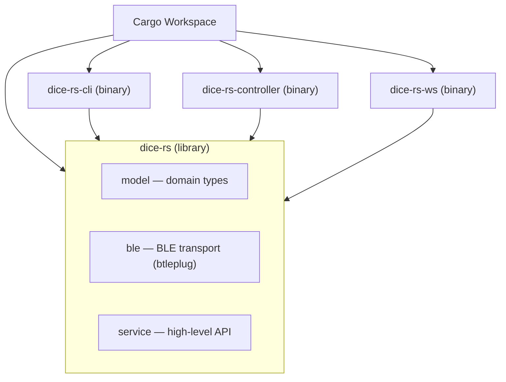
```mermaid
flowchart TB
    workspace["Cargo Workspace"]

    subgraph diceRs["dice-rs (library)"]
        model["model — domain types"]
        ble["ble — BLE transport (btleplug)"]
        service["service — high-level API"]
    end

    diceRsCli["dice-rs-cli (binary)"]
    diceRsController["dice-rs-controller (binary)"]
    diceRsWs["dice-rs-ws (binary)"]

    workspace --> diceRs
    workspace --> diceRsCli
    workspace --> diceRsController
    workspace --> diceRsWs

    diceRsCli --> diceRs
    diceRsController --> diceRs
    diceRsWs --> diceRs
```

| Crate         | Type    | Optional Features | Description                                  |
|---------------|---------|-------------------|----------------------------------------------|
| `dice-rs`     | lib     | `async`           | Core library: model + BLE transport + service|
| `dice-rs-cli`        | bin     | —                 | CLI tool using `clap`                        |
| `dice-rs-controller` | bin     | —                 | GTK 4 desktop controller application         |
| `dice-rs-ws`         | bin     | —                 | WebSocket server exposing dice events        |

### Module Structure (dice-rs)

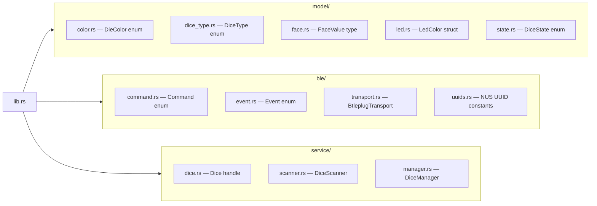
```mermaid
flowchart LR
    lib["lib.rs"]

    subgraph model["model/"]
        color["color.rs — DieColor enum"]
        diceType["dice_type.rs — DiceType enum"]
        face["face.rs — FaceValue type"]
        led["led.rs — LedColor struct"]
        state["state.rs — DiceState enum"]
    end

    subgraph ble["ble/"]
        command["command.rs — Command enum"]
        event["event.rs — Event enum"]
        transport["transport.rs — BtleplugTransport"]
        uuids["uuids.rs — NUS UUID constants"]
    end

    subgraph service["service/"]
        dice["dice.rs — Dice handle"]
        scanner["scanner.rs — DiceScanner"]
        manager["manager.rs — DiceManager"]
    end

    lib --> model
    lib --> ble
    lib --> service
```

Each struct and enum lives in its own file, following the one-struct-per-file
rule from `AGENTS.md`. Each module directory has a `mod.rs` with declarations
and `pub use` re-exports.

### Module Responsibilities

| Module         | Responsibility                                                  |
|----------------|-----------------------------------------------------------------|
| `model`        | Domain types: `DieColor`, `DiceType`, `FaceValue`, `LedColor`, `DiceState`, `Acceleration` |
| `ble::uuids`   | NUS service and characteristic UUID constants                   |
| `ble::command` | `Command` enum with `encode() → Vec<u8>` method                 |
| `ble::event`   | `Event` enum with `parse(&[u8]) → Result<Event>` method         |
| `ble::transport` | `BleTransport` trait + `BtleplugTransport` implementation     |
| `service::scanner`  | `DiceScanner`: scan + filter by name prefix               |
| `service::manager`  | `DiceManager`: adapter management, multi-dice connections |
| `service::dice`     | `Dice` handle: event channel, commands, request-response  |
| `service::interpreter` | XYZ-to-face-value interpretation using vector tables     |

### Data Flow

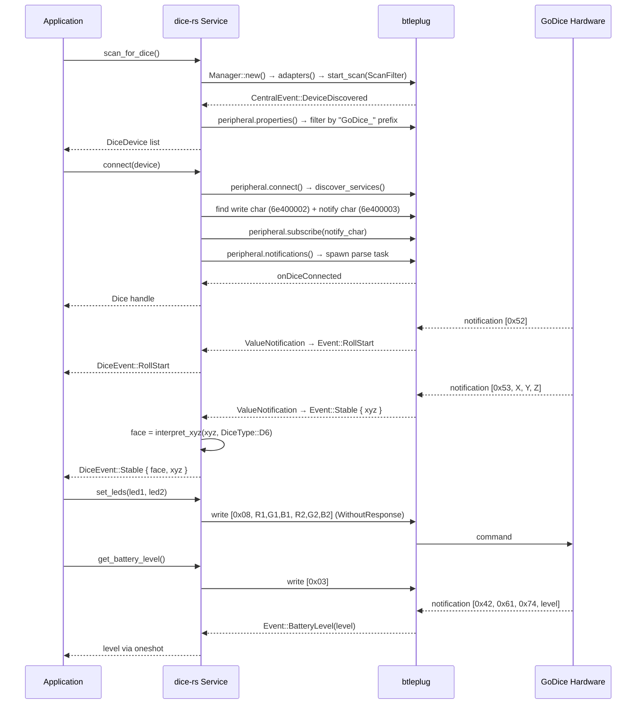
```mermaid
sequenceDiagram
    participant App as Application
    participant Svc as dice-rs Service
    participant BLE as btleplug
    participant Dice as GoDice Hardware

    App->>Svc: scan_for_dice()
    Svc->>BLE: Manager::new() → adapters() → start_scan(ScanFilter)
    BLE-->>Svc: CentralEvent::DeviceDiscovered
    Svc->>BLE: peripheral.properties() → filter by "GoDice_" prefix
    Svc-->>App: DiceDevice list

    App->>Svc: connect(device)
    Svc->>BLE: peripheral.connect() → discover_services()
    Svc->>BLE: find write char (6e400002) + notify char (6e400003)
    Svc->>BLE: peripheral.subscribe(notify_char)
    Svc->>BLE: peripheral.notifications() → spawn parse task
    BLE-->>Svc: onDiceConnected
    Svc-->>App: Dice handle

    Dice-->>BLE: notification [0x52]
    BLE-->>Svc: ValueNotification → Event::RollStart
    Svc-->>App: DiceEvent::RollStart

    Dice-->>BLE: notification [0x53, X, Y, Z]
    BLE-->>Svc: ValueNotification → Event::Stable { xyz }
    Svc->>Svc: face = interpret_xyz(xyz, DiceType::D6)
    Svc-->>App: DiceEvent::Stable { face, xyz }

    App->>Svc: set_leds(led1, led2)
    Svc->>BLE: write [0x08, R1,G1,B1, R2,G2,B2] (WithoutResponse)
    BLE->>Dice: command

    App->>Svc: get_battery_level()
    Svc->>BLE: write [0x03]
    Dice-->>BLE: notification [0x42, 0x61, 0x74, level]
    BLE-->>Svc: Event::BatteryLevel(level)
    Svc-->>App: level via oneshot
```

### BLE Backend: btleplug

[`btleplug`](https://docs.rs/btleplug/latest/btleplug/) (v0.12) is the
primary BLE backend. It is a cross-platform Rust BLE library supporting
Linux (BlueZ DBus), macOS (CoreBluetooth), and Windows (WinRT). The initial
release targets Linux only, but `btleplug`'s cross-platform capability keeps
the door open for future platform support.

#### btleplug API Usage

The btleplug API is built around three core traits from `btleplug::api`:
`Manager`, `Central`, and `Peripheral`. The concrete platform types live in
`btleplug::platform`.

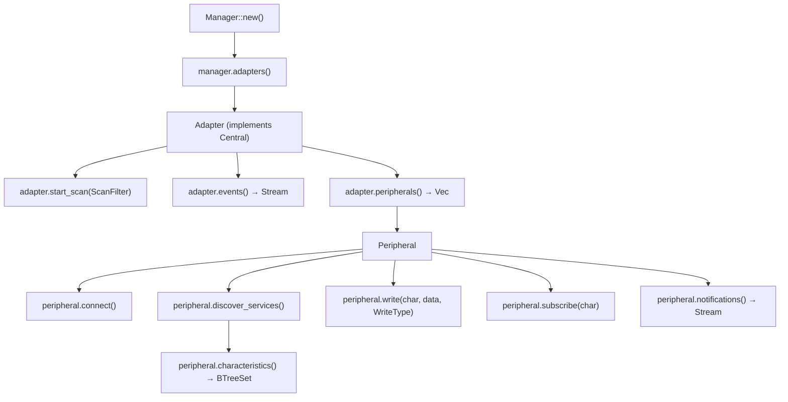
```mermaid
flowchart TB
    manager["Manager::new()"]
    adapters["manager.adapters()"]
    adapter["Adapter (implements Central)"]
    scan["adapter.start_scan(ScanFilter)"]
    events["adapter.events() → Stream<CentralEvent>"]
    peripherals["adapter.peripherals() → Vec<Peripheral>"]
    peripheral["Peripheral"]
    connect["peripheral.connect()"]
    discover["peripheral.discover_services()"]
    characteristics["peripheral.characteristics() → BTreeSet<Characteristic>"]
    write["peripheral.write(char, data, WriteType)"]
    subscribe["peripheral.subscribe(char)"]
    notifications["peripheral.notifications() → Stream<ValueNotification>"]

    manager --> adapters --> adapter
    adapter --> scan
    adapter --> events
    adapter --> peripherals --> peripheral
    peripheral --> connect
    peripheral --> discover --> characteristics
    peripheral --> write
    peripheral --> subscribe
    peripheral --> notifications
```

#### Mapping btleplug to dice-rs

| btleplug API                         | dice-rs Usage                                  |
|--------------------------------------|------------------------------------------------|
| `Manager::new().await`               | `DiceManager::new()` internal initialization   |
| `manager.adapters().await`           | Select first adapter (or let user choose)      |
| `adapter.start_scan(ScanFilter)`     | `DiceScanner::scan("GoDice_")`                 |
| `adapter.events()` stream            | Listen for `CentralEvent::DeviceDiscovered`    |
| `peripheral.properties().await`      | Filter by `local_name` containing `GoDice_`    |
| `peripheral.connect().await`         | `DiceManager::connect(device)`                 |
| `peripheral.discover_services()`     | Discover NUS service and characteristics       |
| `peripheral.characteristics()`       | Find write + notify characteristics by UUID    |
| `peripheral.subscribe(notify_char)`  | Enable notifications on `6e400003-...`         |
| `peripheral.notifications()` stream  | Spawn task to parse events → `DiceEvent`       |
| `peripheral.write(write_char, data)` | Send `Command` bytes to `6e400002-...`         |
| `peripheral.disconnect().await`      | `Dice::disconnect()`                           |

#### ScanFilter Usage

`btleplug::api::ScanFilter` accepts a list of service UUIDs to filter by.
Since GoDice advertises the NUS service UUID, the scan filter is:

```rust
use btleplug::api::ScanFilter;
use uuid::Uuid;

const NUS_SERVICE_UUID: Uuid = uuid::uuid!("6e400001-b5a3-f393-e0a9-e50e24dcca9e");

let filter = ScanFilter {
    services: vec![NUS_SERVICE_UUID],
};
```

However, some platforms may not advertise the service UUID in scan results.
The `DiceScanner` therefore also filters by device name prefix (`GoDice_`)
using `PeripheralProperties::local_name` as a fallback.

#### WriteType Selection

GoDice commands are short and do not require acknowledgment. The write
characteristic supports write-without-response for low-latency command
delivery:

```rust
use btleplug::api::WriteType;

peripheral.write(&write_char, &command_bytes, WriteType::WithoutResponse).await?;
```

If reliability issues arise, `WriteType::WithResponse` can be used as a
fallback. This is configurable via the `BleTransport` trait.

#### Notification Handling

The `Peripheral::notifications()` method returns a `Stream<ValueNotification>`.
A spawned tokio task reads from this stream, parses each notification into an
`Event`, and forwards it to the `Dice` handle's event channel:

```rust
use btleplug::api::Peripheral as _;
use futures::StreamExt;

let mut notifications = peripheral.notifications().await?;
tokio::spawn(async move {
    while let Some(notification) = notifications.next().await {
        if let Ok(event) = Event::parse(&notification.value) {
            event_sender.send(event).await.ok();
        }
    }
});
```

#### Request-Response Pattern

Battery level and dice color are request-response: the host sends a command
byte, and the dice responds with a notification. The Python API uses
`asyncio.Queue` to match responses to requests. `dice-rs` uses
`tokio::sync::oneshot` channels stored in FIFO queues (`VecDeque`) for
pending requests. This avoids a race condition where a second concurrent
request would overwrite the first request's sender. When a response
notification arrives, canceled senders are purged (`queue.retain(|s|
!s.is_canceled())`), then the oldest pending sender is dequeued
(`pop_front`) and delivered the result. Callers wrap `rx.await` in
`tokio::time::timeout` (`RESPONSE_TIMEOUT_SECS` = 5 s); on timeout the
receiver is dropped, which marks the sender as canceled so the
notification task can purge it before matching the next response. This
prevents FIFO desynchronization when a BLE packet is lost:

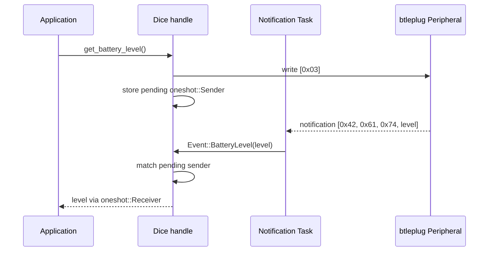
```mermaid
sequenceDiagram
    participant App as Application
    participant Dice as Dice handle
    participant Notifier as Notification Task
    participant BLE as btleplug Peripheral

    App->>Dice: get_battery_level()
    Dice->>BLE: write [0x03]
    Dice->>Dice: store pending oneshot::Sender

    BLE-->>Notifier: notification [0x42, 0x61, 0x74, level]
    Notifier->>Dice: Event::BatteryLevel(level)
    Dice->>Dice: match pending sender
    Dice-->>App: level via oneshot::Receiver
```

### BLE Backend: bluer

[`bluer`](https://docs.rs/bluer/latest/bluer/) is a Linux-only async BLE
library that wraps BlueZ DBus directly. It is listed in
`docs/RESOURCES.md` as an alternative.

**Decision: `bluer` is NOT needed for the initial implementation.**

Rationale:

- **Cross-platform potential**: `btleplug` covers Linux (BlueZ), macOS
  (CoreBluetooth), and Windows (WinRT). The initial release targets Linux
  only, but the `BleTransport` trait allows adding other backends later.
  `bluer` only supports Linux.
- **Sufficient API**: `btleplug`'s `Central` and `Peripheral` traits provide
  all required operations: scan, connect, discover services, write,
  subscribe, and notification streaming.
- **Simpler dependency tree**: Using a single BLE backend reduces complexity
  and avoids platform-specific code paths.
- **Future option**: The `BleTransport` trait abstraction means a `bluer`
  backend could be added later as an optional feature if deeper BlueZ control
  (e.g., custom GATT server, adapter configuration) is ever needed.

### Key Design Decisions

- **Async-first**: All BLE I/O is async using `tokio` + `btleplug`. A blocking
  `async` feature gate is not planned initially; callers use a tokio runtime.
- **Trait-based transport**: `BleTransport` trait abstracts the BLE backend so
  that `btleplug` can be swapped or mocked in tests.
- **Channel-based events**: Each `Dice` handle exposes a
  `tokio::sync::broadcast::Receiver<DiceEvent>` for streaming events to the
  caller. Multiple consumers can subscribe to the same dice's events.
- **Request-response via oneshot**: Battery, color, and calibration queries
  use `tokio::sync::oneshot` channels stored in `VecDeque` FIFO queues,
  matched against pending requests in the notification task. The queue
  ensures concurrent requests do not overwrite each other.
- **Error handling**: `thiserror` for library errors, `miette` for CLI/WS
  user-facing diagnostics.
- **Thread safety**: `Dice` handles are `Clone + Send + Sync`, backed by
  `Arc<Mutex<...>>` for shared connection state.
- **WriteType**: Default `WriteType::WithoutResponse` for low latency;
  configurable to `WithResponse` for reliability.
- **LED write throttling**: Rapid `set_leds` calls are coalesced via a
  debounce task (`LED_DEBOUNCE_MS` = 30 ms). Only the most recent color
  is written after a quiet window, preventing BlueZ/DBus socket buffer
  overflow from high-frequency color changes (e.g. slider drags).

---

## Implementation Details

### Command Encoding

The `Command` enum encapsulates all host-to-dice commands. Each variant
implements `encode() → Vec<u8>` to produce the byte payload written to the
NUS write characteristic.

```rust
/// Commands sent to the GoDice via the NUS write characteristic.
#[derive(Debug, Clone, PartialEq)]
pub enum Command {
    /// Request battery level. Response: Event::BatteryLevel
    GetBatteryLevel,
    /// Set both RGB LEDs. (0,0,0) turns an LED off.
    SetLeds { led1: LedColor, led2: LedColor },
    /// Pulse both LEDs with a color for a defined number of cycles.
    PulseLeds {
        pulse_count: u8,
        on_time: u8,
        off_time: u8,
        color: LedColor,
    },
    /// Request dice color. Response: Event::DiceColor
    GetDiceColor,
}

impl Command {
    pub fn encode(&self) -> Vec<u8> {
        match self {
            Self::GetBatteryLevel => vec![0x03],
            Self::SetLeds { led1, led2 } => {
                vec![0x08, led1.r, led1.g, led1.b, led2.r, led2.g, led2.b]
            }
            Self::PulseLeds { pulse_count, on_time, off_time, color } => {
                vec![0x10, *pulse_count, *on_time, *off_time, color.r, color.g, color.b, 1, 0]
            }
            Self::GetDiceColor => vec![0x17],
        }
    }
}
```

### Event Decoding

The `Event` enum represents all dice-to-host notifications. The `parse`
function inspects the first byte(s) to determine the event type, then
extracts the payload.

```rust
/// Events received from the GoDice via the NUS notify characteristic.
#[derive(Debug, Clone, PartialEq)]
pub enum Event {
    /// Dice has started rolling (0x52 / 'R')
    RollStart,
    /// Dice is stable and flat (0x53 / 'S'), followed by XYZ accelerometer data
    Stable { acceleration: Acceleration },
    /// Stable after a fake roll (0x46 0x53 / 'FS')
    FakeStable { acceleration: Acceleration },
    /// Stable but tilted (0x54 0x53 / 'TS')
    TiltStable { acceleration: Acceleration },
    /// Stable after small movement (0x4D 0x53 / 'MS')
    MoveStable { acceleration: Acceleration },
    /// Battery level response (0x42 0x61 0x74 / 'Bat')
    BatteryLevel { level: u8 },
    /// Dice color response (0x43 0x6F 0x6C / 'Col')
    DiceColor { color: DieColor },
}
```

The parse logic follows the JS API's `parseMessage` and the Python API's
`_handle_upd`:

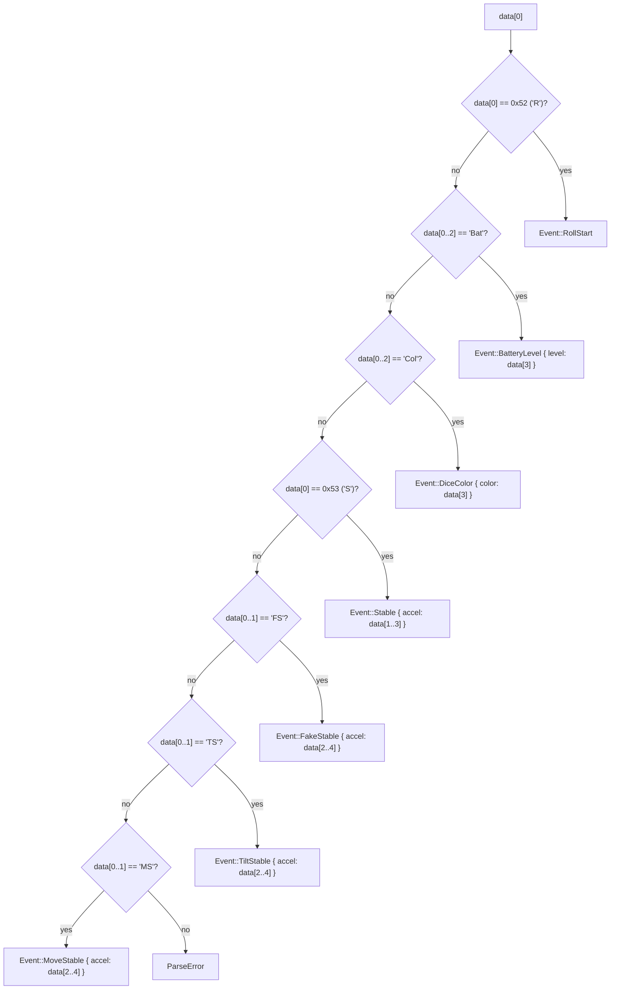
```mermaid
flowchart TB
    start["data[0]"]
    isR{"data[0] == 0x52 ('R')?"}
    isBat{"data[0..2] == 'Bat'?"}
    isCol{"data[0..2] == 'Col'?"}
    isS{"data[0] == 0x53 ('S')?"}
    isFS{"data[0..1] == 'FS'?"}
    isTS{"data[0..1] == 'TS'?"}
    isMS{"data[0..1] == 'MS'?"}
    unknown["ParseError"]

    rollStart["Event::RollStart"]
    battery["Event::BatteryLevel { level: data[3] }"]
    color["Event::DiceColor { color: data[3] }"]
    stable["Event::Stable { accel: data[1..3] }"]
    fakeStable["Event::FakeStable { accel: data[2..4] }"]
    tiltStable["Event::TiltStable { accel: data[2..4] }"]
    moveStable["Event::MoveStable { accel: data[2..4] }"]

    start --> isR
    isR -->|yes| rollStart
    isR -->|no| isBat
    isBat -->|yes| battery
    isBat -->|no| isCol
    isCol -->|yes| color
    isCol -->|no| isS
    isS -->|yes| stable
    isS -->|no| isFS
    isFS -->|yes| fakeStable
    isFS -->|no| isTS
    isTS -->|yes| tiltStable
    isTS -->|no| isMS
    isMS -->|yes| moveStable
    isMS -->|no| unknown
```

### Accelerometer Data

XYZ accelerometer data is extracted as three **signed 8-bit integers**
(`i8`) from the notification payload. The Python API uses
`struct.unpack(">bbb", xyz_bytes)` (big-endian signed bytes), and the JS API
uses `data.getInt8(startByte)`.

```rust
/// Raw 3-axis accelerometer data from the dice.
#[derive(Debug, Clone, Copy, PartialEq, Eq)]
pub struct Acceleration {
    pub x: i8,
    pub y: i8,
    pub z: i8,
}

impl Acceleration {
    pub fn from_bytes(bytes: &[u8]) -> Self {
        Self {
            x: bytes[0] as i8,
            y: bytes[1] as i8,
            z: bytes[2] as i8,
        }
    }
}
```

### Face Value Determination

The dice does not send the face value directly. Instead, it sends raw XYZ
accelerometer data, and the client determines which face is up by finding
the closest matching vector in a pre-defined table.

The algorithm (from both the JS and Python APIs):

1. Extract `[x, y, z]` from the notification payload.
2. Look up the vector table for the current `DiceType`.
3. For each entry `(face_value, reference_vector)` in the table, compute the
   squared Euclidean distance: `(x - rx)² + (y - ry)² + (z - rz)²`.
4. Return the face value with the smallest distance.
5. If a shell transform applies (D10, D10X, D4, D8, D12), map the
   intermediate value through the transform table.

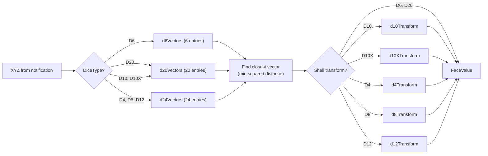
```mermaid
flowchart LR
    xyz["XYZ from notification"]
    tableSelect{"DiceType?"}
    d6Table["d6Vectors (6 entries)"]
    d20Table["d20Vectors (20 entries)"]
    d24Table["d24Vectors (24 entries)"]
    closest["Find closest vector\n(min squared distance)"]
    transform{"Shell transform?"}
    d10Trans["d10Transform"]
    d10xTrans["d10XTransform"]
    d4Trans["d4Transform"]
    d8Trans["d8Transform"]
    d12Trans["d12Transform"]
    faceValue["FaceValue"]

    xyz --> tableSelect
    tableSelect -->|D6| d6Table
    tableSelect -->|D20| d20Table
    tableSelect -->|D10, D10X| d20Table
    tableSelect -->|D4, D8, D12| d24Table
    d6Table --> closest
    d20Table --> closest
    d24Table --> closest
    closest --> transform
    transform -->|D6, D20| faceValue
    transform -->|D10| d10Trans --> faceValue
    transform -->|D10X| d10xTrans --> faceValue
    transform -->|D4| d4Trans --> faceValue
    transform -->|D8| d8Trans --> faceValue
    transform -->|D12| d12Trans --> faceValue
```

#### D6 Vector Table

| Face | X    | Y    | Z    |
|------|------|------|------|
| 1    | -64  | 0    | 0    |
| 2    | 0    | 0    | 64   |
| 3    | 0    | 64   | 0    |
| 4    | 0    | -64  | 0    |
| 5    | 0    | 0    | -64  |
| 6    | 64   | 0    | 0    |

The D20 and D24 vector tables (20 and 24 entries respectively) and the
shell transform tables are defined as `const` arrays in the
`service::interpreter` module. They are ported directly from the JS API's
`d20Vectors`, `d24Vectors`, `d10Transform`, `d10XTransform`, `d4Transform`,
`d8Transform`, and `d12Transform` objects.

#### Interpreter API

```rust
/// Determines the face value from accelerometer data for a given dice type.
/// If an `AccelerationOffset` is provided, it is subtracted from the
/// raw acceleration before distance calculation.
pub fn interpret(
    acceleration: Acceleration,
    dice_type: DiceType,
    offset: Option<AccelerationOffset>,
) -> FaceValue {
    let corrected = offset.map_or(acceleration, |o| o.apply(acceleration));
    let (x, y, z) = (corrected.x as i32, corrected.y as i32, corrected.z as i32);

    let (table, transform) = match dice_type {
        DiceType::D6 => (&D6_VECTORS, None),
        DiceType::D20 => (&D20_VECTORS, None),
        DiceType::D10 => (&D20_VECTORS, Some(&D10_TRANSFORM)),
        DiceType::D10X => (&D20_VECTORS, Some(&D10X_TRANSFORM)),
        DiceType::D4 => (&D24_VECTORS, Some(&D4_TRANSFORM)),
        DiceType::D8 => (&D24_VECTORS, Some(&D8_TRANSFORM)),
        DiceType::D12 => (&D24_VECTORS, Some(&D12_TRANSFORM)),
    };

    let mut min_distance = i32::MAX;
    let mut best_index = 0;
    for (index, vector) in table.iter().enumerate() {
        let dx = x - vector[0] as i32;
        let dy = y - vector[1] as i32;
        let dz = z - vector[2] as i32;
        let distance = dx * dx + dy * dy + dz * dz;
        if distance < min_distance {
            min_distance = distance;
            best_index = index;
        }
    }

    let raw_value = best_index + 1;
    let mapped = transform.map_or(raw_value, |t| t[best_index]);
    FaceValue::new(mapped)
}
```

### Dice Handle API

The `Dice` struct is the primary user-facing handle for a connected GoDice.
It is `Clone + Send + Sync` and wraps shared connection state in `Arc`.

```rust
use std::sync::atomic::{AtomicU8, Ordering};
use std::sync::Arc;

/// Handle to a connected GoDice device.
#[derive(Clone)]
pub struct Dice {
    inner: Arc<DiceInner>,
}

/// Internal shared state for a connected dice.
/// Stored behind `Arc` so all `Dice` clones share the same state.
pub struct DiceInner {
    /// BLE transport for write operations.
    transport: Box<dyn BleTransport>,
    /// Write characteristic UUID (NUS RX).
    write_char: Uuid,
    /// Broadcast sender for `DiceEvent` stream.
    event_sender: broadcast::Sender<DiceEvent>,
    /// Current dice type stored as `AtomicU8` for lock-free reads.
    /// Converted to `DiceType` via `TryFrom<u8>` at use site.
    /// This avoids async lock overhead in the notification task hot path.
    /// `Arc`-wrapped so it can be cloned into the notification task.
    dice_type: Arc<AtomicU8>,
    /// FIFO queue of pending battery level request senders.
    pending_battery: Arc<Mutex<VecDeque<oneshot::Sender<u8>>>>,
    /// FIFO queue of pending dice color request senders.
    pending_color: Arc<Mutex<VecDeque<oneshot::Sender<DieColor>>>>,
    /// FIFO queue of pending calibration request senders.
    pending_calibration: Arc<Mutex<VecDeque<oneshot::Sender<bool>>>>,
    /// JoinHandle of the notification parsing task.
    /// Aborted on disconnect/reconnect to prevent orphaned tasks.
    notification_handle: Mutex<Option<JoinHandle<()>>>,
    /// JoinHandle of the connection monitor task.
    /// Aborted on disconnect/reconnect to prevent orphaned tasks.
    monitor_handle: Mutex<Option<JoinHandle<()>>>,
    /// LED write throttle state for coalescing rapid `set_leds` calls.
    /// Prevents BlueZ/DBus socket buffer overflow when an application
    /// fires many color changes in quick succession (e.g. color slider drag).
    led_throttle: Mutex<LedThrottleState>,
    /// JoinHandle of the LED debounce task.
    /// Aborted on disconnect/reconnect alongside other background tasks.
    led_debounce_handle: Mutex<Option<JoinHandle<()>>>,
    /// Notify the LED debounce task that a new color is pending.
    /// Stored separately from `LedThrottleState` so the debounce task
    /// can await notifications without holding the throttle mutex
    /// across an `.await` point.
    led_notify: Arc<tokio::sync::Notify>,
    /// Software calibration offset applied to accelerometer readings
    /// before face value interpretation. `None` when no software
    /// calibration has been performed.
    ///
    /// Uses `std::sync::RwLock` (not `tokio::sync::RwLock`) because the
    /// lock is only held for a trivial copy — never across `.await`.
    /// This avoids unnecessary task-scheduling overhead on every
    /// sensor event in the notification task.
    /// `Arc`-wrapped so it can be cloned into the notification task.
    calibration_offset: Arc<std::sync::RwLock<Option<AccelerationOffset>>>,
}

/// Coalescing debounce state for LED write commands.
///
/// When `set_leds` is called repeatedly within `LED_DEBOUNCE_MS`,
/// only the most recent color is written to the BLE transport.
/// A pending write is deferred until no new `set_leds` call arrives
/// for the debounce window, then flushed by a background task.
pub struct LedThrottleState {
    /// Most recent LED colors requested.
    pending: Option<(LedColor, LedColor)>,
    /// Instant of the last `set_leds` call.
    last_update: Option<tokio::time::Instant>,
}

/// Minimum interval between consecutive LED writes (milliseconds).
/// Rapid calls within this window are coalesced into a single write.
const LED_DEBOUNCE_MS: u64 = 30;

/// Timeout for request-response BLE queries (battery, color, calibration).
/// If the dice does not respond within this window, the caller receives
/// `Error::ResponseTimeout` and the pending sender is dropped, which
/// causes `is_canceled()` to return true so the notification task can
/// purge it from the FIFO queue before matching the next response.
const RESPONSE_TIMEOUT_SECS: u64 = 5;

/// Software calibration offset computed from a resting accelerometer sample.
///
/// When the firmware does not support hardware calibration via BLE,
/// `calibrate_software()` captures the current XYZ reading and computes
/// the deviation from the expected gravity vector. The offset is subtracted
/// from all subsequent accelerometer readings before face value interpretation.
#[derive(Debug, Clone, Copy, PartialEq, Default)]
pub struct AccelerationOffset {
    /// X-axis deviation from the expected resting vector.
    pub dx: i8,
    /// Y-axis deviation from the expected resting vector.
    pub dy: i8,
    /// Z-axis deviation from the expected resting vector.
    pub dz: i8,
}

impl AccelerationOffset {
    /// Compute the offset between a measured acceleration and the
    /// expected ideal gravity vector for the given dice type.
    ///
    /// The expected vector is the closest reference vector from the
    /// dice type's vector table. The offset is `measured - expected`.
    pub fn from_measured(acceleration: Acceleration, dice_type: DiceType) -> Self {
        let expected = closest_vector(acceleration, dice_type);
        Self {
            dx: acceleration.x - expected[0],
            dy: acceleration.y - expected[1],
            dz: acceleration.z - expected[2],
        }
    }

    /// Apply the offset to an acceleration reading, clamping to i8 range.
    pub fn apply(&self, acceleration: Acceleration) -> Acceleration {
        Acceleration {
            x: acceleration.x.saturating_sub(self.dx),
            y: acceleration.y.saturating_sub(self.dy),
            z: acceleration.z.saturating_sub(self.dz),
        }
    }
}
```

The `notification_handle` and `monitor_handle` fields ensure that old
background tasks are cleanly aborted before new ones are spawned during
reconnect. Without this, a stale notification task could linger and race
with the new task for the same `event_sender`.

```rust
impl Dice {
    /// Set both RGB LEDs.
    pub async fn set_leds(&self, led1: LedColor, led2: LedColor) -> Result<()>;

    /// Pulse both LEDs with a color.
    pub async fn pulse_leds(
        &self,
        pulse_count: u8,
        on_time: u8,
        off_time: u8,
        color: LedColor,
    ) -> Result<()>;

    /// Request battery level (0–100 percent).
    pub async fn get_battery_level(&self) -> Result<u8>;

    /// Request dice color.
    pub async fn get_color(&self) -> Result<DieColor>;

    /// Subscribe to dice events.
    pub fn subscribe(&self) -> Receiver<DiceEvent>;

    /// Set the dice type for face value interpretation.
    pub fn set_dice_type(&self, dice_type: DiceType);

    /// Disconnect from the dice.
    ///
    /// Aborts the notification and connection monitor tasks, then
    /// calls `peripheral.disconnect()`. After this call, the `Dice`
    /// handle is no longer usable for BLE operations.
    pub async fn disconnect(&self) -> Result<()> {
        self.abort_tasks();
        self.inner.transport.disconnect().await
    }

    /// Abort the notification and connection monitor tasks.
    ///
    /// Called by `disconnect()` and `reconnect_internal()` to ensure
    /// no orphaned background tasks remain.
    fn abort_tasks(&self) {
        if let Ok(mut handle) = self.inner.notification_handle.lock() {
            if let Some(task) = handle.take() {
                task.abort();
            }
        }
        if let Ok(mut handle) = self.inner.monitor_handle.lock() {
            if let Some(task) = handle.take() {
                task.abort();
            }
        }
        if let Ok(mut handle) = self.inner.led_debounce_handle.lock() {
            if let Some(task) = handle.take() {
                task.abort();
            }
        }
    }

    /// Internal reconnect: re-subscribe and re-spawn tasks.
    ///
    /// Aborts old tasks before spawning new ones to prevent orphans.
    async fn reconnect_internal(&self) -> Result<()> {
        // Abort old background tasks from the previous connection.
        self.abort_tasks();

        // Re-subscribe to notifications.
        self.inner.transport.subscribe(&self.notify_char).await?;

        // Spawn new notification task with fresh stream.
        let notifications = self.inner.transport.notifications().await;
        let handle = spawn_notification_task(
            notifications,
            self.inner.dice_type.clone(),
            self.inner.event_sender.clone(),
            self.inner.pending_battery.clone(),
            self.inner.pending_color.clone(),
            self.inner.calibration_offset.clone(),
        );
        if let Ok(mut guard) = self.inner.notification_handle.lock() {
            *guard = Some(handle);
        }

        // Spawn new connection monitor.
        let monitor = spawn_connection_monitor(
            self.clone(),
            Duration::from_secs(5),
            self.inner.event_sender.clone(),
        );
        if let Ok(mut guard) = self.inner.monitor_handle.lock() {
            *guard = Some(monitor);
        }

        // Spawn LED debounce task.
        let debounce = spawn_led_debounce_task(self.clone());
        if let Ok(mut guard) = self.inner.led_debounce_handle.lock() {
            *guard = Some(debounce);
        }

        Ok(())
    }
}
```

### DiceEvent

The high-level event enum that applications receive:

```rust
/// High-level events emitted by a connected GoDice.
#[derive(Debug, Clone, PartialEq)]
pub enum DiceEvent {
    /// Dice has started rolling.
    RollStart,
    /// Dice is stable and flat after a roll.
    Stable { face: FaceValue, acceleration: Acceleration },
    /// Dice is stable but tilted after a roll.
    TiltStable { face: FaceValue, acceleration: Acceleration },
    /// Dice is stable after a fake roll.
    FakeStable { face: FaceValue, acceleration: Acceleration },
    /// Dice is stable after a small movement (face rotation).
    MoveStable { face: FaceValue, acceleration: Acceleration },
    /// Dice has disconnected.
    Disconnected,
}
```

### Connection Lifecycle

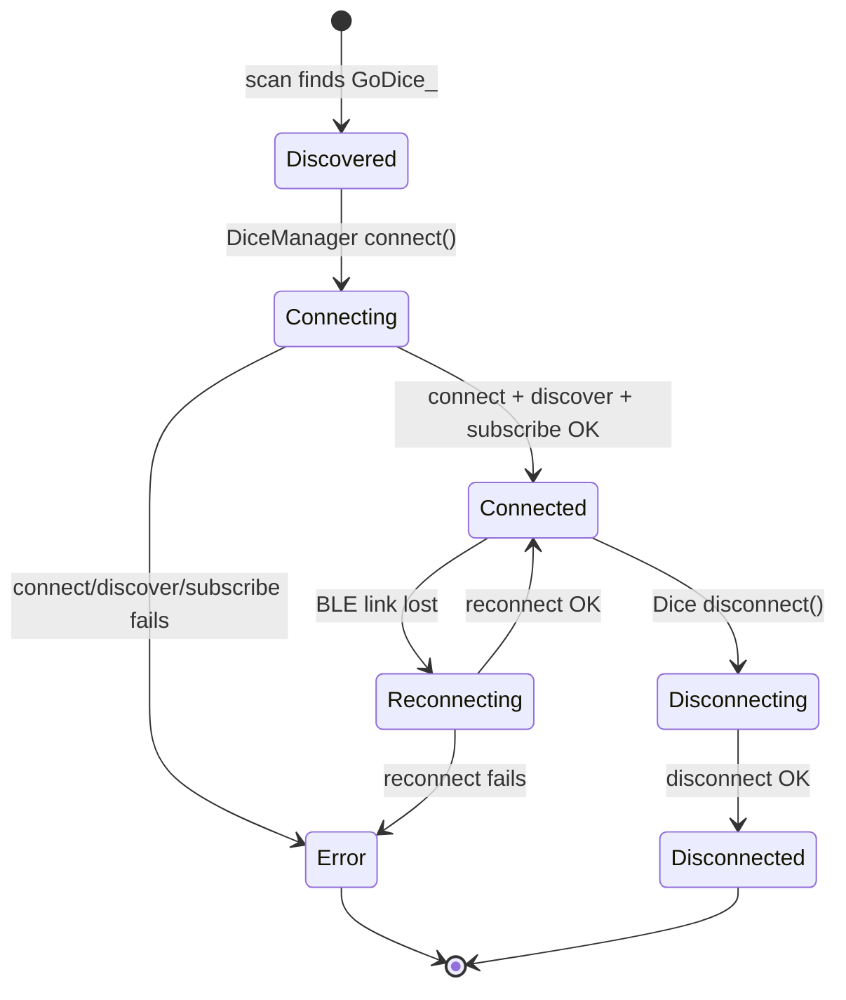
```mermaid
stateDiagram-v2
    [*] --> Discovered: scan finds GoDice_
    Discovered --> Connecting: DiceManager connect()
    Connecting --> Connected: connect + discover + subscribe OK
    Connecting --> Error: connect/discover/subscribe fails
    Connected --> Disconnecting: Dice disconnect()
    Connected --> Reconnecting: BLE link lost
    Reconnecting --> Connected: reconnect OK
    Reconnecting --> Error: reconnect fails
    Disconnecting --> Disconnected: disconnect OK
    Error --> [*]
    Disconnected --> [*]
```

---

## Phase Plan

The phases follow `docs/GOAL.md`. Phase 3 is intentionally absent from the goal
document (skipped numbering); this concept preserves that numbering.

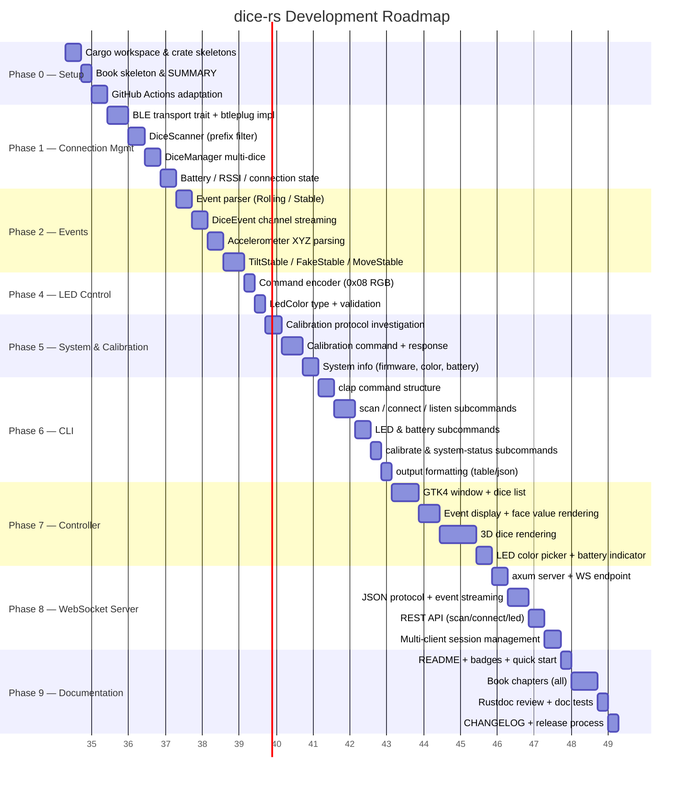
```mermaid
gantt
    title dice-rs Development Roadmap
    dateFormat YYYY-MM-DD
    axisFormat %V

    section Phase 0 — Setup
    Cargo workspace & crate skeletons      :p0a, 2026-08-25, 3d
    Book skeleton & SUMMARY                :p0b, after p0a, 2d
    GitHub Actions adaptation              :p0c, after p0b, 3d

    section Phase 1 — Connection Mgmt
    BLE transport trait + btleplug impl    :p1a, after p0c, 4d
    DiceScanner (prefix filter)            :p1b, after p1a, 3d
    DiceManager multi-dice                 :p1c, after p1b, 3d
    Battery / RSSI / connection state      :p1d, after p1c, 3d

    section Phase 2 — Events
    Event parser (Rolling / Stable)        :p2a, after p1d, 3d
    DiceEvent channel streaming            :p2b, after p2a, 3d
    Accelerometer XYZ parsing              :p2c, after p2b, 3d
    TiltStable / FakeStable / MoveStable   :p2d, after p2c, 4d

    section Phase 4 — LED Control
    Command encoder (0x08 RGB)             :p4a, after p2d, 2d
    LedColor type + validation             :p4b, after p4a, 2d

    section Phase 5 — System & Calibration
    Calibration protocol investigation        :p5a, after p4b, 3d
    Calibration command + response           :p5b, after p5a, 4d
    System info (firmware, color, battery)   :p5c, after p5b, 3d

    section Phase 6 — CLI
    clap command structure                 :p6a, after p5c, 3d
    scan / connect / listen subcommands    :p6b, after p6a, 4d
    LED & battery subcommands              :p6c, after p6b, 3d
    calibrate & system-status subcommands  :p6d, after p6c, 2d
    output formatting (table/json)         :p6e, after p6d, 2d

    section Phase 7 — Controller
    GTK4 window + dice list                :p7a, after p6e, 5d
    Event display + face value rendering   :p7b, after p7a, 4d
    3D dice rendering                      :p7c, after p7b, 7d
    LED color picker + battery indicator   :p7d, after p7c, 3d

    section Phase 8 — WebSocket Server
    axum server + WS endpoint              :p8a, after p7d, 3d
    JSON protocol + event streaming        :p8b, after p8a, 4d
    REST API (scan/connect/led)            :p8c, after p8b, 3d
    Multi-client session management        :p8d, after p8c, 3d

    section Phase 9 — Documentation
    README + badges + quick start          :p9a, after p8d, 2d
    Book chapters (all)                    :p9b, after p9a, 5d
    Rustdoc review + doc tests             :p9c, after p9b, 2d
    CHANGELOG + release process            :p9d, after p9c, 2d
```

### Phase Details

#### Phase 0 — Project Setup

- Create `Cargo.toml` workspace with `dice-rs`, `dice-rs-cli`,
  `dice-rs-controller`, `dice-rs-ws` members.
- Scaffold `lib.rs`, `main.rs` entry points.
- Populate `book/src/SUMMARY.md` with chapter outline.
- Adapt existing GitHub Actions workflows to run `cargo fmt --check`,
  `cargo clippy`, `cargo test`, `cargo audit`, and mdBook build.

#### Phase 1 — Connection and Device Management

##### BleTransport Trait

The `BleTransport` trait abstracts the BLE backend so that `btleplug` can be
swapped or mocked in tests. It mirrors the subset of `btleplug::api::Central`
and `btleplug::api::Peripheral` methods that `dice-rs` requires.

```rust
/// Abstraction over a BLE backend (btleplug, bluer, mock).
#[async_trait]
pub trait BleTransport: Send + Sync {
    /// The peripheral type returned by the backend.
    type Peripheral: BlePeripheral + Send + Sync;

    /// Start scanning for BLE devices with the given filter.
    async fn start_scan(&self, filter: ScanFilter) -> Result<()>;

    /// Stop an active scan.
    async fn stop_scan(&self) -> Result<()>;

    /// Return all peripherals discovered so far.
    async fn peripherals(&self) -> Result<Vec<Self::Peripheral>>;

    /// Subscribe to central events (device discovered, lost, etc.).
    async fn events(&self) -> Result<BoxStream<'static, CentralEvent>>;
}

/// Abstraction over a single BLE peripheral.
#[async_trait]
pub trait BlePeripheral: Send + Sync {
    /// Unique identifier of the peripheral.
    fn id(&self) -> PeripheralId;

    /// MAC address of the peripheral.
    fn address(&self) -> BDAddr;

    /// Current connection state.
    async fn is_connected(&self) -> Result<bool>;

    /// Cached properties (local name, RSSI, etc.).
    async fn properties(&self) -> Result<Option<PeripheralProperties>>;

    /// Establish a connection.
    async fn connect(&self) -> Result<()>;

    /// Disconnect from the peripheral.
    async fn disconnect(&self) -> Result<()>;

    /// Discover GATT services and characteristics.
    async fn discover_services(&self) -> Result<()>;

    /// Find a characteristic by UUID.
    fn characteristic(&self, uuid: Uuid) -> Option<Characteristic>;

    /// Write data to a characteristic.
    async fn write(&self, characteristic: &Characteristic, data: &[u8], write_type: WriteType) -> Result<()>;

    /// Enable notifications on a characteristic.
    async fn subscribe(&self, characteristic: &Characteristic) -> Result<()>;

    /// Stream of incoming notifications.
    async fn notifications(&self) -> Result<BoxStream<'static, ValueNotification>>;
}
```

The `BtleplugTransport` struct implements `BleTransport` by wrapping
`btleplug::platform::Adapter` (which implements `Central`) and
`btleplug::platform::Peripheral` (which implements `Peripheral`).

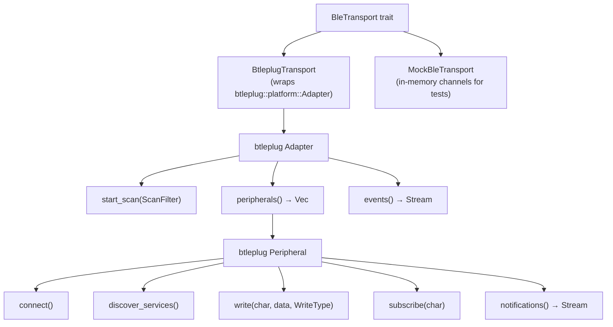
```mermaid
flowchart TB
    trait["BleTransport trait"]
    btleplug["BtleplugTransport\n(wraps btleplug::platform::Adapter)"]
    mock["MockBleTransport\n(in-memory channels for tests)"]

    trait --> btleplug
    trait --> mock

    btleplug --> adapter["btleplug Adapter"]
    adapter --> scan["start_scan(ScanFilter)"]
    adapter --> peripherals["peripherals() → Vec<Peripheral>"]
    adapter --> events["events() → Stream<CentralEvent>"]

    peripherals --> peripheral["btleplug Peripheral"]
    peripheral --> connect["connect()"]
    peripheral --> discover["discover_services()"]
    peripheral --> write["write(char, data, WriteType)"]
    peripheral --> subscribe["subscribe(char)"]
    peripheral --> notifications["notifications() → Stream<ValueNotification>"]
```

##### DiceScanner

`DiceScanner` wraps the scan logic with GoDice-specific filtering.

```rust
/// Scans for GoDice BLE devices in range.
pub struct DiceScanner<T: BleTransport> {
    transport: Arc<T>,
    name_prefix: String,
    scan_duration: Duration,
}

/// A discovered GoDice device, not yet connected.
#[derive(Debug, Clone)]
pub struct DiceDevice {
    /// Unique BLE identifier.
    pub id: PeripheralId,
    /// MAC address.
    pub address: BDAddr,
    /// Advertised device name (e.g. "GoDice_001234").
    pub name: String,
    /// Received signal strength indicator (if available).
    pub rssi: Option<i16>,
}

impl<T: BleTransport> DiceScanner<T> {
    /// Create a scanner with the default prefix "GoDice_" and 5s scan duration.
    pub fn new(transport: Arc<T>) -> Self;

    /// Set a custom name prefix.
    pub fn with_name_prefix(self, prefix: impl Into<String>) -> Self;

    /// Set a custom scan duration.
    pub fn with_scan_duration(self, duration: Duration) -> Self;

    /// Scan for GoDice devices. Returns when the scan duration elapses or
    /// the transport stops scanning.
    ///
    /// Uses a two-stage filter:
    /// 1. `ScanFilter` with the NUS service UUID (if supported by platform).
    /// 2. Fallback: filter `PeripheralProperties::local_name` by prefix.
    pub async fn scan(&self) -> Result<Vec<DiceDevice>>;
}
```

Scan flow:

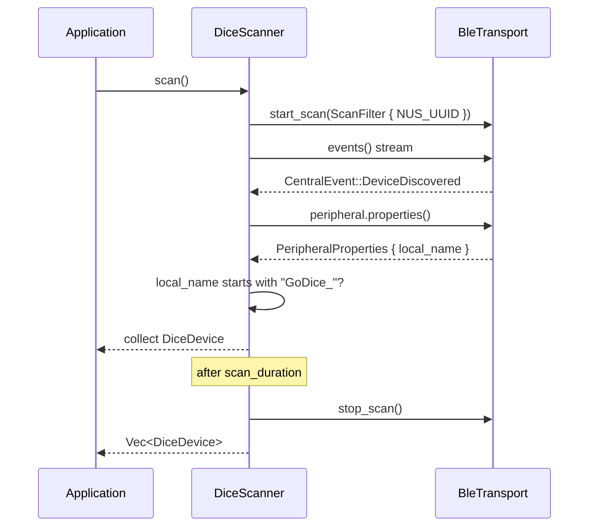
```mermaid
sequenceDiagram
    participant App as Application
    participant Scanner as DiceScanner
    participant BLE as BleTransport

    App->>Scanner: scan()
    Scanner->>BLE: start_scan(ScanFilter { NUS_UUID })
    Scanner->>BLE: events() stream
    BLE-->>Scanner: CentralEvent::DeviceDiscovered
    Scanner->>BLE: peripheral.properties()
    BLE-->>Scanner: PeripheralProperties { local_name }
    Scanner->>Scanner: local_name starts with "GoDice_"?
    Scanner-->>App: collect DiceDevice
    Note over Scanner: after scan_duration
    Scanner->>BLE: stop_scan()
    Scanner-->>App: Vec<DiceDevice>
```

##### DiceManager

`DiceManager` owns the BLE transport and manages connections to multiple
dice concurrently.

```rust
/// Manages BLE adapter and multiple dice connections.
pub struct DiceManager {
    transport: Arc<BtleplugTransport>,
}

impl DiceManager {
    /// Create a new manager. Internally calls `Manager::new()` and selects
    /// the first available Bluetooth adapter.
    pub async fn new() -> Result<Self>;

    /// Create a scanner for discovering GoDice devices.
    pub fn scanner(&self) -> DiceScanner<BtleplugTransport>;

    /// Scan for GoDice devices using the default scanner settings.
    pub async fn scan(&self) -> Result<Vec<DiceDevice>>;

    /// Connect to a discovered device.
    ///
    /// Performs:
    /// 1. `peripheral.connect()`
    /// 2. `peripheral.discover_services()`
    /// 3. Find write char (`6e400002`) and notify char (`6e400003`)
    /// 4. `peripheral.subscribe(notify_char)`
    /// 5. `peripheral.notifications()` → spawn parse task
    /// 6. Return `Dice` handle
    pub async fn connect(&self, device: &DiceDevice) -> Result<Dice>;

    /// Attempt to reconnect to a disconnected dice.
    ///
    /// Retries with exponential backoff until success or max retries.
    /// Mirrors the JS API's `attemptReconnect` behavior.
    pub async fn reconnect(&self, dice: &Dice) -> Result<()>;

    /// List all currently connected dice.
    pub fn connected_dice(&self) -> Vec<Dice>;

    /// Disconnect all dice and release the BLE adapter.
    pub async fn shutdown(&self) -> Result<()>;
}
```

Connection sequence:

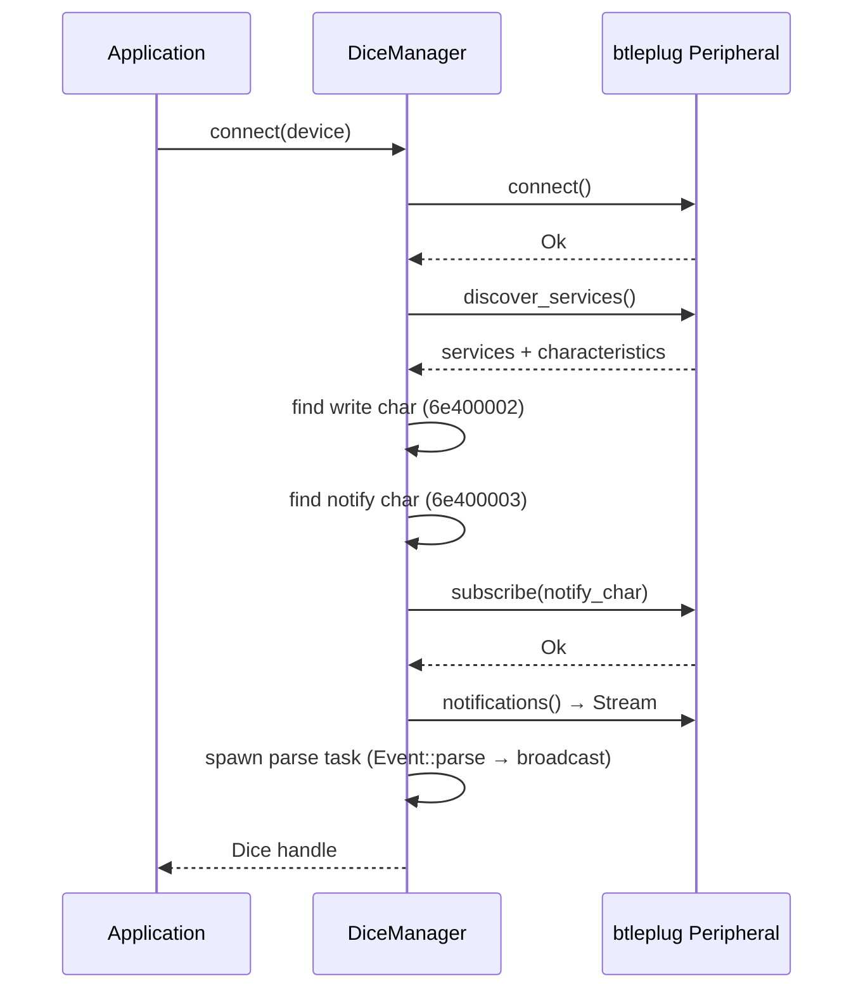
```mermaid
sequenceDiagram
    participant App as Application
    participant Mgr as DiceManager
    participant BLE as btleplug Peripheral

    App->>Mgr: connect(device)
    Mgr->>BLE: connect()
    BLE-->>Mgr: Ok

    Mgr->>BLE: discover_services()
    BLE-->>Mgr: services + characteristics

    Mgr->>Mgr: find write char (6e400002)
    Mgr->>Mgr: find notify char (6e400003)

    Mgr->>BLE: subscribe(notify_char)
    BLE-->>Mgr: Ok

    Mgr->>BLE: notifications() → Stream
    Mgr->>Mgr: spawn parse task (Event::parse → broadcast)

    Mgr-->>App: Dice handle
```

##### Battery, RSSI, and Connection State

**Battery Level** uses the request-response pattern (see
[Request-Response Pattern](#request-response-pattern)):

```rust
impl Dice {
    /// Request battery level. Sends command `0x03`, waits for `Bat` event.
    /// Returns level as percentage (0–100).
    pub async fn get_battery_level(&self) -> Result<u8> {
        let (tx, rx) = tokio::sync::oneshot::channel();
        self.inner.pending_battery.lock().map_err(|_| Error::LockPoisoned)?.push_back(tx);
        self.transport.write(&self.write_char, &[0x03], WriteType::WithoutResponse).await?;
        let timeout = Duration::from_secs(RESPONSE_TIMEOUT_SECS);
        let level = tokio::time::timeout(timeout, rx.await)
            .await
            .map_err(|_| Error::ResponseTimeout(timeout))?
            .map_err(|_| Error::ResponseTimeout(timeout))?;
        Ok(level)
    }
}
```

The notification task matches `Event::BatteryLevel { level }` against the
oldest pending oneshot sender (FIFO `pop_front`) and delivers the result.

**RSSI** is read from `PeripheralProperties::rssi` (an `Option<i16>`).
This is platform-dependent and may not be available on all platforms.

```rust
impl Dice {
    /// Query RSSI from cached peripheral properties.
    pub async fn rssi(&self) -> Result<Option<i16>>;
}
```

**Connection State** is queried via `peripheral.is_connected()`:

```rust
impl Dice {
    /// Check if the dice is currently connected.
    pub async fn is_connected(&self) -> Result<bool>;
}
```

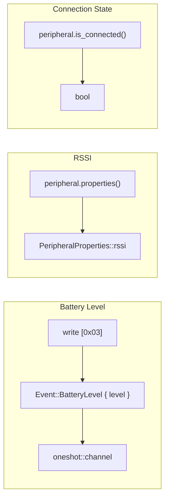
```mermaid
flowchart LR
    subgraph battery["Battery Level"]
        cmd1["write [0x03]"]
        resp1["Event::BatteryLevel { level }"]
        oneshot1["oneshot::channel"]
        cmd1 --> resp1 --> oneshot1
    end

    subgraph rssi["RSSI"]
        props["peripheral.properties()"]
        rssiVal["PeripheralProperties::rssi"]
        props --> rssiVal
    end

    subgraph connState["Connection State"]
        isConnected["peripheral.is_connected()"]
        bool["bool"]
        isConnected --> bool
    end
```

##### Reconnect Logic

The JS API's `attemptReconnect` retries connection in a loop with 1-second
delay. `dice-rs` implements this with exponential backoff. Each call to
`reconnect_internal()` aborts the old notification and connection monitor
tasks before spawning fresh ones, preventing orphaned background tasks:

```rust
impl DiceManager {
    pub async fn reconnect(&self, dice: &Dice) -> Result<()> {
        let mut backoff = Duration::from_millis(500);
        let max_backoff = Duration::from_secs(5);
        let max_retries = 10;

        for attempt in 0..max_retries {
            if dice.is_connected().await? {
                return Ok(());
            }
            if let Err(e) = dice.reconnect_internal().await {
                debug!(attempt, error = %e, "reconnect attempt failed");
            }
            tokio::time::sleep(backoff).await;
            backoff = (backoff * 2).min(max_backoff);
        }
        Err(Error::ReconnectFailed)
    }
}
```

##### Types Defined in Phase 1

| Type             | File                            | Description                                     |
|------------------|---------------------------------|-------------------------------------------------|
| `BleTransport`   | `ble/transport.rs`              | Trait abstracting the BLE backend               |
| `BlePeripheral`  | `ble/peripheral.rs`             | Trait abstracting a single peripheral           |
| `BtleplugTransport` | `ble/btleplug_transport.rs`  | `BleTransport` impl wrapping `btleplug::platform` |
| `MockBleTransport` | `ble/mock_transport.rs` (test) | In-memory mock for integration tests            |
| `DiceDevice`     | `service/dice_device.rs`        | Discovered device (id, address, name, RSSI)     |
| `DiceScanner`    | `service/scanner.rs`            | Scanner with name-prefix filtering              |
| `DiceManager`    | `service/manager.rs`            | Multi-dice connection manager                   |
| `Dice`           | `service/dice.rs`               | Handle to a connected dice                      |
| `DiceInner`      | `service/dice_inner.rs`         | Shared inner state (transport, queues, handles) |
| `LedThrottleState` | `service/led_throttle_state.rs` | LED debounce state (pending color, Notify) |
| `DiceError`      | `error.rs`                      | Error enum (`thiserror`)                        |

#### Phase 2 — Dice and Motion Events

##### Event Enum and Parsing

The `Event` enum represents all raw notifications from the dice. The `parse`
method inspects the first byte(s) to determine the event type, then extracts
the payload. See [Event Decoding](#event-decoding) for the full enum
definition and parse decision tree.

Parse logic in detail:

```rust
impl Event {
    pub fn parse(data: &[u8]) -> Result<Self> {
        if data.is_empty() {
            return Err(ParseError::EmptyPacket);
        }

        let first = data[0];

        // RollStart: single byte 0x52 ('R')
        if first == 0x52 {
            return Ok(Self::RollStart);
        }

        // BatteryLevel: prefix "Bat" (0x42, 0x61, 0x74) + level byte
        if data.len() >= 4 && &data[0..3] == b"Bat" {
            return Ok(Self::BatteryLevel { level: data[3] });
        }

        // DiceColor: prefix "Col" (0x43, 0x6F, 0x6C) + color byte
        if data.len() >= 4 && &data[0..3] == b"Col" {
            let color = DieColor::try_from(data[3])?;
            return Ok(Self::DiceColor { color });
        }

        // Stable: single byte 0x53 ('S') + 3 signed bytes XYZ
        if first == 0x53 {
            if data.len() < 4 {
                return Err(ParseError::TruncatedPacket);
            }
            return Ok(Self::Stable {
                acceleration: Acceleration::from_bytes(&data[1..4]),
            });
        }

        // Two-byte prefix events: FS, TS, MS — all followed by 3 signed bytes XYZ
        if data.len() >= 5 && data[1] == 0x53 {
            let acceleration = Acceleration::from_bytes(&data[2..5]);
            return match first {
                0x46 => Ok(Self::FakeStable { acceleration }),
                0x54 => Ok(Self::TiltStable { acceleration }),
                0x4D => Ok(Self::MoveStable { acceleration }),
                _ => Err(ParseError::UnknownEvent { byte: first }),
            };
        }

        Err(ParseError::UnknownEvent { byte: first })
    }
}
```

##### Parse Error Type

```rust
/// Errors that can occur when parsing a notification packet.
#[derive(Debug, Clone, PartialEq, thiserror::Error)]
pub enum ParseError {
    /// The packet is empty.
    #[error("empty packet")]
    EmptyPacket,
    /// The packet is shorter than expected.
    #[error("truncated packet: expected {expected} bytes, got {actual}")]
    TruncatedPacket { expected: usize, actual: usize },
    /// The first byte does not match any known event.
    #[error("unknown event byte: 0x{byte:02X}")]
    UnknownEvent { byte: u8 },
    /// The color byte is not a valid DieColor value.
    #[error("invalid dice color value: {0}")]
    InvalidColor(u8),
}
```

##### Notification Task Architecture

A spawned tokio task reads from the `btleplug` notification stream, parses
each packet into an `Event`, then transforms it into a `DiceEvent` (with
face value) and broadcasts it to all subscribers. It also matches
request-response events (battery, color, calibration) against pending
oneshot senders from FIFO queues.

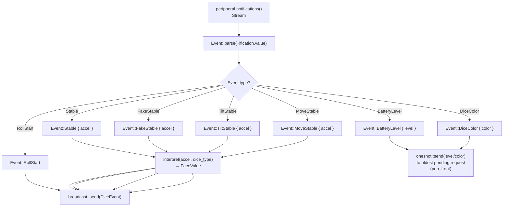
```mermaid
flowchart TB
    stream["peripheral.notifications()\nStream<ValueNotification>"]
    parse["Event::parse(&notification.value)"]
    matchEvent{"Event type?"}

    rollStart["Event::RollStart"]
    stable["Event::Stable { accel }"]
    fakeStable["Event::FakeStable { accel }"]
    tiltStable["Event::TiltStable { accel }"]
    moveStable["Event::MoveStable { accel }"]
    battery["Event::BatteryLevel { level }"]
    color["Event::DiceColor { color }"]

    interpret["interpret(accel, dice_type)\n→ FaceValue"]
    broadcast["broadcast::send(DiceEvent)"]
    oneshot["oneshot::send(level/color)\nto oldest pending request\n(pop_front)"]

    stream --> parse --> matchEvent
    matchEvent -->|RollStart| rollStart --> broadcast
    matchEvent -->|Stable| stable --> interpret --> broadcast
    matchEvent -->|FakeStable| fakeStable --> interpret --> broadcast
    matchEvent -->|TiltStable| tiltStable --> interpret --> broadcast
    matchEvent -->|MoveStable| moveStable --> interpret --> broadcast
    matchEvent -->|BatteryLevel| battery --> oneshot
    matchEvent -->|DiceColor| color --> oneshot
```

Notification task implementation:

```rust
/// Spawns the notification parsing task for a connected dice.
fn spawn_notification_task(
    mut notifications: BoxStream<'static, ValueNotification>,
    dice_type: Arc<AtomicU8>,
    event_sender: broadcast::Sender<DiceEvent>,
    pending_battery: Arc<Mutex<VecDeque<oneshot::Sender<u8>>>>,
    pending_color: Arc<Mutex<VecDeque<oneshot::Sender<DieColor>>>>,
    calibration_offset: Arc<std::sync::RwLock<Option<AccelerationOffset>>>,
) -> JoinHandle<()> {
    tokio::spawn(async move {
        while let Some(notification) = notifications.next().await {
            match Event::parse(&notification.value) {
                Ok(Event::RollStart) => {
                    if event_sender.send(DiceEvent::RollStart).is_err() {
                        debug!("no subscribers for RollStart event");
                    }
                }
                Ok(Event::Stable { acceleration }) => {
                    let dice_type = DiceType::try_from(dice_type.load(Ordering::Relaxed)).unwrap_or(DiceType::D6);
                    let offset = *calibration_offset.read().unwrap_or_default();
                    let face = interpret(acceleration, dice_type, offset);
                    if event_sender.send(DiceEvent::Stable { face, acceleration }).is_err() {
                        debug!("no subscribers for Stable event");
                    }
                }
                Ok(Event::FakeStable { acceleration }) => {
                    let dice_type = DiceType::try_from(dice_type.load(Ordering::Relaxed)).unwrap_or(DiceType::D6);
                    let offset = *calibration_offset.read().unwrap_or_default();
                    let face = interpret(acceleration, dice_type, offset);
                    if event_sender.send(DiceEvent::FakeStable { face, acceleration }).is_err() {
                        debug!("no subscribers for FakeStable event");
                    }
                }
                Ok(Event::TiltStable { acceleration }) => {
                    let dice_type = DiceType::try_from(dice_type.load(Ordering::Relaxed)).unwrap_or(DiceType::D6);
                    let offset = *calibration_offset.read().unwrap_or_default();
                    let face = interpret(acceleration, dice_type, offset);
                    if event_sender.send(DiceEvent::TiltStable { face, acceleration }).is_err() {
                        debug!("no subscribers for TiltStable event");
                    }
                }
                Ok(Event::MoveStable { acceleration }) => {
                    let dice_type = DiceType::try_from(dice_type.load(Ordering::Relaxed)).unwrap_or(DiceType::D6);
                    let offset = *calibration_offset.read().unwrap_or_default();
                    let face = interpret(acceleration, dice_type, offset);
                    if event_sender.send(DiceEvent::MoveStable { face, acceleration }).is_err() {
                        debug!("no subscribers for MoveStable event");
                    }
                }
                Ok(Event::BatteryLevel { level }) => {
                    if let Ok(mut queue) = pending_battery.lock() {
                        queue.retain(|s| !s.is_canceled());
                        if let Some(sender) = queue.pop_front() {
                            if sender.send(level).is_err() {
                                debug!("battery level response dropped: receiver gone");
                            }
                        }
                    }
                }
                Ok(Event::DiceColor { color }) => {
                    if let Ok(mut queue) = pending_color.lock() {
                        queue.retain(|s| !s.is_canceled());
                        if let Some(sender) = queue.pop_front() {
                            if sender.send(color).is_err() {
                                debug!("dice color response dropped: receiver gone");
                            }
                        }
                    }
                }
                Err(error) => {
                    debug!(error = %error, "failed to parse notification");
                }
            }
        }
        if event_sender.send(DiceEvent::Disconnected).is_err() {
            debug!("no subscribers for Disconnected event");
        }
    })
}
```

##### DiceType Model

`DiceType` determines which vector table and optional transform are used for
face value interpretation. It is a client-side setting — no command is sent
to the dice.

```rust
/// The physical shell type attached to the D6 sensor inside the GoDice.
///
/// Determines which vector table and shell transform are used to interpret
/// accelerometer data into a face value.
///
/// `#[repr(u8)]` allows storage as `AtomicU8` for lock-free reads
/// in the notification task hot path.
#[derive(Debug, Clone, Copy, PartialEq, Eq, Default)]
#[repr(u8)]
pub enum DiceType {
    /// Standard 6-sided die (default).
    #[default]
    D6,
    /// 20-sided die.
    D20,
    /// 10-sided die (values 1–10).
    D10,
    /// 10-sided "tens" die (values 00, 10, 20, ..., 90).
    D10X,
    /// 4-sided die.
    D4,
    /// 8-sided die.
    D8,
    /// 12-sided die.
    D12,
}

impl From<DiceType> for u8 {
    fn from(dt: DiceType) -> Self {
        dt as u8
    }
}

impl TryFrom<u8> for DiceType {
    type Error = Error;
    fn try_from(value: u8) -> Result<Self> {
        match value {
            0 => Ok(Self::D6),
            1 => Ok(Self::D20),
            2 => Ok(Self::D10),
            3 => Ok(Self::D10X),
            4 => Ok(Self::D4),
            5 => Ok(Self::D8),
            6 => Ok(Self::D12),
            _ => Err(Error::InvalidDiceType(value)),
        }
    }
}

impl DiceType {
    /// Returns the vector table used for this dice type.
    pub fn vector_table(&self) -> &'static [(i32, i32, i32)] {
        match self {
            Self::D6 => &D6_VECTORS,
            Self::D20 | Self::D10 | Self::D10X => &D20_VECTORS,
            Self::D4 | Self::D8 | Self::D12 => &D24_VECTORS,
        }
    }

    /// Returns the shell transform table, if applicable.
    pub fn transform(&self) -> Option<&'static [u8]> {
        match self {
            Self::D6 | Self::D20 => None,
            Self::D10 => Some(&D10_TRANSFORM),
            Self::D10X => Some(&D10X_TRANSFORM),
            Self::D4 => Some(&D4_TRANSFORM),
            Self::D8 => Some(&D8_TRANSFORM),
            Self::D12 => Some(&D12_TRANSFORM),
        }
    }
}
```

##### Interpreter Module

The `service::interpreter` module contains the vector tables, shell transform
tables, and the `interpret` function. See
[Face Value Determination](#face-value-determination) for the algorithm and
[Interpreter API](#interpreter-api) for the function signature.

Module structure:

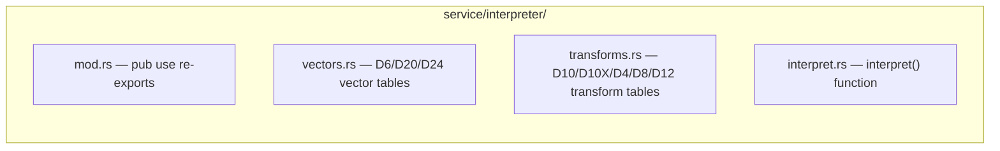
```mermaid
flowchart LR
    subgraph interpreter["service/interpreter/"]
        modRs["mod.rs — pub use re-exports"]
        vectors["vectors.rs — D6/D20/D24 vector tables"]
        transforms["transforms.rs — D10/D10X/D4/D8/D12 transform tables"]
        interpretFn["interpret.rs — interpret() function"]
    end
```

Vector table constants:

```rust
/// D6 reference vectors: (face_index → (x, y, z)).
/// Index 0 = face 1, index 5 = face 6.
pub const D6_VECTORS: [(i32, i32, i32); 6] = [
    (-64, 0, 0),    // face 1
    (0, 0, 64),     // face 2
    (0, 64, 0),     // face 3
    (0, -64, 0),    // face 4
    (0, 0, -64),    // face 5
    (64, 0, 0),     // face 6
];

/// D20 reference vectors (20 entries, ported from JS API d20Vectors).
/// Index 0 = face 1, index 19 = face 20.
pub const D20_VECTORS: [(i32, i32, i32); 20] = [
    (-64, 0, -22),    // face 1
    (42, -42, 40),    // face 2
    (0, 22, -64),     // face 3
    (0, 22, 64),      // face 4
    (-42, -42, 42),   // face 5
    (22, 64, 0),      // face 6
    (-42, -42, -42),  // face 7
    (64, 0, -22),     // face 8
    (-22, 64, 0),     // face 9
    (42, -42, -42),   // face 10
    (-42, 42, 42),    // face 11
    (22, -64, 0),     // face 12
    (-64, 0, 22),     // face 13
    (42, 42, 42),     // face 14
    (-22, -64, 0),    // face 15
    (42, 42, -42),    // face 16
    (0, -22, -64),    // face 17
    (0, -22, 64),     // face 18
    (-42, 42, -42),   // face 19
    (64, 0, 22),      // face 20
];

/// D24 reference vectors (24 entries, ported from JS API d24Vectors).
/// Index 0 = face 1, index 23 = face 24.
pub const D24_VECTORS: [(i32, i32, i32); 24] = [
    (20, -60, -20),   // face 1
    (20, 0, 60),      // face 2
    (-40, -40, 40),   // face 3
    (-60, 0, 20),     // face 4
    (40, 20, 40),     // face 5
    (-20, -60, -20),  // face 6
    (20, 60, 20),     // face 7
    (-40, 20, -40),   // face 8
    (-40, 40, 40),    // face 9
    (-20, 0, 60),     // face 10
    (-20, -60, 20),   // face 11
    (60, 0, 20),      // face 12
    (-60, 0, -20),    // face 13
    (20, 60, -20),    // face 14
    (20, 0, -60),     // face 15
    (40, -20, -40),   // face 16
    (-20, 60, -20),   // face 17
    (-40, -40, -40),  // face 18
    (40, -20, 40),    // face 19
    (20, -60, 20),    // face 20
    (60, 0, -20),     // face 21
    (40, 20, -40),    // face 22
    (-20, 0, -60),    // face 23
    (-20, 60, 20),    // face 24
];

/// D10 shell transform: maps D20 vector index → D10 face value.
/// Ported from JS API d10Transform.
pub const D10_TRANSFORM: [u8; 20] = [
    8, 2, 6, 1, 4, 3, 9, 0, 7, 5,
    5, 7, 0, 9, 3, 4, 1, 6, 2, 8,
];

/// D10X shell transform: maps D20 vector index → D10X face value.
/// Ported from JS API d10XTransform.
pub const D10X_TRANSFORM: [u8; 20] = [
    80, 20, 60, 10, 40, 30, 90, 0, 70, 50,
    50, 70, 0, 90, 30, 40, 10, 60, 20, 80,
];

/// D4 shell transform: maps D24 vector index → D4 face value.
/// Ported from JS API d4Transform.
pub const D4_TRANSFORM: [u8; 24] = [
    3, 1, 4, 1, 4, 4, 1, 4, 2, 3,
    1, 1, 1, 4, 2, 3, 3, 2, 2, 2,
    4, 1, 3, 2,
];

/// D8 shell transform: maps D24 vector index → D8 face value.
/// Ported from JS API d8Transform.
pub const D8_TRANSFORM: [u8; 24] = [
    3, 3, 6, 1, 2, 8, 1, 1, 4, 7,
    5, 5, 4, 4, 2, 5, 7, 7, 8, 2,
    8, 3, 6, 6,
];

/// D12 shell transform: maps D24 vector index → D12 face value.
/// Ported from JS API d12Transform.
pub const D12_TRANSFORM: [u8; 24] = [
    1, 2, 3, 4, 5, 6, 7, 8, 9, 10,
    11, 12, 1, 2, 3, 4, 5, 6, 7, 8,
    9, 10, 11, 12,
];
```

##### FaceValue Type

```rust
/// The face value rolled on a die (1-based).
#[derive(Debug, Clone, Copy, PartialEq, Eq, PartialOrd, Ord, Hash)]
pub struct FaceValue(u8);

impl FaceValue {
    /// Create a face value. Returns error if value is 0.
    pub fn new(value: u8) -> Result<Self> {
        if value == 0 {
            return Err(Error::InvalidFaceValue(0));
        }
        Ok(Self(value))
    }

    /// Get the numeric value.
    pub fn get(&self) -> u8 {
        self.0
    }
}

impl std::fmt::Display for FaceValue {
    fn fmt(&self, f: &mut std::fmt::Formatter<'_>) -> std::fmt::Result {
        write!(f, "{}", self.0)
    }
}
```

##### DiceEvent Channel

The `Dice` handle exposes a `tokio::sync::broadcast` channel for streaming
events to subscribers. Multiple consumers can subscribe independently.

```rust
impl Dice {
    /// Subscribe to dice events. Each subscriber gets its own receiver.
    /// If the broadcaster's buffer is full, slow subscribers may miss events.
    pub fn subscribe(&self) -> broadcast::Receiver<DiceEvent> {
        self.inner.event_sender.subscribe()
    }

    /// Set the dice type for face value interpretation.
    /// This is a client-side setting; no BLE command is sent.
    /// Synchronous — uses `AtomicU8::store` instead of an async lock.
    pub fn set_dice_type(&self, dice_type: DiceType) {
        self.inner.dice_type.store(dice_type.into(), Ordering::Relaxed);
    }
}
```

Event delivery flow:

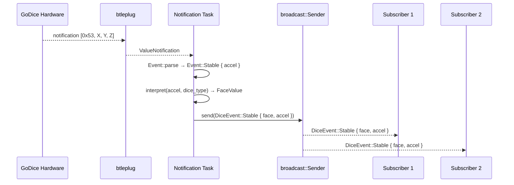
```mermaid
sequenceDiagram
    participant Dice as GoDice Hardware
    participant BLE as btleplug
    participant Task as Notification Task
    participant Chan as broadcast::Sender
    participant Sub1 as Subscriber 1
    participant Sub2 as Subscriber 2

    Dice-->>BLE: notification [0x53, X, Y, Z]
    BLE-->>Task: ValueNotification
    Task->>Task: Event::parse → Event::Stable { accel }
    Task->>Task: interpret(accel, dice_type) → FaceValue
    Task->>Chan: send(DiceEvent::Stable { face, accel })
    Chan-->>Sub1: DiceEvent::Stable { face, accel }
    Chan-->>Sub2: DiceEvent::Stable { face, accel }
```

##### StabilityDescriptor Mapping

GoDice emits different stability events depending on how the dice came to
rest. Each event carries accelerometer data (XYZ) from which a face value
is derived. Understanding the distinction is important for applications
that need to validate rolls or filter out non-roll events:

| Event         | BLE Prefix | Description                                                                 |
|---------------|------------|-----------------------------------------------------------------------------|
| `RollStart`   | `0x52` (`R`)  | Dice has started moving (acceleration exceeded the roll threshold). No face value is available yet. |
| `Stable`      | `0x53` (`S`)  | Dice is flat and stationary after a genuine roll. This is the canonical "result landed" event. |
| `TiltStable`  | `0x54 0x53` (`TS`) | Dice is stationary but resting on an edge or at an angle (not flat on a face). The face value is derived from the tilted orientation. |
| `FakeStable`  | `0x46 0x53` (`FS`) | Dice was placed down manually rather than rolled (e.g. user set it on a face). The dice detected insufficient movement for a real roll but still reports a stable position. Applications may want to reject these as non-roll results. |
| `MoveStable`  | `0x4D 0x53` (`MS`) | Dice was picked up and placed back down with a small movement (face rotation without a full roll). Useful for "tilt" interactions where the user turns the dice to a specific face without rolling it. |

The Python API defines a `StabilityDescriptor` enum. `dice-rs` maps the raw
events to this descriptor so applications can distinguish stability types
without matching on `DiceEvent` variants directly:

```rust
/// Describes the stability state of the dice.
#[derive(Debug, Clone, Copy, PartialEq, Eq)]
pub enum StabilityDescriptor {
    /// Dice is currently rolling (RollStart event).
    Rolling,
    /// Dice is stable and flat (Stable event).
    Stable,
    /// Dice is stable but tilted (TiltStable event).
    TiltStable,
    /// Dice is stable after a fake roll (FakeStable event).
    FakeStable,
    /// Dice is stable after small movement (MoveStable event).
    MoveStable,
}

impl DiceEvent {
    /// Returns the stability descriptor for stable/rolling events.
    pub fn stability(&self) -> Option<StabilityDescriptor> {
        match self {
            Self::RollStart => Some(StabilityDescriptor::Rolling),
            Self::Stable { .. } => Some(StabilityDescriptor::Stable),
            Self::TiltStable { .. } => Some(StabilityDescriptor::TiltStable),
            Self::FakeStable { .. } => Some(StabilityDescriptor::FakeStable),
            Self::MoveStable { .. } => Some(StabilityDescriptor::MoveStable),
            Self::Disconnected => None,
        }
    }
}
```

##### Types Defined in Phase 2

| Type                   | File                              | Description                                         |
|------------------------|-----------------------------------|-----------------------------------------------------|
| `Event`                | `ble/event.rs`                   | Raw notification enum (7 variants)                   |
| `ParseError`           | `ble/parse_error.rs`             | Error type for packet parsing                        |
| `Acceleration`         | `model/acceleration.rs`           | Signed XYZ accelerometer data (`i8` × 3)            |
| `FaceValue`            | `model/face.rs`                  | Newtype for rolled face value (1-based)              |
| `DiceType`             | `model/dice_type.rs`             | Shell type enum (D6, D20, D10, D10X, D4, D8, D12)   |
| `StabilityDescriptor`  | `model/stability.rs`             | Stability state enum                                 |
| `DiceEvent`            | `service/dice_event.rs`          | High-level event enum for application consumers      |
| `D6_VECTORS`           | `service/interpreter/vectors.rs`  | D6 reference vector table (6 entries)               |
| `D20_VECTORS`          | `service/interpreter/vectors.rs`  | D20 reference vector table (20 entries)             |
| `D24_VECTORS`          | `service/interpreter/vectors.rs`  | D24 reference vector table (24 entries)             |
| `D10_TRANSFORM`        | `service/interpreter/transforms.rs` | D10 shell transform table (20 entries)           |
| `D10X_TRANSFORM`       | `service/interpreter/transforms.rs` | D10X shell transform table (20 entries)          |
| `D4_TRANSFORM`         | `service/interpreter/transforms.rs` | D4 shell transform table (24 entries)            |
| `D8_TRANSFORM`         | `service/interpreter/transforms.rs` | D8 shell transform table (24 entries)            |
| `D12_TRANSFORM`        | `service/interpreter/transforms.rs` | D12 shell transform table (24 entries)           |
| `interpret()`          | `service/interpreter/interpret.rs` | Face value determination function                  |

#### Phase 4 — LED and Visual Effects

##### LedColor Type

The GoDice has two independently addressable RGB LEDs. Colors are specified
as three `u8` values (0–255) per LED.

```rust
/// An RGB color for a GoDice LED.
///
/// Each channel is clamped to the range 0–255. `(0, 0, 0)` turns the LED off.
#[derive(Debug, Clone, Copy, PartialEq, Eq, Hash)]
pub struct LedColor {
    /// Red channel (0–255).
    pub r: u8,
    /// Green channel (0–255).
    pub g: u8,
    /// Blue channel (0–255).
    pub b: u8,
}

impl LedColor {
    /// Black (LED off).
    pub const OFF: Self = Self { r: 0, g: 0, b: 0 };

    /// Red.
    pub const RED: Self = Self { r: 255, g: 0, b: 0 };

    /// Green.
    pub const GREEN: Self = Self { r: 0, g: 255, b: 0 };

    /// Blue.
    pub const BLUE: Self = Self { r: 0, g: 0, b: 255 };

    /// White.
    pub const WHITE: Self = Self { r: 255, g: 255, b: 255 };

    /// Create a new color from RGB values.
    pub const fn new(r: u8, g: u8, b: u8) -> Self {
        Self { r, g, b }
    }

    /// Create a color from a 24-bit hex value (e.g. `0xFF8800`).
    pub const fn from_hex(hex: u32) -> Self {
        Self {
            r: ((hex >> 16) & 0xFF) as u8,
            g: ((hex >> 8) & 0xFF) as u8,
            b: (hex & 0xFF) as u8,
        }
    }

    /// Convert to a 24-bit hex value.
    pub fn to_hex(&self) -> u32 {
        ((self.r as u32) << 16) | ((self.g as u32) << 8) | (self.b as u32)
    }

    /// Returns true if all channels are zero (LED off).
    pub fn is_off(&self) -> bool {
        self.r == 0 && self.g == 0 && self.b == 0
    }
}

impl From<(u8, u8, u8)> for LedColor {
    fn from((r, g, b): (u8, u8, u8)) -> Self {
        Self { r, g, b }
    }
}

impl std::fmt::Display for LedColor {
    fn fmt(&self, f: &mut std::fmt::Formatter<'_>) -> std::fmt::Result {
        write!(f, "#{:02X}{:02X}{:02X}", self.r, self.g, self.b)
    }
}
```

##### Command Enum

The `Command` enum encapsulates all host-to-dice commands. See
[Command Encoding](#command-encoding) for the full enum definition and
`encode()` implementation.

```rust
impl Command {
    /// Decode a command from its byte representation.
    /// Useful for testing and protocol debugging.
    pub fn decode(data: &[u8]) -> Result<Self> {
        if data.is_empty() {
            return Err(CommandError::EmptyPacket);
        }
        match data[0] {
            0x03 if data.len() == 1 => Ok(Self::GetBatteryLevel),
            0x08 if data.len() == 7 => Ok(Self::SetLeds {
                led1: LedColor::new(data[1], data[2], data[3]),
                led2: LedColor::new(data[4], data[5], data[6]),
            }),
            0x10 if data.len() == 9 => Ok(Self::PulseLeds {
                pulse_count: data[1],
                on_time: data[2],
                off_time: data[3],
                color: LedColor::new(data[4], data[5], data[6]),
            }),
            0x17 if data.len() == 1 => Ok(Self::GetDiceColor),
            opcode => Err(CommandError::UnknownOpcode { opcode, length: data.len() }),
        }
    }
}
```

##### Command Error Type

```rust
/// Errors that can occur when encoding or decoding commands.
#[derive(Debug, Clone, PartialEq, thiserror::Error)]
pub enum CommandError {
    /// The packet is empty.
    #[error("empty packet")]
    EmptyPacket,
    /// The opcode is not a known command.
    #[error("unknown opcode: 0x{opcode:02X} (length {length})")]
    UnknownOpcode { opcode: u8, length: usize },
    /// The packet length does not match the expected payload size.
    #[error("invalid payload length: expected {expected}, got {actual}")]
    InvalidLength { expected: usize, actual: usize },
}
```

##### Byte Layout Reference

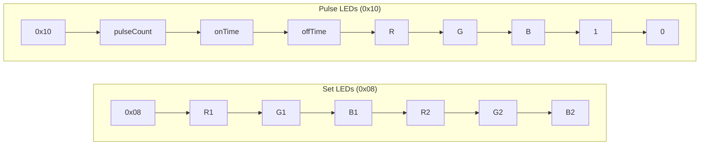
```mermaid
flowchart LR
    subgraph setLeds["Set LEDs (0x08)"]
        direction LR
        op1["0x08"]
        r1["R1"]
        g1["G1"]
        b1["B1"]
        r2["R2"]
        g2["G2"]
        b2["B2"]
        op1 --> r1 --> g1 --> b1 --> r2 --> g2 --> b2
    end

    subgraph pulseLeds["Pulse LEDs (0x10)"]
        direction LR
        op2["0x10"]
        pc["pulseCount"]
        ot["onTime"]
        oft["offTime"]
        pr["R"]
        pg["G"]
        pb["B"]
        t1["1"]
        t2["0"]
        op2 --> pc --> ot --> oft --> pr --> pg --> pb --> t1 --> t2
    end
```

| Command     | Opcode | Total Bytes | Payload Layout                                         |
|-------------|--------|-------------|--------------------------------------------------------|
| SetLeds     | `0x08` | 7           | `[R1, G1, B1, R2, G2, B2]`                             |
| PulseLeds   | `0x10` | 9           | `[pulseCount, onTime, offTime, R, G, B, 1, 0]`         |

**Pulse LEDs timing**: `onTime` and `offTime` are in units of 10 ms. With
`pulseCount = 5`, `onTime = 10`, `offTime = 10`, the LED pulses 5 times,
each cycle lasting 200 ms (100 ms on + 100 ms off). Maximum value 255
gives 2550 ms per phase. The trailing `[1, 0]` bytes are fixed and required
by the GoDice firmware.

##### Dice LED API

```rust
impl Dice {
    /// Set both RGB LEDs to the given colors.
    ///
    /// Sends `[0x08, R1, G1, B1, R2, G2, B2]` to the write characteristic.
    /// Use `LedColor::OFF` to turn an individual LED off.
    ///
    /// Rapid successive calls are coalesced: if `set_leds` is called
    /// again within `LED_DEBOUNCE_MS`, only the most recent colors are
    /// written. This prevents BlueZ/DBus socket buffer overflow when an
    /// application fires many color changes in quick succession (e.g.
    /// a color slider drag in the GTK controller).
    pub async fn set_leds(&self, led1: LedColor, led2: LedColor) -> Result<()> {
        {
            let throttle = self.inner.led_throttle.lock().map_err(|_| Error::LockPoisoned)?;
            throttle.pending = Some((led1, led2));
            throttle.last_update = Some(tokio::time::Instant::now());
        }
        self.inner.led_notify.notify_one();
        Ok(())
    }

    /// Flush a pending LED write immediately, bypassing the debounce.
    ///
    /// Called by the debounce background task after the quiet window
    /// has elapsed, or by `set_leds_immediate` for explicit non-throttled writes.
    async fn flush_led(&self) -> Result<()> {
        let (led1, led2) = {
            let throttle = self.inner.led_throttle.lock().map_err(|_| Error::LockPoisoned)?;
            match throttle.pending.take() {
                Some(colors) => colors,
                None => return Ok(()),
            }
        };
        let command = Command::SetLeds { led1, led2 };
        let data = command.encode();
        self.transport
            .write(&self.write_char, &data, WriteType::WithoutResponse)
            .await
    }

    /// Set both LEDs without debounce — writes immediately.
    ///
    /// Use this for one-shot LED commands where coalescing is undesirable
    /// (e.g. CLI commands, calibration sequences).
    pub async fn set_leds_immediate(&self, led1: LedColor, led2: LedColor) -> Result<()> {
        let command = Command::SetLeds { led1, led2 };
        let data = command.encode();
        self.transport
            .write(&self.write_char, &data, WriteType::WithoutResponse)
            .await
    }

    /// Set both LEDs to the same color.
    pub async fn set_led(&self, color: LedColor) -> Result<()> {
        self.set_leds(color, color).await
    }

    /// Turn both LEDs off.
    pub async fn turn_off_leds(&self) -> Result<()> {
        self.set_leds(LedColor::OFF, LedColor::OFF).await
    }

    /// Pulse both LEDs with a color for a defined number of cycles.
    ///
    /// Sends `[0x10, pulseCount, onTime, offTime, R, G, B, 1, 0]` to the
    /// write characteristic.
    ///
    /// # Arguments
    /// * `pulse_count` - Number of pulse cycles (1–255).
    /// * `on_time` - On duration in 10 ms units (1–255, i.e. 10 ms – 2550 ms).
    /// * `off_time` - Off duration in 10 ms units (1–255, i.e. 10 ms – 2550 ms).
    /// * `color` - The color to pulse.
    pub async fn pulse_leds(
        &self,
        pulse_count: u8,
        on_time: u8,
        off_time: u8,
        color: LedColor,
    ) -> Result<()> {
        let command = Command::PulseLeds {
            pulse_count,
            on_time,
            off_time,
            color,
        };
        let data = command.encode();
        self.transport
            .write(&self.write_char, &data, WriteType::WithoutResponse)
            .await
    }

    /// Pulse both LEDs with a color using a single pulse.
    ///
    /// Convenience method equivalent to `pulse_leds(1, on_time, off_time, color)`.
    pub async fn pulse_once(&self, on_time: u8, off_time: u8, color: LedColor) -> Result<()> {
        self.pulse_leds(1, on_time, off_time, color).await
    }
}
```

##### LED Write Debouncing

Rapid `set_leds` calls (e.g. from a GTK color slider drag) are coalesced
by a background debounce task. The task waits for a quiet window of
`LED_DEBOUNCE_MS` with no new calls, then flushes the most recent color
to the BLE transport. This prevents BlueZ/DBus socket buffer overflow
from `WriteType::WithoutResponse` flooding.

```rust
/// Spawns a background task that flushes pending LED writes after
/// a debounce window. Only the most recent color is sent.
fn spawn_led_debounce_task(dice: Dice) -> JoinHandle<()> {
    tokio::spawn(async move {
        let debounce = Duration::from_millis(LED_DEBOUNCE_MS);
        loop {
            // Check if a color is pending. The lock is released before
            // any `.await` — `led_notify` is an `Arc<Notify>` stored
            // separately in `DiceInner`, so no mutex guard is needed
            // to wait for notifications.
            let has_pending = {
                let throttle = dice.inner.led_throttle.lock();
                match throttle {
                    Ok(throttle) => throttle.pending.is_some(),
                    Err(_) => break,
                }
            };

            if !has_pending {
                // Wait for a new LED write request. No mutex held.
                dice.inner.led_notify.notified().await;
            }

            // Sleep for the debounce window. If a new call arrives
            // during this sleep, the Notify wakes us early and we
            // restart the timer — only the last color survives.
            tokio::time::sleep(debounce).await;

            // Flush the most recent pending color to the BLE transport.
            if let Err(error) = dice.flush_led().await {
                debug!(error = %error, "failed to flush debounced LED write");
            }
        }
    })
}
```

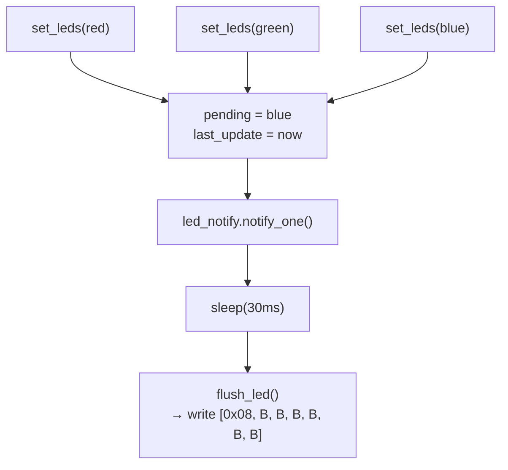
```mermaid
flowchart TB
    call1["set_leds(red)"]
    call2["set_leds(green)"]
    call3["set_leds(blue)"]
    pending["pending = blue\nlast_update = now"]
    notify["led_notify.notify_one()"]
    sleep["sleep(30ms)"]
    flush["flush_led()\n→ write [0x08, B, B, B, B, B, B]"]

    call1 --> pending
    call2 --> pending
    call3 --> pending
    pending --> notify --> sleep --> flush
```

LED command flow:

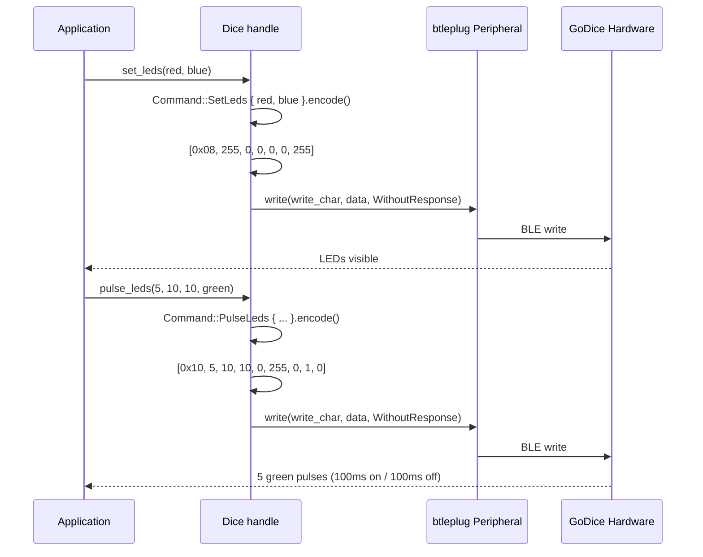
```mermaid
sequenceDiagram
    participant App as Application
    participant Dice as Dice handle
    participant BLE as btleplug Peripheral
    participant HW as GoDice Hardware

    App->>Dice: set_leds(red, blue)
    Dice->>Dice: Command::SetLeds { red, blue }.encode()
    Dice->>Dice: [0x08, 255, 0, 0, 0, 0, 255]
    Dice->>BLE: write(write_char, data, WithoutResponse)
    BLE->>HW: BLE write
    HW-->>App: LEDs visible

    App->>Dice: pulse_leds(5, 10, 10, green)
    Dice->>Dice: Command::PulseLeds { ... }.encode()
    Dice->>Dice: [0x10, 5, 10, 10, 0, 255, 0, 1, 0]
    Dice->>BLE: write(write_char, data, WithoutResponse)
    BLE->>HW: BLE write
    HW-->>App: 5 green pulses (100ms on / 100ms off)
```

##### Validation

All `LedColor` fields are `u8`, so values are inherently bounded to 0–255.
No additional clamping is needed. The `pulse_count`, `on_time`, and
`off_time` parameters are also `u8` and thus bounded.

The `Command::decode` method validates packet length and returns
`CommandError::InvalidLength` if the payload does not match the expected
size for the opcode. This is primarily used in tests to verify round-trip
encode/decode correctness.

##### Testing Strategy

Round-trip tests verify that `Command::encode()` followed by
`Command::decode()` produces the original command:

```rust
#[test]
fn set_leds_round_trip() {
    let led1 = LedColor::new(255, 128, 0);
    let led2 = LedColor::new(0, 64, 200);
    let command = Command::SetLeds { led1, led2 };
    let encoded = command.encode();
    assert_eq!(encoded, vec![0x08, 255, 128, 0, 0, 64, 200]);
    let decoded = Command::decode(&encoded).unwrap();
    assert_eq!(command, decoded);
}

#[test]
fn pulse_leds_round_trip() {
    let color = LedColor::new(0, 255, 0);
    let command = Command::PulseLeds {
        pulse_count: 5,
        on_time: 10,
        off_time: 10,
        color,
    };
    let encoded = command.encode();
    assert_eq!(encoded, vec![0x10, 5, 10, 10, 0, 255, 0, 1, 0]);
    let decoded = Command::decode(&encoded).unwrap();
    assert_eq!(command, decoded);
}

#[test]
fn led_color_constants() {
    assert!(LedColor::OFF.is_off());
    assert!(!LedColor::RED.is_off());
    assert_eq!(LedColor::from_hex(0xFF8800), LedColor::new(255, 136, 0));
    assert_eq!(LedColor::RED.to_string(), "#FF0000");
}

#[test]
fn decode_invalid_opcode() {
    let result = Command::decode(&[0xFF]);
    assert_eq!(result, Err(CommandError::UnknownOpcode { opcode: 0xFF, length: 1 }));
}
```

##### Types Defined in Phase 4

| Type             | File                  | Description                                         |
|------------------|-----------------------|-----------------------------------------------------|
| `LedColor`       | `model/led.rs`        | RGB color struct with constants and conversions     |
| `Command`        | `ble/command.rs`      | Command enum (SetLeds, PulseLeds, GetBatteryLevel, GetDiceColor) |
| `CommandError`   | `ble/command_error.rs`| Error type for command encode/decode                |

#### Phase 5 — System and Calibration

##### Calibration Protocol Investigation

Neither the official JavaScript API nor the Python API exposes a calibration
command. The `docs/GOAL.md` mentions sensor calibration as a Phase 5 feature,
but the exact byte encoding is unknown. Before implementation can begin, the
calibration protocol must be discovered through one or more of the following
methods:

```mermaid
flowchart TB
    start["Phase 5 Start"]
    investigate{"Calibration protocol investigation"}
    method1["1. Contact Particula support\nfor calibration command spec"]
    method2["2. Bluetooth packet sniffing\nwith Wireshark/nRF Connect\nwhile using GoDice app"]
    method3["3. Reverse-engineer GoDice\nmobile app (Android APK)"]
    method4["4. Experiment with candidate\nopcodes (e.g. 0x13, 0x14, 0x15)"]

    start --> investigate
    investigate --> method1
    investigate --> method2
    investigate --> method3
    investigate --> method4

    method1 --> found{"Protocol found?"}
    method2 --> found
    method3 --> found
    method4 --> found

    found -->|yes| implement["Implement calibration\ncommand + response"]
    found -->|no| defer["Defer calibration to\nfuture phase, document\nin Limitations"]
```

This investigation is the first task in Phase 5 (Gantt task `p5a`, 3 days).
If the protocol cannot be discovered, calibration is deferred and the
Limitations section is updated accordingly.

##### Calibration Command (Tentative)

Based on common BLE peripheral patterns and the GoDice command numbering
(opcodes 0x03, 0x08, 0x10, 0x17 are taken), calibration likely uses an
opcode in the `0x13`–`0x16` range. The tentative design assumes a
request-response pattern similar to battery level and dice color:

```rust
/// Calibration command to reset the sensor's zero position.
///
/// **WARNING**: The opcode and response format are tentative.
/// They must be confirmed via protocol investigation before implementation.
pub const CALIBRATION_OPCODE: u8 = 0x13; // TENTATIVE

/// Calibration response event prefix (tentative).
/// Could follow the "Cal" ASCII prefix pattern like "Bat" and "Col".
pub const CALIBRATION_RESPONSE_PREFIX: &[u8] = b"Cal"; // TENTATIVE
```

The `Command` enum is extended with a calibration variant:

```rust
pub enum Command {
    // ... existing variants ...
    /// Reset sensor calibration. TENTATIVE — opcode unconfirmed.
    Calibrate,
}

impl Command {
    pub fn encode(&self) -> Vec<u8> {
        match self {
            // ... existing ...
            Self::Calibrate => vec![CALIBRATION_OPCODE],
        }
    }
}
```

The `Event` enum is extended with a calibration response:

```rust
pub enum Event {
    // ... existing variants ...
    /// Calibration response (tentative format).
    /// Prefix "Cal" (0x43, 0x61, 0x6C) + status byte.
    Calibrated { success: bool },
}

impl Event {
    pub fn parse(data: &[u8]) -> Result<Self> {
        // ... existing parsing ...

        // Calibrated: prefix "Cal" (0x43, 0x61, 0x6C) + status byte
        // NOTE: This conflicts with DiceColor prefix "Col" (0x43, 0x6F, 0x6C).
        // The second byte distinguishes: 0x61 ('a') for Cal vs 0x6F ('o') for Col.
        if data.len() >= 4 && data[0] == 0x43 && data[1] == 0x61 && data[2] == 0x6C {
            return Ok(Self::Calibrated { success: data[3] != 0 });
        }

        // ... rest of parsing ...
    }
}
```

##### Calibration API

```rust
impl Dice {
    /// Trigger sensor calibration.
    ///
    /// The dice should be placed on a flat, stable surface before calling
    /// this method. The sensor zero position is reset based on the current
    /// orientation.
    ///
    /// Sends the calibration command and waits for the response event.
    /// Returns `Ok(())` on success, `Err(Error::CalibrationFailed)` on failure.
    ///
    /// **WARNING**: Command opcode and response format are tentative.
    pub async fn calibrate(&self) -> Result<()> {
        let (tx, rx) = tokio::sync::oneshot::channel();
        self.inner.pending_calibration.lock().map_err(|_| Error::LockPoisoned)?.push_back(tx);
        self.transport
            .write(&self.write_char, &[CALIBRATION_OPCODE], WriteType::WithoutResponse)
            .await?;
        let timeout = Duration::from_secs(RESPONSE_TIMEOUT_SECS);
        let success = tokio::time::timeout(timeout, rx.await)
            .await
            .map_err(|_| Error::ResponseTimeout(timeout))?
            .map_err(|_| Error::ResponseTimeout(timeout))?;
        if success {
            Ok(())
        } else {
            Err(Error::CalibrationFailed)
        }
    }

    /// Software-based calibration fallback.
    ///
    /// If the firmware does not support hardware calibration via BLE
    /// (opcode `0x13` is unconfirmed), this method provides a pure
    /// software alternative. The user places the dice on a flat,
    /// stable surface, then calls this method.
    ///
    /// The library captures the next `Stable` event's accelerometer
    /// reading and computes an `AccelerationOffset` — the deviation
    /// from the expected ideal gravity vector. All subsequent
    /// accelerometer readings have this offset subtracted before
    /// face value interpretation.
    ///
    /// Returns the computed offset for inspection/logging.
    pub async fn calibrate_software(&self) -> Result<AccelerationOffset> {
        let mut receiver = self.subscribe();
        // Wait for the next Stable event with accelerometer data.
        loop {
            match receiver.recv().await {
                Ok(DiceEvent::Stable { acceleration, .. })
                | Ok(DiceEvent::FakeStable { acceleration, .. })
                | Ok(DiceEvent::TiltStable { acceleration, .. })
                | Ok(DiceEvent::MoveStable { acceleration, .. }) => {
                    let dice_type = DiceType::try_from(
                        self.inner.dice_type.load(Ordering::Relaxed)
                    ).unwrap_or(DiceType::D6);
                    let offset = AccelerationOffset::from_measured(acceleration, dice_type);
                    *self.inner.calibration_offset.write().map_err(|_| Error::LockPoisoned)? = Some(offset);
                    return Ok(offset);
                }
                Ok(DiceEvent::RollStart) => {
                    // Ignore roll events — wait for a stable reading.
                }
                Ok(DiceEvent::Disconnected) => {
                    return Err(Error::ConnectionLost);
                }
                Err(broadcast::error::RecvError::Lagged(_)) => {
                    // Catch up — keep waiting for a stable event.
                }
                Err(broadcast::error::RecvError::Closed) => {
                    return Err(Error::ConnectionLost);
                }
            }
        }
    }

    /// Clear any previously set software calibration offset.
    pub fn clear_software_calibration(&self) -> Result<()> {
        *self.inner.calibration_offset.write().map_err(|_| Error::LockPoisoned)? = None;
        Ok(())
    }
}
```

Calibration flow:

```mermaid
sequenceDiagram
    participant App as Application
    participant Dice as Dice handle
    participant BLE as btleplug Peripheral
    participant HW as GoDice Hardware

    Note over App: Place dice on flat surface

    App->>Dice: calibrate()
    Dice->>Dice: enqueue pending oneshot::Sender
    Dice->>BLE: write [0x13] (TENTATIVE)
    BLE->>HW: calibration command

    HW-->>BLE: notification [0x43, 0x61, 0x6C, 0x01] (TENTATIVE)
    BLE-->>Dice: Event::Calibrated { success: true }
    Dice->>Dice: match pending sender
    Dice-->>App: Ok(())

    Note over App,HM: If success=0:
    HW-->>BLE: notification [0x43, 0x61, 0x6C, 0x00]
    BLE-->>Dice: Event::Calibrated { success: false }
    Dice-->>App: Err(Error::CalibrationFailed)
```

Software calibration flow (fallback when firmware does not support BLE calibration):

```mermaid
sequenceDiagram
    participant App as Application
    participant Dice as Dice handle
    participant Task as Notification Task

    Note over App: Place dice on flat surface

    App->>Dice: calibrate_software()
    Dice->>Dice: subscribe() → receiver
    Dice->>Dice: loop: receiver.recv().await

    Note over App: User rolls / taps dice to generate a Stable event

    Task->>Task: Event::Stable { accel }
    Task->>Task: interpret(accel, type, offset=None)
    Task-->>Dice: DiceEvent::Stable { face, acceleration }

    Dice->>Dice: AccelerationOffset::from_measured(accel, dice_type)
    Dice->>Dice: calibration_offset = Some(offset)
    Dice-->>App: Ok(AccelerationOffset { dx, dy, dz })

    Note over App,Task: Subsequent events:
    Task->>Task: interpret(accel, type, offset=Some(...))
    Note over Task: Offset subtracted before distance calculation
```

##### System Information API

Phase 5 also consolidates system-level queries that were partially
implemented in earlier phases. The `Dice` handle gains convenience methods
that were previously scattered:

```rust
impl Dice {
    /// Get the dice color. Sends command `0x17`, waits for `Col` event.
    /// Returns the physical color of the dice.
    pub async fn get_color(&self) -> Result<DieColor> {
        let (tx, rx) = tokio::sync::oneshot::channel();
        self.inner.pending_color.lock().map_err(|_| Error::LockPoisoned)?.push_back(tx);
        self.transport
            .write(&self.write_char, &[0x17], WriteType::WithoutResponse)
            .await?;
        let timeout = Duration::from_secs(RESPONSE_TIMEOUT_SECS);
        tokio::time::timeout(timeout, rx.await)
            .await
            .map_err(|_| Error::ResponseTimeout(timeout))?
            .map_err(|_| Error::ResponseTimeout(timeout))
    }

    /// Get the battery level. Sends command `0x03`, waits for `Bat` event.
    /// Returns level as percentage (0–100).
    pub async fn get_battery_level(&self) -> Result<u8> {
        let (tx, rx) = tokio::sync::oneshot::channel();
        self.inner.pending_battery.lock().map_err(|_| Error::LockPoisoned)?.push_back(tx);
        self.transport
            .write(&self.write_char, &[0x03], WriteType::WithoutResponse)
            .await?;
        let timeout = Duration::from_secs(RESPONSE_TIMEOUT_SECS);
        tokio::time::timeout(timeout, rx.await)
            .await
            .map_err(|_| Error::ResponseTimeout(timeout))?
            .map_err(|_| Error::ResponseTimeout(timeout))
    }

    /// Get comprehensive system status in a single call.
    /// Performs battery level and color queries concurrently.
    pub async fn system_status(&self) -> Result<SystemStatus> {
        let (battery, color) = tokio::try_join!(
            self.get_battery_level(),
            self.get_color(),
        )?;
        Ok(SystemStatus {
            battery_level: battery,
            color,
            connected: self.is_connected().await?,
            rssi: self.rssi().await?,
        })
    }
}
```

##### SystemStatus Type

```rust
/// Aggregated system status of a connected GoDice.
#[derive(Debug, Clone, PartialEq)]
pub struct SystemStatus {
    /// Battery level (0–100 percent).
    pub battery_level: u8,
    /// Physical dice color.
    pub color: DieColor,
    /// Current connection state.
    pub connected: bool,
    /// Received signal strength indicator (if available).
    pub rssi: Option<i16>,
}
```

##### Error Extensions

The `DiceError` enum is extended with calibration-specific errors:

```rust
/// Errors that can occur when interacting with a GoDice.
#[derive(Debug, Clone, PartialEq, thiserror::Error)]
pub enum DiceError {
    // ... existing errors (ConnectionFailed, WriteFailed, etc.) ...

    /// A mutex lock was poisoned by a panicking thread.
    #[error("lock poisoned")]
    LockPoisoned,

    /// Calibration command failed. The dice reported a calibration error.
    #[error("calibration failed")]
    CalibrationFailed,

    /// The calibration protocol is not yet implemented.
    /// The opcode has not been confirmed.
    #[error("calibration protocol not yet confirmed")]
    CalibrationNotConfirmed,

    /// A request-response query timed out before the dice responded.
    #[error("response timeout: no reply within {0:?}")]
    ResponseTimeout(Duration),

    /// The BLE connection was lost during an operation.
    #[error("connection lost")]
    ConnectionLost,

    /// An invalid dice type byte was encountered (e.g. from AtomicU8).
    #[error("invalid dice type byte: {0}")]
    InvalidDiceType(u8),
}
```

##### Firmware Version Query

The official APIs do not expose a firmware version command. If the protocol
investigation discovers one, it will be added as:

```rust
impl Dice {
    /// Request firmware version. TENTATIVE — opcode unconfirmed.
    pub async fn get_firmware_version(&self) -> Result<FirmwareVersion>;
}

/// Firmware version information.
#[derive(Debug, Clone, PartialEq)]
pub struct FirmwareVersion {
    pub major: u8,
    pub minor: u8,
    pub patch: u8,
}
```

This is listed as a **stretch goal** within Phase 5 — it will only be
implemented if the protocol investigation yields the command encoding.

##### Connection State Monitoring

Phase 5 also adds proactive connection state monitoring. The notification
task (from Phase 2) already sends `DiceEvent::Disconnected` when the
notification stream ends. Phase 5 adds a periodic connection health check:

```rust
/// Spawns a background task that periodically checks connection state
/// and emits DiceEvent::Disconnected if the BLE link is lost.
fn spawn_connection_monitor(
    dice: Dice,
    interval: Duration,
    event_sender: broadcast::Sender<DiceEvent>,
) -> JoinHandle<()> {
    tokio::spawn(async move {
        let mut ticker = tokio::time::interval(interval);
        loop {
            ticker.tick().await;
            match dice.is_connected().await {
                Ok(true) => {}
                Ok(false) | Err(_) => {
                    if event_sender.send(DiceEvent::Disconnected).is_err() {
                        debug!("no subscribers for Disconnected event");
                    }
                    break;
                }
            }
        }
    })
}
```

```mermaid
flowchart LR
    monitor["Connection Monitor\n(every 5s)"]
    check["dice.is_connected()"]
    connected{"connected?"}
  continue["continue monitoring"]
  disconnect["broadcast::send\n(DiceEvent::Disconnected)"]

    monitor --> check --> connected
    connected -->|yes| continue --> check
    connected -->|no| disconnect
```

##### Testing Strategy

Since the calibration protocol is unconfirmed, tests are structured to be
protocol-agnostic:

```rust
#[test]
fn calibration_command_encodes_opcode() {
    let command = Command::Calibrate;
    let encoded = command.encode();
    assert_eq!(encoded, vec![CALIBRATION_OPCODE]);
}

#[test]
fn calibrated_event_parses_success() {
    // TENTATIVE format: "Cal" + status byte
    let data = [0x43, 0x61, 0x6C, 0x01];
    let event = Event::parse(&data).unwrap();
    assert_eq!(event, Event::Calibrated { success: true });
}

#[test]
fn calibrated_event_parses_failure() {
    let data = [0x43, 0x61, 0x6C, 0x00];
    let event = Event::parse(&data).unwrap();
    assert_eq!(event, Event::Calibrated { success: false });
}

#[test]
fn calibrated_event_distinguishes_from_dice_color() {
    // DiceColor: "Col" = [0x43, 0x6F, 0x6C, color]
    // Calibrated: "Cal" = [0x43, 0x61, 0x6C, status]
    // Second byte: 0x6F ('o') vs 0x61 ('a')
    let color_data = [0x43, 0x6F, 0x6C, 2];
    let cal_data = [0x43, 0x61, 0x6C, 1];

    assert!(matches!(Event::parse(&color_data), Ok(Event::DiceColor { .. })));
    assert!(matches!(Event::parse(&cal_data), Ok(Event::Calibrated { .. })));
}

#[test]
fn acceleration_offset_from_measured_d6() {
    // D6 resting on face 1: expected vector ~[0, 0, 64]
    // Simulated reading with slight drift: [2, -1, 63]
    let acceleration = Acceleration { x: 2, y: -1, z: 63 };
    let offset = AccelerationOffset::from_measured(acceleration, DiceType::D6);
    assert_eq!(offset, AccelerationOffset { dx: 2, dy: -1, dz: -1 });
}

#[test]
fn acceleration_offset_apply_corrects_drift() {
    let offset = AccelerationOffset { dx: 2, dy: -1, dz: -1 };
    let acceleration = Acceleration { x: 2, y: -1, z: 63 };
    let corrected = offset.apply(acceleration);
    assert_eq!(corrected, Acceleration { x: 0, y: 0, z: 64 });
}

#[test]
fn acceleration_offset_apply_saturates() {
    let offset = AccelerationOffset { dx: 100, dy: -100, dz: 0 };
    let acceleration = Acceleration { x: 1, y: -1, z: 50 };
    let corrected = offset.apply(acceleration);
    // i8::MIN = -128, i8::MAX = 127 — saturating_sub clamps
    assert_eq!(corrected.x, i8::MIN);
    assert_eq!(corrected.y, 99);
    assert_eq!(corrected.z, 50);
}

#[test]
fn interpret_with_offset_corrects_face_value() {
    // Without offset: drifted reading [2, -1, 63] might still match face 1
    // With offset: corrected to [0, 0, 64] — exact match to D6 vector
    let offset = Some(AccelerationOffset { dx: 2, dy: -1, dz: -1 });
    let acceleration = Acceleration { x: 2, y: -1, z: 63 };
    let face = interpret(acceleration, DiceType::D6, offset);
    assert_eq!(face, FaceValue::new(1).unwrap());
}

#[test]
fn system_status_concurrent_queries() {
    // Mock transport returns battery=75, color=Green
    let status = dice.system_status().await.unwrap();
    assert_eq!(status.battery_level, 75);
    assert_eq!(status.color, DieColor::Green);
    assert!(status.connected);
}
```

##### Types Defined in Phase 5

| Type              | File                  | Description                                          |
|-------------------|-----------------------|------------------------------------------------------|
| `SystemStatus`    | `model/system_status.rs` | Aggregated status (battery, color, connected, RSSI) |
| `FirmwareVersion` | `model/firmware_version.rs` | Firmware version (stretch goal, if protocol found) |
| `AccelerationOffset` | `model/acceleration_offset.rs` | Software calibration offset (dx, dy, dz) |
| `Command::Calibrate` | `ble/command.rs`  | Calibration command variant (tentative opcode)       |
| `Event::Calibrated` | `ble/event.rs`     | Calibration response event variant (tentative)       |
| `DiceError` extensions | `error.rs`     | `CalibrationFailed`, `CalibrationNotConfirmed`, `ResponseTimeout`, `ConnectionLost` |

#### Phase 6 — CLI Tool

##### Crate Structure

The `dice-rs-cli` crate is a thin wrapper around the `dice-rs` library. It
contains no business logic — all BLE operations are delegated to the library.
The CLI crate only handles argument parsing, output formatting, and
user interaction.

Table rendering uses the [`tabled`](https://docs.rs/crate/tabled/latest)
crate, which provides derive-based table formatting from structs and enums.

```
dice-rs-cli/
├── Cargo.toml
└── src/
    ├── main.rs              # Entry point, dispatch only
    ├── cli.rs               # Cli struct (clap Parser)
    ├── command.rs           # Command enum (subcommands)
    ├── output_format.rs     # OutputFormat enum
    ├── led_action.rs        # LedAction enum
    ├── cli_error.rs         # CliError enum
    ├── output.rs            # Output formatting functions (JSON, plain)
    ├── device_row.rs        # DeviceRow struct (tabled)
    ├── status_row.rs        # StatusRow struct (tabled)
    ├── battery_row.rs       # BatteryRow struct (tabled)
    └── interactive.rs       # Interactive mode (REPL-style)
```

##### Clap Command Structure

```rust
use clap::{Parser, Subcommand};

/// Command-line tool for GoDice BLE dice.
#[derive(Parser, Debug)]
#[command(name = "dice-rs", version, about = "Control GoDice BLE dice from the command line")]
pub struct Cli {
    /// Output format: table, json, or plain
    #[arg(short, long, global = true, default_value = "table")]
    pub format: OutputFormat,

    /// Verbosity level (-v info, -vv debug, -vvv trace)
    #[arg(short, long, global = true, action = clap::ArgAction::Count)]
    pub verbose: u8,

    #[command(subcommand)]
    pub command: Command,
}

/// Output format options.
#[derive(Debug, Clone, Copy, PartialEq, Eq, clap::ValueEnum)]
pub enum OutputFormat {
    /// Human-readable table format (default).
    Table,
    /// JSON output for scripting and piping.
    Json,
    /// Plain text, minimal formatting.
    Plain,
}

#[derive(Subcommand, Debug)]
pub enum Command {
    /// Scan for GoDice devices in range.
    Scan {
        /// Scan duration in seconds.
        #[arg(short, long, default_value = "5")]
        duration: u64,
    },

    /// Connect to a GoDice device and listen for events.
    Listen {
        /// Device address (MAC) from scan results.
        address: String,

        /// Dice type for face value interpretation.
        #[arg(short, long, default_value = "d6")]
        dice_type: String,
    },

    /// Query battery level of a connected dice.
    Battery {
        /// Device address (MAC).
        address: String,
    },

    /// Control LEDs on a connected dice.
    Led {
        /// Device address (MAC).
        address: String,

        #[command(subcommand)]
        action: LedAction,
    },

    /// Calibrate the sensor of a connected dice.
    Calibrate {
        /// Device address (MAC).
        address: String,
    },

    /// Show comprehensive system status of a connected dice.
    Status {
        /// Device address (MAC).
        address: String,
    },

    /// Get the dice color.
    Color {
        /// Device address (MAC).
        address: String,
    },

    /// Interactive REPL mode — scan, connect, and issue commands interactively.
    Interactive,
}

#[derive(Subcommand, Debug)]
pub enum LedAction {
    /// Set both LEDs to a color.
    Set {
        /// Color as hex (e.g. FF0000) or named (red, green, blue, white, off).
        color: String,
    },

    /// Set each LED independently.
    SetDual {
        /// LED 1 color.
        led1: String,
        /// LED 2 color.
        led2: String,
    },

    /// Pulse both LEDs.
    Pulse {
        /// Color as hex or named.
        color: String,
        /// Number of pulse cycles.
        #[arg(short, long, default_value = "3")]
        count: u8,
        /// On time in 10ms units.
        #[arg(short, long, default_value = "10")]
        on_time: u8,
        /// Off time in 10ms units.
        #[arg(long, default_value = "10")]
        off_time: u8,
    },

    /// Turn both LEDs off.
    Off,
}
```

Command hierarchy:

```mermaid
flowchart TB
    cli["dice-rs [--format] [--verbose]"]
    scan["scan [--duration]"]
    listen["listen <address> [--dice-type]"]
    battery["battery <address>"]
    led["led <address> <action>"]
    calibrate["calibrate <address>"]
    status["status <address>"]
    color["color <address>"]
    interactive["interactive"]

    ledSet["set <color>"]
    ledSetDual["set-dual <led1> <led2>"]
    ledPulse["pulse <color> [-c] [-o] [--off-time]"]
    ledOff["off"]

    cli --> scan
    cli --> listen
    cli --> battery
    cli --> led
    cli --> calibrate
    cli --> status
    cli --> color
    cli --> interactive

    led --> ledSet
    led --> ledSetDual
    led --> ledPulse
    led --> ledOff
```

##### Subcommand Implementations

**Scan** — discovers GoDice devices and prints them in the selected format.

The `tabled` crate renders device tables via `Tabled` derive:

```rust
use tabled::Tabled;

/// A row in the scan results table.
#[derive(Tabled)]
struct DeviceRow {
    address: String,
    name: String,
    rssi: String,
}

impl From<&DiceDevice> for DeviceRow {
    fn from(device: &DiceDevice) -> Self {
        Self {
            address: device.address.to_string(),
            name: device.name.clone(),
            rssi: device.rssi.map(|r| format!("{r} dBm")).unwrap_or_else(|| "N/A".into()),
        }
    }
}

async fn run_scan(manager: &DiceManager, duration: u64, format: OutputFormat) -> Result<()> {
    let scanner = manager.scanner().with_scan_duration(Duration::from_secs(duration));
    let devices = scanner.scan().await?;

    match format {
        OutputFormat::Table => {
            let rows: Vec<DeviceRow> = devices.iter().map(DeviceRow::from).collect();
            let table = tabled::Table::new(&rows)
                .with(tabled::settings::Style::rounded())
                .to_string();
            println!("{table}");
        }
        OutputFormat::Json => print_device_json(&devices),
        OutputFormat::Plain => print_device_plain(&devices),
    }
    Ok(())
}
```

Example output:

```
$ dice-rs scan --duration 5
╭───────────┬──────────────────┬──────────╮
│ address   │ name             │ rssi     │
├───────────┼──────────────────┼──────────┤
│ AA:BB:CC  │ GoDice_001234    │ -42 dBm  │
│ DD:EE:FF  │ GoDice_005678    │ -55 dBm  │
╰───────────┴──────────────────┴──────────╯

$ dice-rs scan --format json
[{"address":"AA:BB:CC","name":"GoDice_001234","rssi":-42},...]
```

**Listen** — connects to a dice and streams events until interrupted:

```rust
async fn run_listen(
    manager: &DiceManager,
    address: &str,
    dice_type: &str,
    format: OutputFormat,
) -> Result<()> {
    let device = find_device_by_address(manager, address).await?;
    let dice = manager.connect(&device).await?;
    dice.set_dice_type(parse_dice_type(dice_type)?);

    let mut events = dice.subscribe();
    println!("Listening for events from {address} (Ctrl+C to stop)...");

    loop {
        tokio::select! {
            event = events.recv() => {
                match event {
                    Ok(DiceEvent::RollStart) => print_event("rolling", format),
                    Ok(DiceEvent::Stable { face, .. }) => {
                        print_event(&format!("stable face={face}"), format);
                    }
                    Ok(DiceEvent::TiltStable { face, .. }) => {
                        print_event(&format!("tilt-stable face={face}"), format);
                    }
                    Ok(DiceEvent::FakeStable { face, .. }) => {
                        print_event(&format!("fake-stable face={face}"), format);
                    }
                    Ok(DiceEvent::MoveStable { face, .. }) => {
                        print_event(&format!("move-stable face={face}"), format);
                    }
                    Ok(DiceEvent::Disconnected) => {
                        print_event("disconnected", format);
                        break;
                    }
                    Err(broadcast::error::RecvError::Lagged(n)) => {
                        debug!("missed {n} events");
                    }
                    Err(broadcast::error::RecvError::Closed) => break,
                }
            }
            _ = tokio::signal::ctrl_c() => {
                println!("\nStopping...");
                break;
            }
        }
    }

    dice.disconnect().await?;
    Ok(())
}
```

Example output:

```
$ dice-rs listen AA:BB:CC --dice-type d6
Listening for events from AA:BB:CC (Ctrl+C to stop)...
[12:34:56] rolling
[12:34:57] stable face=6
[12:35:10] rolling
[12:35:11] stable face=3
```

**LED** — sets or pulses LEDs:

```rust
async fn run_led(
    manager: &DiceManager,
    address: &str,
    action: LedAction,
) -> Result<()> {
    let device = find_device_by_address(manager, address).await?;
    let dice = manager.connect(&device).await?;

    match action {
        LedAction::Set { color } => {
            let color = parse_color(&color)?;
            dice.set_led(color).await?;
            println!("LEDs set to {color}");
        }
        LedAction::SetDual { led1, led2 } => {
            let led1 = parse_color(&led1)?;
            let led2 = parse_color(&led2)?;
            dice.set_leds(led1, led2).await?;
            println!("LED 1: {led1}, LED 2: {led2}");
        }
        LedAction::Pulse { color, count, on_time, off_time } => {
            let color = parse_color(&color)?;
            dice.pulse_leds(count, on_time, off_time, color).await?;
            println!("Pulsing {color} x{count} ({on_time}0ms on / {off_time}0ms off)");
        }
        LedAction::Off => {
            dice.turn_off_leds().await?;
            println!("LEDs off");
        }
    }

    dice.disconnect().await?;
    Ok(())
}
```

**Color parsing** — supports named colors and hex values:

```rust
/// Parse a color string: named ("red", "green", ...) or hex ("FF0000", "0xFF0000").
fn parse_color(input: &str) -> Result<LedColor> {
    let normalized = input.to_lowercase();
    let color = match normalized.as_str() {
        "off" | "black" => LedColor::OFF,
        "red" => LedColor::RED,
        "green" => LedColor::GREEN,
        "blue" => LedColor::BLUE,
        "white" => LedColor::WHITE,
        hex => {
            let hex = hex.strip_prefix("0x").unwrap_or(hex);
            let value = u32::from_str_radix(hex, 16)
                .map_err(|_| CliError::InvalidColor(input.to_string()))?;
            LedColor::from_hex(value)
        }
    };
    Ok(color)
}
```

**Battery / Status / Color / Calibrate** — query commands:

```rust
async fn run_battery(manager: &DiceManager, address: &str, format: OutputFormat) -> Result<()> {
    let dice = connect_by_address(manager, address).await?;
    let level = dice.get_battery_level().await?;
    match format {
        OutputFormat::Table => {
            #[derive(Tabled)]
            struct BatteryRow {
                battery: String,
            }
            let row = BatteryRow { battery: format!("{level}%") };
            let table = tabled::Table::new(vec![row])
                .with(tabled::settings::Style::rounded())
                .to_string();
            println!("{table}");
        }
        OutputFormat::Json => println!(r#"{{"battery_level":{level}}}"#),
        OutputFormat::Plain => println!("{level}%"),
    }
    dice.disconnect().await?;
    Ok(())
}

async fn run_status(manager: &DiceManager, address: &str, format: OutputFormat) -> Result<()> {
    let dice = connect_by_address(manager, address).await?;
    let status = dice.system_status().await?;
    match format {
        OutputFormat::Table => {
            #[derive(Tabled)]
            struct StatusRow {
                property: String,
                value: String,
            }
            let rows = vec![
                StatusRow { property: "Battery".into(), value: format!("{}%", status.battery_level) },
                StatusRow { property: "Color".into(), value: format!("{:?}", status.color) },
                StatusRow { property: "Connected".into(), value: format!("{}", status.connected) },
                StatusRow { property: "RSSI".into(), value: status.rssi.map(|r| format!("{r} dBm")).unwrap_or_else(|| "N/A".into()) },
            ];
            let table = tabled::Table::new(rows)
                .with(tabled::settings::Style::rounded())
                .to_string();
            println!("{table}");
        }
        OutputFormat::Json => print_status_json(&status),
        OutputFormat::Plain => print_status_plain(&status),
    }
    dice.disconnect().await?;
    Ok(())
}

async fn run_calibrate(manager: &DiceManager, address: &str) -> Result<()> {
    let dice = connect_by_address(manager, address).await?;
    println!("Place the dice on a flat surface and press Enter to calibrate...");
    tokio::io::stdin().read_line(&mut String::new()).await?;
    dice.calibrate().await?;
    println!("Calibration complete.");
    dice.disconnect().await?;
    Ok(())
}
```

**Interactive** — REPL mode for exploratory use:

```rust
async fn run_interactive(manager: &DiceManager) -> Result<()> {
    println!("dice-rs interactive mode. Type 'help' for commands, 'quit' to exit.");

    let mut dice: Option<Dice> = None;
    let mut input = String::new();

    loop {
        input.clear();
        print!("dice-rs> ");
        io::stdout().flush().ok();
        tokio::io::stdin().read_line(&mut input).await?;

        let input = input.trim();
        match input {
            "help" => print_interactive_help(),
            "quit" | "exit" => break,
            "scan" => {
                let devices = manager.scan().await?;
                let rows: Vec<DeviceRow> = devices.iter().map(DeviceRow::from).collect();
                let table = tabled::Table::new(&rows)
                    .with(tabled::settings::Style::rounded())
                    .to_string();
                println!("{table}");
            }
            cmd if cmd.starts_with("connect ") => {
                let address = cmd.strip_prefix("connect ").unwrap_or(cmd);
                let device = find_device_by_address(manager, address).await?;
                dice = Some(manager.connect(&device).await?);
                println!("Connected to {address}");
            }
            "disconnect" => {
                if let Some(d) = dice.take() {
                    d.disconnect().await?;
                    println!("Disconnected");
                }
            }
            "battery" => {
                if let Some(d) = &dice {
                    let level = d.get_battery_level().await?;
                    println!("Battery: {level}%");
                }
            }
            "color" => {
                if let Some(d) = &dice {
                    let color = d.get_color().await?;
                    println!("Color: {color:?}");
                }
            }
            cmd if cmd.starts_with("led ") => {
                if let Some(d) = &dice {
                    let color_str = cmd.strip_prefix("led ").unwrap_or(cmd);
                    let color = parse_color(color_str)?;
                    d.set_led(color).await?;
                    println!("LEDs set to {color}");
                }
            }
            "status" => {
                if let Some(d) = &dice {
                    let status = d.system_status().await?;
                    let rows = vec![
                        StatusRow { property: "Battery".into(), value: format!("{}%", status.battery_level) },
                        StatusRow { property: "Color".into(), value: format!("{:?}", status.color) },
                        StatusRow { property: "Connected".into(), value: format!("{}", status.connected) },
                        StatusRow { property: "RSSI".into(), value: status.rssi.map(|r| format!("{r} dBm")).unwrap_or_else(|| "N/A".into()) },
                    ];
                    let table = tabled::Table::new(rows)
                        .with(tabled::settings::Style::rounded())
                        .to_string();
                    println!("{table}");
                }
            }
            "calibrate" => {
                if let Some(d) = &dice {
                    d.calibrate().await?;
                    println!("Calibration complete");
                }
            }
            _ => println!("Unknown command. Type 'help' for available commands."),
        }
    }

    if let Some(d) = dice.take() {
        d.disconnect().await?;
    }
    Ok(())
}
```

##### CLI Error Type

```rust
/// Errors specific to the CLI tool.
#[derive(Debug, thiserror::Error)]
pub enum CliError {
    /// Device with the given address was not found in scan results.
    #[error("device not found: {0}")]
    DeviceNotFound(String),

    /// Invalid color string.
    #[error("invalid color: {0} (expected named color or hex like FF0000)")]
    InvalidColor(String),

    /// Invalid dice type string.
    #[error("invalid dice type: {0} (expected d6, d20, d10, d10x, d4, d8, or d12)")]
    InvalidDiceType(String),

    /// No dice connected for a command that requires one.
    #[error("no dice connected — use 'connect' first")]
    NotConnected,

    /// Underlying library error.
    #[error(transparent)]
    Dice(#[from] dice_rs::DiceError),
}
```

##### Logging

Verbosity is controlled by the global `--verbose` flag:

```rust
fn init_logging(verbose: u8) {
    let level = match verbose {
        0 => tracing::Level::WARN,
        1 => tracing::Level::INFO,
        2 => tracing::Level::DEBUG,
        _ => tracing::Level::TRACE,
    };
    tracing_subscriber::fmt()
        .with_max_level(level)
        .with_target(false)
        .init();
}
```

##### Testing Strategy

CLI tests use `assert_cmd` to run the binary as a subprocess and verify
output. For commands requiring a physical dice, tests are marked
`#[ignore]` and run only with `--ignored` when hardware is available.

```rust
#[test]
fn scan_help() {
    let mut cmd = Command::cargo_bin("dice-rs").unwrap();
    cmd.arg("scan").arg("--help");
    cmd.assert()
        .success()
        .stdout(predicates::str::contains("Scan for GoDice devices"));
}

#[test]
fn led_set_help() {
    let mut cmd = Command::cargo_bin("dice-rs").unwrap();
    cmd.arg("led").arg("AA:BB:CC").arg("set").arg("--help");
    cmd.assert()
        .success()
        .stdout(predicates::str::contains("Set both LEDs"));
}

#[test]
fn parse_color_named() {
    assert_eq!(parse_color("red").unwrap(), LedColor::RED);
    assert_eq!(parse_color("OFF").unwrap(), LedColor::OFF);
}

#[test]
fn parse_color_hex() {
    assert_eq!(parse_color("FF0000").unwrap(), LedColor::RED);
    assert_eq!(parse_color("0x00FF00").unwrap(), LedColor::GREEN);
}

#[test]
fn parse_color_invalid() {
    assert!(parse_color("xyz").is_err());
}

#[test]
#[ignore = "requires physical GoDice hardware"]
fn scan_finds_device() {
    let mut cmd = Command::cargo_bin("dice-rs").unwrap();
    cmd.arg("scan").arg("--duration").arg("10");
    cmd.assert()
        .success()
        .stdout(predicates::str::contains("GoDice_"));
}
```

##### Types Defined in Phase 6

| Type            | File                    | Description                                         |
|-----------------|-------------------------|-----------------------------------------------------|
| `Cli`           | `cli.rs`                | Top-level clap struct with global flags             |
| `Command`       | `command.rs`            | Subcommand enum (scan, listen, battery, led, ...)   |
| `OutputFormat`  | `output_format.rs`      | Output format enum (Table, Json, Plain)             |
| `LedAction`     | `led_action.rs`         | LED subcommand enum (Set, SetDual, Pulse, Off)      |
| `CliError`      | `cli_error.rs`          | CLI-specific error type                             |
| `DeviceRow`     | `device_row.rs`         | `tabled::Tabled` row for scan results                |
| `StatusRow`     | `status_row.rs`         | `tabled::Tabled` row for system status               |
| `BatteryRow`    | `battery_row.rs`        | `tabled::Tabled` row for battery level               |

#### Phase 7 — GTK 4 Controller

##### Crate Structure

The `dice-rs-controller` crate is a graphical desktop application for
controlling GoDice devices. It uses GTK 4 via the
[`gtk4-rs`](https://gtk-rs.org/gtk4-rs/) bindings.

3D dice rendering uses `gtk4::GLArea` (which provides an OpenGL context
managed by GTK) with the [`glow`](https://github.com/grovesNL/glow) crate
as a safe OpenGL wrapper. This is the simplest and most reliable approach
for embedding GPU-accelerated 3D rendering inside a GTK 4 widget — `glow`
wraps the GL function pointers from the `GLArea`'s context and provides
type-safe OpenGL ES 3.0 calls.

An alternative approach is [`wgpu`](https://wgpu.rs/) via an external GLES
adapter bound to the `GLArea` framebuffer. This provides a modern,
cross-platform GPU API but requires `unsafe` code to bridge the
`GLArea`'s GL context into wgpu's HAL (`wgpu::hal::gles::Adapter::new_external`).
This integration is not yet stabilized (see
[wgpu#7581](https://github.com/gfx-rs/wgpu/issues/7581)). If wgpu matures
its external framebuffer support, the rendering backend can be swapped
without changing the `Dice3D` widget's public API.

```
dice-rs-controller/
├── Cargo.toml
├── resources/
│   ├── style.css           # Application CSS
│   ├── dice_d6.obj         # D6 3D model
│   ├── dice_d20.obj        # D20 3D model
│   └── ui/
│       ├── window.ui       # Main window template
│       ├── dice_row.ui     # Dice list row template
│       └── face_display.ui # Face value display template
└── src/
    ├── main.rs             # Entry point, Application init
    ├── application.rs      # Application struct (gtk4::Application)
    ├── window.rs           # MainWindow struct
    ├── dice_row.rs         # DiceRow widget (list row for a dice)
    ├── face_display.rs     # FaceDisplay widget (shows current face)
    ├── dice_3d.rs          # Dice3D widget (glow + GLArea + glam 3D rendering)
    ├── dice_renderer.rs    # DiceRenderer (shaders, buffers, MVP matrix)
    ├── dice_model.rs       # DiceModel (OBJ loading, vertex/normals data)
    ├── led_controls.rs     # LedControls widget (color picker + buttons)
    ├── battery_indicator.rs # BatteryIndicator widget (progress bar)
    ├── scan_dialog.rs      # ScanDialog (device discovery)
    └── event_controller.rs # EventController (tokio → GTK main loop bridge)
```

##### Application Architecture

The application follows the GTK 4 composite template pattern. Each custom
widget is defined in its own file with a corresponding `.ui` template file.

```mermaid
flowchart TB
    app["Application\n(gtk4::Application)"]
    window["MainWindow"]
    scanDialog["ScanDialog\n(device discovery)"]
    listBox["gtk4::ListBox\n(dice list)"]
    diceRow["DiceRow\n(per connected dice)"]
    faceDisplay["FaceDisplay\n(current face value)"]
    dice3d["Dice3D\n(glow + GLArea + glam)"]
    ledControls["LedControls\n(color picker)"]
    batteryIndicator["BatteryIndicator\n(progress bar)"]
    eventController["EventController\n(tokio → GTK bridge)"]

    app --> window
    window --> scanDialog
    window --> listBox
    listBox --> diceRow
    diceRow --> faceDisplay
    diceRow --> dice3d
    diceRow --> ledControls
    diceRow --> batteryIndicator
    diceRow --> eventController
```

##### Application Struct

```rust
use gtk4::prelude::*;
use gtk4::subclass::prelude::*;

/// The GTK application for the dice-rs controller.
pub struct Application {
    manager: Arc<DiceManager>,
}

impl Application {
    /// Create a new application instance.
    pub fn new(manager: Arc<DiceManager>) -> Self {
        Self { manager }
    }

    /// Run the application.
    pub fn run(&self) {
        let app = gtk4::Application::builder()
            .application_id("io.github.smearor.dice-rs")
            .build();

        app.connect_activate(move |gtk_app| {
            let window = MainWindow::new(gtk_app, manager.clone());
            window.present();
        });

        app.run();
    }
}
```

##### MainWindow

The main window contains a scan button, a list of connected dice, and a
status bar.

```rust
/// Main application window.
pub struct MainWindow {
    window: gtk4::ApplicationWindow,
    scan_button: gtk4::Button,
    dice_list: gtk4::ListBox,
    status_label: gtk4::Label,
    manager: Arc<DiceManager>,
    dice_rows: RefCell<Vec<DiceRow>>,
}

impl MainWindow {
    /// Create the main window.
    pub fn new(app: &gtk4::Application, manager: Arc<DiceManager>) -> Self {
        let builder = gtk4::Builder::from_resource("/io/github/smearor/dice-rs/ui/window.ui");
        // ... extract widgets from builder ...

        let window = Self {
            window, scan_button, dice_list, status_label, manager,
            dice_rows: RefCell::new(Vec::new()),
        };

        window.connect_signals();
        window
    }

    /// Connect signal handlers.
    fn connect_signals(&self) {
        self.scan_button.connect_clicked({
            let manager = self.manager.clone();
            let dice_list = self.dice_list.clone();
            let status_label = self.status_label.clone();
            move |_| {
                let manager = manager.clone();
                let dice_list = dice_list.clone();
                let status_label = status_label.clone();
                glib::spawn_future_local(async move {
                    status_label.set_text("Scanning...");
                    match manager.scan().await {
                        Ok(devices) => {
                            let dialog = ScanDialog::new(&devices);
                            dialog.connect_response({
                                let manager = manager.clone();
                                let dice_list = dice_list.clone();
                                move |_, response| {
                                    if let Some(device) = response {
                                        let manager = manager.clone();
                                        let dice_list = dice_list.clone();
                                        glib::spawn_future_local(async move {
                                            if let Ok(dice) = manager.connect(&device).await {
                                                let row = DiceRow::new(dice);
                                                dice_list.append(&row);
                                            }
                                        });
                                    }
                                }
                            });
                            dialog.present();
                            status_label.set_text("Scan complete");
                        }
                        Err(error) => {
                            status_label.set_text(&format!("Scan failed: {error}"));
                        }
                    }
                });
            }
        });
    }

    /// Present the window.
    pub fn present(&self) {
        self.window.present();
    }
}
```

##### EventController — Async-to-GTK Bridge

The `EventController` bridges the async `dice-rs` event channel into the GTK
main loop using `glib::MainContext::spawn_future_local`. This avoids blocking
the UI thread while waiting for dice events.

```rust
/// Bridges async dice events into the GTK main loop.
pub struct EventController {
    dice: Dice,
    face_display: FaceDisplay,
    battery_indicator: BatteryIndicator,
    dice_3d: Dice3D,
}

impl EventController {
    /// Start listening for dice events and updating widgets.
    pub fn start(&self) {
        let mut receiver = self.dice.subscribe();
        let face_display = self.face_display.clone();
        let battery_indicator = self.battery_indicator.clone();
        let dice_3d = self.dice_3d.clone();

        glib::spawn_future_local(async move {
            loop {
                match receiver.recv().await {
                    Ok(DiceEvent::RollStart) => {
                    face_display.set_rolling();
                    dice_3d.start_rolling_animation();
                    }
                    Ok(DiceEvent::Stable { face, acceleration }) => {
                    face_display.set_face(face);
                    dice_3d.set_orientation(acceleration);
                    dice_3d.stop_rolling_animation();
                    }
                    Ok(DiceEvent::TiltStable { face, acceleration }) => {
                    face_display.set_face(face);
                    face_display.set_tilted(true);
                    dice_3d.set_orientation(acceleration);
                    }
                    Ok(DiceEvent::FakeStable { face, .. }) => {
                    face_display.set_face(face);
                    face_display.set_fake(true);
                    }
                    Ok(DiceEvent::MoveStable { face, .. }) => {
                    face_display.set_face(face);
                    }
                    Ok(DiceEvent::Disconnected) => {
                    face_display.set_disconnected();
                    break;
                    }
                    Err(broadcast::error::RecvError::Lagged(n)) => {
                    debug!("GTK event controller missed {n} events");
                    }
                    Err(broadcast::error::RecvError::Closed) => break,
                }
            }
        });
    }
}
```

Event flow:

```mermaid
sequenceDiagram
    participant Dice as GoDice Hardware
    participant BLE as btleplug
    participant Task as Notification Task
    participant Chan as broadcast::Sender
    participant EC as EventController
    participant GTK as GTK Main Loop
    participant UI as Widgets

    Dice-->>BLE: notification [0x53, X, Y, Z]
    BLE-->>Task: ValueNotification
    Task->>Chan: send(DiceEvent::Stable { face, accel })
    Chan-->>EC: receiver.recv().await
    EC->>GTK: glib::spawn_future_local
    GTK->>UI: face_display.set_face(6)
    GTK->>UI: dice_3d.set_orientation(accel)
```

##### FaceDisplay Widget

Displays the current face value with visual feedback for stability state.

```rust
/// Displays the current face value of a dice.
pub struct FaceDisplay {
    label: gtk4::Label,
    revealer: gtk4::Revealer,
    css_classes: RefCell<Vec<String>>,
}

impl FaceDisplay {
    /// Create a new face display widget.
    pub fn new() -> Self {
        let label = gtk4::Label::builder()
            .label("?")
            .css_classes(vec!["face-display", "face-unknown"])
            .build();
        // ... setup revealer for animations ...
        Self { label, revealer, css_classes: RefCell::new(Vec::new()) }
    }

    /// Set the face value and update styling.
    pub fn set_face(&self, face: FaceValue) {
        self.label.set_label(&face.to_string());
        self.set_css_class("face-stable");
    }

    /// Show rolling state.
    pub fn set_rolling(&self) {
        self.label.set_label("...");
        self.set_css_class("face-rolling");
    }

    /// Show disconnected state.
    pub fn set_disconnected(&self) {
        self.label.set_label("—");
        self.set_css_class("face-disconnected");
    }

    /// Mark the face as tilted.
    pub fn set_tilted(&self, tilted: bool) {
        if tilted {
            self.set_css_class("face-tilted");
        }
    }

    /// Mark the face as fake stable.
    pub fn set_fake(&self, fake: bool) {
        if fake {
            self.set_css_class("face-fake");
        }
    }

    fn set_css_class(&self, class: &str) {
        let mut classes = self.css_classes.borrow_mut();
        for old in classes.drain(..) {
            self.label.remove_css_class(&old);
        }
        self.label.add_css_class(class);
        classes.push(class.to_string());
    }
}
```

##### Dice3D Widget

Renders a 3D dice model using `gtk4::GLArea` for the OpenGL context and
[`glow`](https://github.com/grovesNL/glow) as the safe GL wrapper. The
`GLArea` provides an OpenGL ES 3.0 context managed by GTK; `glow` wraps
the GL function pointers from that context for type-safe shader
compilation, buffer management, and draw calls.

The model is loaded from an OBJ file and rotated based on the accelerometer
data to reflect the physical orientation of the dice.

**Rendering backend**: `glow` (primary) — safe OpenGL ES 3.0 wrapper.
The `Dice3D` widget encapsulates all GL calls behind a `DiceRenderer`
struct, which owns the compiled shader program, vertex buffers, and
texture. If `wgpu` external framebuffer support stabilizes in the future
(see [wgpu#7581](https://github.com/gfx-rs/wgpu/issues/7581)), only
`DiceRenderer` needs to be replaced — the widget's public API stays
unchanged.

**Math library**: [`glam`](https://github.com/bitshifter/glam) is used
for all 3D math: `Quat` for orientation (avoids gimbal lock that
Euler-angle pitch/roll would cause), `Mat4` for model-view-projection
matrices passed as shader uniforms, and `Vec3` for light direction and
normal calculations. `glam` is SIMD-optimized and the de-facto standard
in the Rust graphics ecosystem.

```rust
/// 3D dice rendering widget using glow + gtk4::GLArea.
pub struct Dice3D {
    gl_area: gtk4::GLArea,
    /// GL context wrapper, initialized on first `create-context` signal.
    gl: RefCell<Option<Rc<glow::Context>>>,
    /// Renderer owning shaders, buffers, and model data.
    renderer: RefCell<Option<DiceRenderer>>,
    model: RefCell<Option<DiceModel>>,
    /// Current dice orientation as a quaternion (glam::Quat).
    /// Converted from accelerometer data; avoids gimbal lock.
    orientation: RefCell<Quat>,
    /// Target orientation for smooth interpolation during rolling.
    target_orientation: RefCell<Quat>,
    rolling: Cell<bool>,
}

impl Dice3D {
    /// Create a new 3D dice widget.
    pub fn new() -> Self {
        let gl_area = gtk4::GLArea::builder()
            .hexpand(true)
            .vexpand(true)
            .minimum_size(200, 200)
            .build();

        let widget = Self {
            gl_area,
            gl: RefCell::new(None),
            renderer: RefCell::new(None),
            model: RefCell::new(None),
            orientation: RefCell::new(Quat::IDENTITY),
            target_orientation: RefCell::new(Quat::IDENTITY),
            rolling: Cell::new(false),
        };

        widget.connect_signals();
        widget
    }

    /// Set the dice type and load the corresponding 3D model.
    pub fn set_dice_type(&self, dice_type: DiceType) {
        let model_path = match dice_type {
            DiceType::D6 => "/io/github/smearor/dice-rs/dice_d6.obj",
            DiceType::D20 => "/io/github/smearor/dice-rs/dice_d20.obj",
            _ => "/io/github/smearor/dice-rs/dice_d6.obj", // fallback
        };
        let model = DiceModel::load_from_resource(model_path);
        *self.model.borrow_mut() = Some(model);
        self.gl_area.queue_render();
    }

    /// Update the dice orientation from accelerometer data.
    ///
    /// Converts the acceleration vector to a rotation quaternion that
    /// aligns the 3D model with the physical dice orientation. The
    /// acceleration vector is normalized and a quaternion is computed
    /// that rotates the model's "up" axis (Y) to match the measured
    /// gravity direction.
    pub fn set_orientation(&self, acceleration: Acceleration) {
        let (x, y, z) = acceleration.as_tuple();
        let gravity = Vec3::new(x as f32, y as f32, z as f32);
        let gravity = gravity.normalize_or_zero();
        if gravity != Vec3::ZERO {
            // Compute rotation from model-up (0, 1, 0) to gravity vector.
            let quat = Quat::from_rotation_arc(Vec3::Y, gravity);
            *self.orientation.borrow_mut() = quat;
            *self.target_orientation.borrow_mut() = quat;
        }
        self.gl_area.queue_render();
    }

    /// Start the rolling animation (spinning with smooth slerp).
    pub fn start_rolling_animation(&self) {
        self.rolling.set(true);
        // Generate a random spin target for visual effect.
        let spin_axis = Vec3::new(1.0, 0.5, 0.3).normalize();
        let spin = Quat::from_axis_angle(spin_axis, std::f32::consts::TAU);
        *self.target_orientation.borrow_mut() = spin;
        glib::source::timeout_add_local(Duration::from_millis(16), {
            let gl_area = self.gl_area.clone();
            let orientation = self.orientation.clone();
            let target = self.target_orientation.clone();
            let rolling = Cell::new(true);
            move || {
                if rolling.get() {
                    // Slerp toward the target orientation for smooth spinning.
                    let mut current = orientation.borrow_mut();
                    let target = target.borrow();
                    *current = current.slerp(*target, 0.1);
                    gl_area.queue_render();
                    glib::ControlFlow::Continue
                } else {
                    glib::ControlFlow::Break
                }
            }
        });
    }

    /// Stop the rolling animation.
    pub fn stop_rolling_animation(&self) {
        self.rolling.set(false);
    }

    fn connect_signals(&self) {
        // Initialize glow context when GLArea creates the GL context.
        self.gl_area.connect_create_context({
            let gl = self.gl.clone();
            let renderer = self.renderer.clone();
            move |_area| {
                // Obtain GL function pointers from the current GLContext.
                // glow::Context::from_loader_function wraps the GL calls.
                let context = unsafe {
                    glow::Context::from_loader_function(|symbol| {
                        // Platform-specific GL function loading via epoxy/egl
                        gl_loader::get_proc_address(symbol) as *const _
                    })
                };
                let context = Rc::new(context);
                *gl.borrow_mut() = Some(context.clone());
                *renderer.borrow_mut() = Some(DiceRenderer::new(context));
                None
            }
        });

        // Render the dice model on each render signal.
        self.gl_area.connect_render({
            let renderer = self.renderer.clone();
            let model = self.model.clone();
            let orientation = self.orientation.clone();
            move |_area, _context| {
                let renderer = renderer.borrow();
                let model = model.borrow();
                let orientation = orientation.borrow();
                if let (Some(renderer), Some(model)) = (renderer.as_ref(), model.as_ref()) {
                    renderer.render(model, *orientation);
                }
                Inhibit(false)
            }
        });
    }
}
```

###### DiceRenderer

The `DiceRenderer` owns the OpenGL state (shaders, buffers, textures) and
performs the actual draw calls using `glam` for all matrix math:

```rust
/// OpenGL renderer for 3D dice models, using glow + glam.
pub struct DiceRenderer {
    gl: Rc<glow::Context>,
    /// Compiled shader program (vertex + fragment).
    program: <glow::Context as glow::HasContext>::Program,
    /// Vertex array object for the dice model.
    vao: <glow::Context as glow::HasContext>::VertexArray,
    /// Vertex buffer with positions, normals, and UVs.
    vbo: <glow::Context as glow::HasContext>::Buffer,
    /// Index buffer for indexed drawing.
    ebo: <glow::Context as glow::HasContext>::Buffer,
    /// Number of indices to draw.
    index_count: i32,
    /// Diffuse texture handle.
    texture: <glow::Context as glow::HasContext>::Texture,
    /// Light direction for diffuse lighting (normalized).
    light_dir: Vec3,
}

impl DiceRenderer {
    /// Create a new renderer with the given GL context.
    /// Compiles shaders, creates buffers, and sets up static uniforms.
    pub fn new(gl: Rc<glow::Context>) -> Self {
        // ... compile shaders, create VAO/VBO/EBO, load texture ...
        Self {
            gl,
            program,
            vao,
            vbo,
            ebo,
            index_count: 0,
            texture,
            light_dir: Vec3::new(0.5, -1.0, 0.3).normalize(),
        }
    }

    /// Render the dice model with the given orientation.
    ///
    /// Builds a model-view-projection matrix from the quaternion
    /// orientation and passes it to the shader as a uniform.
    /// Diffuse lighting is computed from `light_dir` and vertex normals.
    pub fn render(&self, model: &DiceModel, orientation: Quat) {
        let gl = &self.gl;

        // Model matrix: rotation from quaternion, centered at origin.
        let model_matrix = Mat4::from_quat(orientation);

        // View matrix: camera looking at the dice from a fixed angle.
        let view_matrix = Mat4::look_at_rh(
            Vec3::new(0.0, 0.0, 5.0),  // eye
            Vec3::ZERO,                 // target
            Vec3::Y,                    // up
        );

        // Projection matrix: perspective with 45° FOV.
        let aspect = 1.0; // updated on resize
        let projection = Mat4::perspective_rh_gl(
            std::f32::consts::FRAC_PI_4,
            aspect,
            0.1,  // near
            100.0, // far
        );

        // MVP = Projection * View * Model
        let mvp = projection * view_matrix * model_matrix;

        // Normal matrix = transpose(inverse(model_matrix)) — for lighting.
        let normal_matrix = model_matrix.inverse().transpose();

        // ... set uniforms, bind VAO, draw elements ...
    }
}
```

3D rendering pipeline:

```mermaid
flowchart LR
    accel["Acceleration\n(x, y, z)"]
    normalize["glam::Vec3::normalize\n→ gravity direction"]
    quat["Quat::from_rotation_arc\n→ orientation quaternion"]
    queue["gl_area.queue_render()"]
    createContext["GLArea::create-context\n→ glow::Context::from_loader_function"]
    render["GLArea::render signal"]
    mvp["DiceRenderer::render\nMVP = P * V * M (glam::Mat4)\nnormal_matrix for lighting"]
    display["Display (composited\nby GTK scene graph)"]

    createContext --> render
    accel --> normalize --> quat --> queue --> render --> mvp --> display
```

##### LedControls Widget

Provides a color picker and buttons to control the dice LEDs.

```rust
/// LED control panel for a connected dice.
pub struct LedControls {
    color_button: gtk4::ColorButton,
    pulse_button: gtk4::Button,
    off_button: gtk4::Button,
    dice: RefCell<Option<Dice>>,
}

impl LedControls {
    /// Create a new LED control panel.
    pub fn new() -> Self {
        let color_button = gtk4::ColorButton::builder().build();
        let pulse_button = gtk4::Button::builder().label("Pulse").build();
        let off_button = gtk4::Button::builder().label("Off").build();

        let widget = Self {
            color_button, pulse_button, off_button,
            dice: RefCell::new(None),
        };

        widget.connect_signals();
        widget
    }

    /// Set the dice to control.
    pub fn set_dice(&self, dice: Dice) {
        *self.dice.borrow_mut() = Some(dice);
    }

    fn connect_signals(&self) {
        self.color_button.connect_color_set({
            let dice = self.dice.clone();
            move |button| {
                let rgba = button.rgba();
                let color = LedColor::new(
                    (rgba.red() * 255.0) as u8,
                    (rgba.green() * 255.0) as u8,
                    (rgba.blue() * 255.0) as u8,
                );
                if let Some(dice) = dice.borrow().as_ref() {
                    let dice = dice.clone();
                    glib::spawn_future_local(async move {
                        if let Err(error) = dice.set_led(color).await {
                            debug!(error = %error, "failed to set LED color");
                        }
                    });
                }
            }
        });

        self.pulse_button.connect_clicked({
            let dice = self.dice.clone();
            let color_button = self.color_button.clone();
            move |_| {
                let rgba = color_button.rgba();
                let color = LedColor::new(
                    (rgba.red() * 255.0) as u8,
                    (rgba.green() * 255.0) as u8,
                    (rgba.blue() * 255.0) as u8,
                );
                if let Some(dice) = dice.borrow().as_ref() {
                    let dice = dice.clone();
                    glib::spawn_future_local(async move {
                        if let Err(error) = dice.pulse_leds(5, 10, 10, color).await {
                            debug!(error = %error, "failed to pulse LEDs");
                        }
                    });
                }
            }
        });

        self.off_button.connect_clicked({
            let dice = self.dice.clone();
            move |_| {
                if let Some(dice) = dice.borrow().as_ref() {
                    let dice = dice.clone();
                    glib::spawn_future_local(async move {
                        if let Err(error) = dice.turn_off_leds().await {
                            debug!(error = %error, "failed to turn off LEDs");
                        }
                    });
                }
            }
        });
    }
}
```

##### BatteryIndicator Widget

Shows the battery level as a progress bar with color-coded thresholds.

```rust
/// Battery level indicator widget.
pub struct BatteryIndicator {
    level_bar: gtk4::LevelBar,
    label: gtk4::Label,
}

impl BatteryIndicator {
    /// Create a new battery indicator.
    pub fn new() -> Self {
        let level_bar = gtk4::LevelBar::builder()
            .min_value(0.0)
            .max_value(100.0)
            .value(0.0)
            .build();

        let label = gtk4::Label::builder().label("N/A").build();

        Self { level_bar, label }
    }

    /// Update the battery level display.
    pub fn set_level(&self, level: u8) {
        self.level_bar.set_value(level as f64);
        self.label.set_label(&format!("{level}%"));

        let css_class = match level {
            0..=20 => "battery-critical",
            21..=50 => "battery-low",
            _ => "battery-ok",
        };

        self.level_bar.remove_css_class("battery-critical");
        self.level_bar.remove_css_class("battery-low");
        self.level_bar.remove_css_class("battery-ok");
        self.level_bar.add_css_class(css_class);
    }
}
```

##### ScanDialog

A dialog for selecting a discovered GoDice device to connect to.

```rust
/// Device discovery and selection dialog.
pub struct ScanDialog {
    dialog: gtk4::Dialog,
    list: gtk4::ListBox,
    devices: Vec<DiceDevice>,
}

impl ScanDialog {
    /// Create a new scan dialog with discovered devices.
    pub fn new(devices: &[DiceDevice]) -> Self {
        let dialog = gtk4::Dialog::builder()
            .title("Select GoDice")
            .modal(true)
            .build();

        let list = gtk4::ListBox::builder().build();
        let mut device_list = Vec::new();
        for device in devices {
            let row = gtk4::Box::builder()
                .orientation(gtk4::Orientation::Horizontal)
                .spacing(12)
                .build();
            row.append(&gtk4::Label::new(Some(&device.name)));
            row.append(&gtk4::Label::new(Some(&device.address.to_string())));
            list.append(&row);
            device_list.push(device.clone());
        }

        // ... pack list into dialog content area ...

        Self { dialog, list, devices: device_list }
    }

    /// Connect to the response signal with a callback.
    pub fn connect_response<F>(&self, callback: F)
    where
        F: Fn(&Self, Option<DiceDevice>) + 'static,
    {
        self.list.connect_row_activated({
            let devices = self.devices.clone();
            move |_, row| {
                let index = row.index() as usize;
                if let Some(device) = devices.get(index) {
                    callback(&(), Some(device.clone()));
                }
            }
        });
    }

    /// Present the dialog.
    pub fn present(&self) {
        self.dialog.present();
    }
}
```

##### CSS Styling

```css
/* resources/style.css */

.face-display {
    font-size: 48px;
    font-weight: bold;
    padding: 12px;
}

.face-stable {
    color: #2ecc71;
}

.face-rolling {
    color: #f39c12;
}

.face-tilted {
    color: #e67e22;
}

.face-fake {
    color: #e74c3c;
}

.face-disconnected {
    color: #95a5a6;
}

.battery-critical {
    background-color: #e74c3c;
}

.battery-low {
    background-color: #f39c12;
}

.battery-ok {
    background-color: #2ecc71;
}
```

##### Testing Strategy

GTK widget tests use `gtk4::test` utilities. Integration tests that require
a display are marked `#[ignore]` for headless CI.

```rust
#[test]
fn face_display_shows_face() {
    gtk4::init().unwrap();
    let display = FaceDisplay::new();
    display.set_face(FaceValue::new(6).unwrap());
    assert_eq!(display.label().label(), "6");
}

#[test]
fn face_display_shows_rolling() {
    gtk4::init().unwrap();
    let display = FaceDisplay::new();
    display.set_rolling();
    assert_eq!(display.label().label(), "...");
}

#[test]
fn battery_indicator_updates_level() {
    gtk4::init().unwrap();
    let indicator = BatteryIndicator::new();
    indicator.set_level(75);
    assert_eq!(indicator.label().label(), "75%");
}

#[test]
fn led_color_converts_from_rgba() {
    let rgba = gtk4::gdk::RGBA::new(1.0, 0.0, 0.0, 1.0);
    let color = LedColor::new(
        (rgba.red() * 255.0) as u8,
        (rgba.green() * 255.0) as u8,
        (rgba.blue() * 255.0) as u8,
    );
    assert_eq!(color, LedColor::RED);
}

#[test]
#[ignore = "requires display and physical GoDice hardware"]
fn full_app_connect_and_roll() {
    gtk4::init().unwrap();
    let manager = Arc::new(DiceManager::new().await.unwrap());
    let app = Application::new(manager);
    // ... launch app, connect to dice, verify face display updates ...
}
```

##### Dependencies

```toml
[dependencies]
dice-rs = { path = "../dice-rs" }
gtk4 = "0.9"
glow = "0.16"
gl_loader = "0.1"
glam = "0.29"
tokio = { version = "1", features = ["full"] }
glib = "0.20"
```

##### Types Defined in Phase 7

| Type               | File                  | Description                                         |
|--------------------|-----------------------|-----------------------------------------------------|
| `Application`      | `application.rs`      | GTK application wrapper                             |
| `MainWindow`       | `window.rs`           | Main application window                             |
| `DiceRow`          | `dice_row.rs`         | List row widget for a connected dice                |
| `FaceDisplay`      | `face_display.rs`     | Widget showing current face value                   |
| `Dice3D`           | `dice_3d.rs`          | 3D dice rendering widget (glow + GLArea + glam)     |
| `DiceRenderer`     | `dice_renderer.rs`    | OpenGL renderer (shaders, buffers, MVP matrix)      |
| `LedControls`      | `led_controls.rs`     | LED color picker and pulse/off buttons              |
| `BatteryIndicator` | `battery_indicator.rs`| Battery level progress bar widget                   |
| `ScanDialog`       | `scan_dialog.rs`      | Device discovery and selection dialog               |
| `EventController`  | `event_controller.rs` | Async-to-GTK event bridge                           |
| `DiceModel`        | `dice_model.rs`       | 3D model loaded from OBJ file (vertices, normals)   |

#### Phase 8 — WebSocket Server

##### Crate Structure

The `dice-rs-ws` crate exposes the `dice-rs` library over a network API.
It provides two interfaces:

1. **WebSocket endpoint** (`/ws`) — real-time event streaming for connected dice.
2. **REST API** — scan, connect, disconnect, LED control, battery, status queries.

The server is built with [`axum`](https://docs.rs/axum) and
[`tokio`](https://docs.rs/tokio) for async HTTP/WebSocket handling.

```
dice-rs-ws/
├── Cargo.toml
└── src/
    ├── main.rs              # Entry point, server startup
    ├── app_state.rs         # AppState struct (shared DiceManager)
    ├── server.rs            # Server struct (axum router + bind)
    ├── ws_error.rs          # WsError enum (thiserror)
    ├── ws_handler.rs        # WebSocketHandler struct (connection per client)
    ├── session.rs           # Session struct (per-dice subscription state)
    ├── session_manager.rs   # SessionManager struct (multi-client tracking)
    ├── protocol/
    │   ├── mod.rs            # Module declarations + pub use re-exports
    │   ├── ws_message.rs     # WsMessage enum (server → client)
    │   ├── ws_request.rs     # WsRequest enum (client → server)
    │   ├── dice_event_payload.rs  # DiceEventPayload enum
    │   ├── acceleration_payload.rs # AccelerationPayload struct
    │   ├── device_payload.rs # DevicePayload struct
    │   └── system_status_payload.rs # SystemStatusPayload struct
    └── routes/
        ├── mod.rs           # Route module declarations + re-exports
        ├── scan.rs          # scan_handler (GET /api/scan)
        ├── connect.rs       # connect_handler (POST /api/connect)
        ├── disconnect.rs    # disconnect_handler (POST /api/disconnect)
        ├── led.rs           # led_handler (POST /api/led)
        ├── battery.rs       # battery_handler (GET /api/battery)
        ├── status.rs        # status_handler (GET /api/status)
        └── calibrate.rs     # calibrate_handler (POST /api/calibrate)
```

##### Server Architecture

```mermaid
flowchart TB
    client["WebSocket Client\n(web UI, script, etc.)"]
    server["axum Server\n(0.0.0.0:3000)"]
    router["Router"]
    wsEndpoint["GET /ws\n(WebSocket upgrade)"]
    restApi["REST API"]
    scan["GET /api/scan"]
    connect["POST /api/connect"]
    led["POST /api/led"]
    battery["GET /api/battery"]
    status["GET /api/status"]
    calibrate["POST /api/calibrate"]
    appState["AppState\n(Arc<DiceManager>)"]
    sessionManager["SessionManager\n(Arc<Mutex<HashMap<SessionId, Session>>>)"]

    client --> server
    server --> router
    router --> wsEndpoint
    router --> restApi
    restApi --> scan
    restApi --> connect
    restApi --> led
    restApi --> battery
    restApi --> status
    restApi --> calibrate

    wsEndpoint --> appState
    restApi --> appState
    appState --> sessionManager
```

##### AppState

Shared state accessible to all handlers via `axum::extract::State`.

```rust
use std::collections::HashMap;
use std::sync::Arc;
use tokio::sync::Mutex;

/// Shared application state for the WebSocket server.
pub struct AppState {
    /// The dice manager for BLE operations.
    pub manager: Arc<DiceManager>,
    /// Active sessions keyed by session ID.
    pub sessions: Arc<Mutex<HashMap<SessionId, Session>>>,
}
```

##### Server

```rust
use axum::routing::{get, post};
use axum::Router;

/// The dice-rs WebSocket server.
pub struct Server {
    router: Router,
    bind_address: SocketAddr,
}

impl Server {
    /// Create a new server with the given application state.
    pub fn new(state: Arc<AppState>, bind_address: SocketAddr) -> Self {
        let router = Router::new()
            .route("/ws", get(ws_handler::handle_ws_upgrade))
            .route("/api/scan", get(routes::scan::scan_handler))
            .route("/api/connect", post(routes::connect::connect_handler))
            .route("/api/disconnect", post(routes::disconnect::disconnect_handler))
            .route("/api/led", post(routes::led::led_handler))
            .route("/api/battery", get(routes::battery::battery_handler))
            .route("/api/status", get(routes::status::status_handler))
            .route("/api/calibrate", post(routes::calibrate::calibrate_handler))
            .with_state(state);

        Self { router, bind_address }
    }

    /// Start the server.
    pub async fn run(self) -> Result<()> {
        let listener = tokio::net::TcpListener::bind(self.bind_address).await?;
        axum::serve(listener, self.router).await?;
        Ok(())
    }
}
```

Server startup:

```mermaid
sequenceDiagram
    participant Main as main.rs
    participant Server as Server
    participant Axum as axum::serve
    participant Handler as Request Handler

    Main->>Server: new(state, 0.0.0.0:3000)
    Main->>Server: run().await
    Server->>Axum: TcpListener::bind + serve
    Axum-->>Handler: HTTP request / WS upgrade
    Handler->>Handler: extract State<AppState>
    Handler-->>Axum: JSON response / WS stream
```

##### JSON Protocol

All WebSocket messages and REST responses use JSON. The protocol is
defined with `serde` derives for type-safe serialization.

**WebSocket messages (server → client):**

```rust
use serde::Serialize;

/// A message sent from the server to a WebSocket client.
#[derive(Debug, Clone, Serialize, Deserialize)]
#[serde(tag = "type")]
pub enum WsMessage {
    /// A dice event (roll, stable, tilt, etc.).
    Event {
        session_id: String,
        event: DiceEventPayload,
    },
    /// A successful response to a client request.
    Success {
        session_id: String,
        message: String,
    },
    /// An error response.
    Error {
        session_id: Option<String>,
        code: String,
        message: String,
    },
    /// Scan results.
    ScanResults {
        devices: Vec<DevicePayload>,
    },
    /// Battery level response.
    BatteryLevel {
        session_id: String,
        level: u8,
    },
    /// System status response.
    SystemStatus {
        session_id: String,
        status: SystemStatusPayload,
    },
}

/// Serializable dice event payload.
#[derive(Debug, Clone, Serialize, Deserialize)]
#[serde(tag = "kind")]
pub enum DiceEventPayload {
    RollStart,
    Stable { face: u8, acceleration: AccelerationPayload },
    TiltStable { face: u8, acceleration: AccelerationPayload },
    FakeStable { face: u8, acceleration: AccelerationPayload },
    MoveStable { face: u8, acceleration: AccelerationPayload },
    Disconnected,
}

/// Serializable acceleration data.
#[derive(Debug, Clone, Serialize, Deserialize)]
pub struct AccelerationPayload {
    pub x: i8,
    pub y: i8,
    pub z: i8,
}

/// Serializable device info.
#[derive(Debug, Clone, Serialize, Deserialize)]
pub struct DevicePayload {
    pub address: String,
    pub name: String,
    pub rssi: Option<i16>,
}

/// Serializable system status.
#[derive(Debug, Clone, Serialize, Deserialize)]
pub struct SystemStatusPayload {
    pub battery_level: u8,
    pub color: String,
    pub connected: bool,
    pub rssi: Option<i16>,
}
```

**WebSocket messages (client → server):**

```rust
use serde::Deserialize;

/// A request received from a WebSocket client.
#[derive(Debug, Clone, Deserialize)]
#[serde(tag = "action")]
pub enum WsRequest {
    /// Scan for devices.
    Scan { duration: Option<u64> },
    /// Connect to a device.
    Connect { address: String, dice_type: Option<String> },
    /// Disconnect from a device.
    Disconnect { session_id: String },
    /// Set LED color.
    SetLed { session_id: String, color: String },
    /// Pulse LEDs.
    PulseLed { session_id: String, color: String, count: u8, on_time: u8, off_time: u8 },
    /// Turn LEDs off.
    TurnOffLeds { session_id: String },
    /// Query battery level.
    GetBattery { session_id: String },
    /// Query system status.
    GetStatus { session_id: String },
    /// Calibrate sensor.
    Calibrate { session_id: String },
}
```

Example WebSocket session:

```
→ {"action":"Scan","duration":5}
← {"type":"ScanResults","devices":[{"address":"AA:BB:CC","name":"GoDice_001234","rssi":-42}]}
→ {"action":"Connect","address":"AA:BB:CC","dice_type":"d6"}
← {"type":"Success","session_id":"s1","message":"Connected"}
← {"type":"Event","session_id":"s1","event":{"kind":"RollStart"}}
← {"type":"Event","session_id":"s1","event":{"kind":"Stable","face":6,"acceleration":{"x":0,"y":0,"z":64}}}
→ {"action":"SetLed","session_id":"s1","color":"FF0000"}
← {"type":"Success","session_id":"s1","message":"LEDs set"}
→ {"action":"GetBattery","session_id":"s1"}
← {"type":"BatteryLevel","session_id":"s1","level":75}
```

##### WebSocketHandler

Handles a single WebSocket connection lifecycle. Parses incoming JSON
requests, dispatches to `DiceManager`, and streams events back to the client.

```rust
use axum::extract::ws::{Message, WebSocket, WebSocketUpgrade};

/// Handles a single WebSocket connection.
pub struct WebSocketHandler {
    state: Arc<AppState>,
}

impl WebSocketHandler {
    /// Handle the WebSocket upgrade from an HTTP request.
    pub async fn handle_upgrade(
        ws: WebSocketUpgrade,
        state: State<Arc<AppState>>,
    ) -> Response {
        ws.on_upgrade(move |socket| Self::run(socket, state.0))
    }

    /// Main loop for a single WebSocket connection.
    async fn run(socket: WebSocket, state: Arc<AppState>) {
        let (sender, mut receiver) = socket.split();
        let sender = Arc::new(Mutex::new(sender));

        loop {
            tokio::select! {
                msg = receiver.next() => {
                    match msg {
                        Some(Ok(Message::Text(text))) => {
                            match serde_json::from_str::<WsRequest>(&text) {
                                Ok(request) => {
                                    Self::handle_request(request, &state, &sender).await;
                                }
                                Err(error) => {
                                    Self::send_error(&sender, None, "parse_error", &error.to_string()).await;
                                }
                            }
                        }
                        Some(Ok(Message::Close(_))) | None => break,
                        _ => {}
                    }
                }
            }
        }
    }

    /// Handle a single client request.
    async fn handle_request(
        request: WsRequest,
        state: &Arc<AppState>,
        sender: &Arc<Mutex<SplitSink<WebSocket, Message>>>,
    ) {
        match request {
            WsRequest::Scan { duration } => {
                Self::handle_scan(state, sender, duration).await;
            }
            WsRequest::Connect { address, dice_type } => {
                Self::handle_connect(state, sender, address, dice_type).await;
            }
            WsRequest::Disconnect { session_id } => {
                Self::handle_disconnect(state, sender, session_id).await;
            }
            WsRequest::SetLed { session_id, color } => {
                Self::handle_set_led(state, sender, session_id, color).await;
            }
            WsRequest::GetBattery { session_id } => {
                Self::handle_get_battery(state, sender, session_id).await;
            }
            WsRequest::GetStatus { session_id } => {
                Self::handle_get_status(state, sender, session_id).await;
            }
            WsRequest::Calibrate { session_id } => {
                Self::handle_calibrate(state, sender, session_id).await;
            }
            // ... other variants ...
        }
    }
}
```

WebSocket event streaming:

```mermaid
sequenceDiagram
    participant Client as WS Client
    participant Handler as WebSocketHandler
    participant SM as SessionManager
    participant Dice as Dice handle
    participant Chan as broadcast::Receiver

    Client->>Handler: {"action":"Connect","address":"AA:BB:CC"}
    Handler->>SM: create session
    SM-->>Handler: session_id = "s1"
    Handler->>Dice: manager.connect(device)
    Handler->>Chan: dice.subscribe()
    Handler-->>Client: {"type":"Success","session_id":"s1"}

    loop Event stream
        Chan-->>Handler: DiceEvent::Stable { face: 6 }
        Handler-->>Client: {"type":"Event","session_id":"s1","event":{"kind":"Stable","face":6}}
    end

    Client->>Handler: {"action":"Disconnect","session_id":"s1"}
    Handler->>SM: remove session
    Handler->>Dice: dice.disconnect()
    Handler-->>Client: {"type":"Success","session_id":"s1","message":"Disconnected"}
```

##### Session and SessionManager

```rust
use std::collections::HashMap;
use tokio::sync::Mutex;

/// A unique session identifier.
pub type SessionId = String;

/// Represents a single client's connection to a dice.
pub struct Session {
    /// The session ID.
    pub id: SessionId,
    /// The connected dice handle.
    pub dice: Dice,
    /// The device address.
    pub address: String,
    /// Active event subscription receiver.
    pub event_receiver: broadcast::Receiver<DiceEvent>,
}

/// Manages all active sessions across WebSocket clients.
pub struct SessionManager {
    sessions: HashMap<SessionId, Session>,
}

impl SessionManager {
    /// Create a new session manager.
    pub fn new() -> Self {
        Self { sessions: HashMap::new() }
    }

    /// Create a new session for a connected dice.
    pub fn create(&mut self, dice: Dice, address: String) -> SessionId {
        let id = format!("s{}", self.sessions.len() + 1);
        let event_receiver = dice.subscribe();
        let session = Session {
            id: id.clone(),
            dice,
            address,
            event_receiver,
        };
        self.sessions.insert(id.clone(), session);
        id
    }

    /// Get a session by ID.
    pub fn get(&self, id: &str) -> Option<&Session> {
        self.sessions.get(id)
    }

    /// Get a mutable session by ID.
    pub fn get_mut(&mut self, id: &str) -> Option<&mut Session> {
        self.sessions.get_mut(id)
    }

    /// Remove and return a session by ID.
    pub fn remove(&mut self, id: &str) -> Option<Session> {
        self.sessions.remove(id)
    }

    /// Get all active session IDs.
    pub fn session_ids(&self) -> Vec<SessionId> {
        self.sessions.keys().cloned().collect()
    }
}
```

##### REST API

The REST API provides stateless operations for scripting and integration.
Each endpoint returns JSON.

| Method | Endpoint              | Body / Query              | Response                              |
|--------|-----------------------|---------------------------|---------------------------------------|
| GET    | `/api/scan`           | `?duration=5`             | `{"devices": [...]}`                  |
| POST   | `/api/connect`        | `{"address":"...","dice_type":"d6"}` | `{"session_id":"s1"}`    |
| POST   | `/api/disconnect`     | `{"session_id":"s1"}`     | `{"message":"Disconnected"}`          |
| POST   | `/api/led`            | `{"session_id":"s1","color":"FF0000"}` | `{"message":"LEDs set"}` |
| GET    | `/api/battery`        | `?session_id=s1`          | `{"battery_level":75}`                |
| GET    | `/api/status`         | `?session_id=s1`          | `{"battery_level":75,"color":"Green",...}` |
| POST   | `/api/calibrate`      | `{"session_id":"s1"}`     | `{"message":"Calibration complete"}`  |

Example REST handler:

```rust
/// GET /api/scan — scan for GoDice devices.
pub async fn scan_handler(
    State(state): State<Arc<AppState>>,
    Query(params): Query<ScanParams>,
) -> Result<Json<ScanResponse>, WsError> {
    let duration = Duration::from_secs(params.duration.unwrap_or(5));
    let devices = state.manager.scan_with_duration(duration).await?;
    let device_payloads: Vec<DevicePayload> = devices
        .iter()
        .map(|d| DevicePayload {
            address: d.address.to_string(),
            name: d.name.clone(),
            rssi: d.rssi,
        })
        .collect();
    Ok(Json(ScanResponse { devices: device_payloads }))
}

/// POST /api/connect — connect to a GoDice device.
pub async fn connect_handler(
    State(state): State<Arc<AppState>>,
    Json(body): Json<ConnectRequest>,
) -> Result<Json<ConnectResponse>, WsError> {
    let device = find_device_by_address(&state.manager, &body.address).await?;
    let dice = state.manager.connect(&device).await?;

    if let Some(dice_type) = body.dice_type {
        dice.set_dice_type(parse_dice_type(&dice_type)?);
    }

    let session_id = state.sessions.lock().await.create(dice, body.address);
    Ok(Json(ConnectResponse { session_id }))
}

/// POST /api/led — set LED color on a connected dice.
pub async fn led_handler(
    State(state): State<Arc<AppState>>,
    Json(body): Json<LedRequest>,
) -> Result<Json<SuccessResponse>, WsError> {
    let sessions = state.sessions.lock().await;
    let session = sessions.get(&body.session_id).ok_or(WsError::SessionNotFound)?;
    let color = parse_color(&body.color)?;
    session.dice.set_led(color).await?;
    Ok(Json(SuccessResponse { message: "LEDs set".into() }))
}
```

##### WsError Type

```rust
/// Errors returned by the WebSocket server.
#[derive(Debug, thiserror::Error)]
pub enum WsError {
    /// Session ID not found.
    #[error("session not found: {0}")]
    SessionNotFound(String),

    /// Device address not found in scan results.
    #[error("device not found: {0}")]
    DeviceNotFound(String),

    /// Invalid color string.
    #[error("invalid color: {0}")]
    InvalidColor(String),

    /// Invalid dice type string.
    #[error("invalid dice type: {0}")]
    InvalidDiceType(String),

    /// WebSocket protocol error.
    #[error("websocket error: {0}")]
    WebSocket(#[from] axum::Error),

    /// JSON serialization/deserialization error.
    #[error("json error: {0}")]
    Json(#[from] serde_json::Error),

    /// Underlying dice-rs library error.
    #[error(transparent)]
    Dice(#[from] dice_rs::DiceError),
}

impl IntoResponse for WsError {
    fn into_response(self) -> Response {
        let (status, code, message) = match &self {
            WsError::SessionNotFound(_) => (StatusCode::NOT_FOUND, "session_not_found", self.to_string()),
            WsError::DeviceNotFound(_) => (StatusCode::NOT_FOUND, "device_not_found", self.to_string()),
            WsError::InvalidColor(_) | WsError::InvalidDiceType(_) => {
                (StatusCode::BAD_REQUEST, "invalid_input", self.to_string())
            }
            _ => (StatusCode::INTERNAL_SERVER_ERROR, "internal_error", self.to_string()),
        };
        let body = serde_json::json!({ "code": code, "message": message });
        (status, Json(body)).into_response()
    }
}
```

##### Dependencies

```toml
[dependencies]
dice-rs = { path = "../dice-rs" }
axum = { version = "0.8", features = ["ws"] }
tokio = { version = "1", features = ["full"] }
serde = { version = "1", features = ["derive"] }
serde_json = "1"
tower = "0.5"
tracing = "0.1"
tracing-subscriber = "0.3"
```

##### Testing Strategy

```rust
#[tokio::test]
async fn scan_endpoint_returns_devices() {
    let state = setup_test_state().await;
    let app = build_test_router(state);
    let response = app
        .oneshot(
            axum::http::Request::builder()
                .uri("/api/scan?duration=1")
                .body(axum::body::Body::empty())
                .unwrap(),
        )
        .await
        .unwrap();
    assert_eq!(response.status(), StatusCode::OK);
}

#[tokio::test]
async fn connect_invalid_address_returns_404() {
    let state = setup_test_state().await;
    let app = build_test_router(state);
    let response = app
        .oneshot(
            axum::http::Request::builder()
                .method("POST")
                .uri("/api/connect")
                .header("content-type", "application/json")
                .body(axum::body::Body::from(r#"{"address":"invalid"}"#))
                .unwrap(),
        )
        .await
        .unwrap();
    assert_eq!(response.status(), StatusCode::NOT_FOUND);
}

#[test]
fn ws_message_serializes_event() {
    let msg = WsMessage::Event {
        session_id: "s1".into(),
        event: DiceEventPayload::Stable {
            face: 6,
            acceleration: AccelerationPayload { x: 0, y: 0, z: 64 },
        },
    };
    let json = serde_json::to_string(&msg).unwrap();
    assert!(json.contains("\"kind\":\"Stable\""));
    assert!(json.contains("\"face\":6"));
}

#[test]
fn ws_request_deserializes_scan() {
    let json = r#"{"action":"Scan","duration":5}"#;
    let request: WsRequest = serde_json::from_str(json).unwrap();
    assert!(matches!(request, WsRequest::Scan { duration: Some(5) }));
}

#[test]
fn ws_request_deserializes_set_led() {
    let json = r#"{"action":"SetLed","session_id":"s1","color":"FF0000"}"#;
    let request: WsRequest = serde_json::from_str(json).unwrap();
    assert!(matches!(request, WsRequest::SetLed { .. }));
}

#[tokio::test]
#[ignore = "requires physical GoDice hardware"]
async fn full_ws_session() {
    // ... start server, connect via WS, verify event stream ...
}
```

##### Types Defined in Phase 8

| Type                  | File                                | Description                                         |
|-----------------------|-------------------------------------|-----------------------------------------------------|
| `AppState`            | `app_state.rs`                      | Shared state (DiceManager + SessionManager)         |
| `Server`              | `server.rs`                         | axum server with router and bind address            |
| `WsError`             | `ws_error.rs`                       | Error enum with `IntoResponse` impl                 |
| `WsMessage`           | `protocol/ws_message.rs`            | Server-to-client JSON message enum                  |
| `WsRequest`           | `protocol/ws_request.rs`            | Client-to-server JSON request enum                  |
| `DiceEventPayload`    | `protocol/dice_event_payload.rs`    | Serializable dice event payload                     |
| `AccelerationPayload` | `protocol/acceleration_payload.rs`  | Serializable acceleration data                      |
| `DevicePayload`       | `protocol/device_payload.rs`        | Serializable device info                            |
| `SystemStatusPayload` | `protocol/system_status_payload.rs` | Serializable system status                          |
| `WebSocketHandler`    | `ws_handler.rs`                     | Per-connection WebSocket handler                    |
| `Session`             | `session.rs`                        | Per-dice subscription state for a client            |
| `SessionManager`      | `session_manager.rs`                | Multi-client session tracking                       |

#### Phase 9 — Documentation

##### Overview

Phase 9 consolidates all documentation deliverables: the root `README.md`,
the mdBook user guide, rustdoc API comments, and the `CHANGELOG.md`.
This phase does not produce a crate — it produces documentation artifacts
across the workspace.

```mermaid
flowchart TB
    phase9["Phase 9 — Documentation"]
    readme["README.md
(landing page)"]
    book["book/
(mdBook user guide)"]
    rustdoc["Rustdoc
(inline API docs)"]
    changelog["CHANGELOG.md
(release log)"]

    phase9 --> readme
    phase9 --> book
    phase9 --> rustdoc
    phase9 --> changelog

    book --> summary["SUMMARY.md"]
    book --> chapters["12 chapter .md files"]
    book --> include["{{#include}} docs/BLE.md"]
```

##### README.md

The root `README.md` is expanded from its current placeholder into a
complete crate landing page.

**Structure:**

1. **Title and badges**: crate version, license, CI status, docs.rs link.
2. **Short description**: one paragraph on what `dice-rs` is.
3. **Features**: bullet list of capabilities (scan, connect, events, LED,
   battery, calibration).
4. **Quick start**: code example showing scan + connect + listen for stable
   event.
5. **Workspace layout**: table of crates.
6. **Documentation links**: book, rustdoc, crates.io.
7. **Compatibility**: supported platforms (Linux/BlueZ).
8. **Contributing**: link to `CONTRIBUTING` (if added) and `CODE_OF_CONDUCT`.
9. **License**: MIT.

**Quick start example:**

```rust
use dice_rs::{DiceManager, DiceEvent};

#[tokio::main]
async fn main() -> Result<(), Box<dyn std::error::Error>> {
    let manager = DiceManager::new();
    let devices = manager.scan("GoDice_").await?;

    let mut dice = manager.connect(&devices[0]).await?;
    while let Some(event) = dice.recv().await {
        match event {
            DiceEvent::Stable { face } => println!("Rolled: {face}"),
            DiceEvent::Rolling => println!("Rolling..."),
            _ => {}
        }
    }

    Ok(())
}
```

##### Book (mdBook)

The mdBook in `book/` is the primary user guide. It uses the mermaid
preprocessor already configured in `book.toml`.

**Planned `SUMMARY.md`:**

```markdown
# Summary

- [Introduction](./introduction.md)
- [Getting Started](./getting-started.md)
- [Architecture](./architecture.md)
- [BLE Protocol](./ble-protocol.md)
- [Scanning & Connecting](./connecting.md)
- [Dice Events](./events.md)
- [LED Control](./led.md)
- [Battery & Status](./status.md)
- [Calibration](./calibration.md)
- [CLI Tool](./cli.md)
- [Controller](./controller.md)
- [WebSocket Server](./websocket.md)
- [Platform Notes](./platform-notes.md)
```

**Chapter outline:**

- **Introduction**: motivation, scope, where to get help.
- **Getting Started**: add dependency, tokio runtime, first connection.
- **Architecture**: workspace, module layout, data flow (Mermaid).
- **BLE Protocol**: full protocol reference integrated from `docs/BLE.md` —
  GATT service and characteristics, command reference, event reference, dice
  colors, dice types (shells), and face value determination with vector
  tables. This chapter is the canonical BLE documentation for the project.
  The content from `docs/BLE.md` is included via mdBook's `{{#include}}`
  preprocessor directive so that the source of truth remains in `docs/BLE.md`
  and the book stays in sync automatically.
- **Scanning & Connecting**: `DiceScanner`, `DiceManager`, multi-dice.
- **Dice Events**: event types, channel API, accelerometer data.
- **LED Control**: `LedColor`, `set_leds`, examples.
- **Battery & Status**: battery level, RSSI, connection state.
- **Calibration**: sensor calibration procedure.
- **CLI Tool**: `dice-rs-cli` subcommands and usage.
- **Controller**: `dice-rs-controller` GTK 4 application overview.
- **WebSocket Server**: `dice-rs-ws` protocol and deployment.
- **Platform Notes**: Linux/BlueZ setup, permissions, troubleshooting.

**Resource links from `docs/RESOURCES.md`:**

The links collected in `docs/RESOURCES.md` are not given a dedicated book page.
Instead, they are placed at the appropriate locations within existing chapters:

- **BLE Protocol** chapter: links to the
  [GoDice JavaScript API](https://github.com/ParticulaCode/GoDiceJavaScriptAPI)
  and [GoDice Python API](https://github.com/ParticulaCode/GoDicePythonAPI)
  as protocol reference sources.
- **Architecture** chapter: links to
  [btleplug](https://docs.rs/btleplug/latest/btleplug/) and
  [bluer](https://docs.rs/bluer/latest/bluer/) as BLE backend references.
- **Introduction** chapter: link to the
  [GoDice product page](https://particula-tech.com/products/godice-full-pack)
  as product context.

##### Rustdoc

- All public items have `///` doc comments per `AGENTS.md` standards.
- Every public struct, enum, and function has a compilable example.
- `cargo doc --no-deps --open` produces the API reference.
- `cargo test --doc` runs as part of CI.
- docs.rs hosts published crate documentation.

##### CHANGELOG.md

The existing `CHANGELOG.md` follows the
[Keep a Changelog](https://keepachangelog.com/en/1.0.0/) format and
[Semantic Versioning](https://semver.org/spec/v2.0.0.html). It already has
sections for `Added`, `Changed`, `Fixed`, `Distribution`, and `Infrastructure`
under `## Unreleased`.

**Conventions:**

- All notable changes are recorded under `## Unreleased` during development.
- On release, `## Unreleased` is replaced with the version number and date,
  and a new empty `## Unreleased` section is created.
- Entries are grouped into the existing categories:
  - **Added**: new features, new types, new API methods.
  - **Changed**: changes to existing functionality, API modifications.
  - **Fixed**: bug fixes.
  - **Distribution**: crate publishing, version bumps, dependency updates.
  - **Infrastructure**: CI, workflows, tooling, formatting.
- Each entry is a single bullet point starting with a present-tense verb.
- Breaking changes are prefixed with **BREAKING**.

**Example release entry:**

```markdown
## 0.1.0 — 2026-08-23

### Added
- BLE transport abstraction with `BleTransport` and `BlePeripheral` traits
- `BtleplugTransport` implementation for Linux (BlueZ DBus)
- `DiceScanner` with name-prefix filtering for `GoDice_` devices
- `DiceManager` for multi-dice connection management
- `Dice` handle with event channel (`broadcast::Receiver<DiceEvent>`)
- `Event` enum with 7 variants (RollStart, Stable, TiltStable, FakeStable, MoveStable, BatteryLevel, DiceColor)
- `DiceType` enum (D6, D20, D10, D10X, D4, D8, D12) with vector tables
- `LedColor` struct with RGB constants and conversions
- `Command` enum (SetLeds, PulseLeds, GetBatteryLevel, GetDiceColor)
- `SystemStatus` aggregating battery, color, connection, and RSSI
- `DiceError` with `thiserror` and 10+ variants
- `dice-rs-cli` with scan, listen, battery, led, calibrate, status, color, interactive subcommands
- `dice-rs-controller` GTK 4 application with 3D dice rendering
- `dice-rs-ws` WebSocket server with REST API and event streaming

### Infrastructure
- Cargo workspace with 4 crates
- GitHub Actions: fmt, clippy, test, audit, mdBook build
```

**Release process:**

```mermaid
flowchart LR
    dev["Development
(## Unreleased)"] --> review["Review CHANGELOG
entries"]
    review --> bump["cargo workspaces
version bump"]
    bump --> update["Move Unreleased →
versioned section"]
    update --> commit["Commit + tag
v0.1.0"]
    commit --> publish["cargo publish
(per crate)"]
    publish --> newUnreleased["New empty
## Unreleased"]
```

##### CI Integration

Documentation is built and verified in CI:

- `cargo doc --no-deps --all-features` — builds rustdoc for all crates.
- `cargo test --doc` — runs rustdoc examples as tests.
- `mdbook build book/` — builds the mdBook (with mermaid preprocessor).
- `cargo fmt --check` — ensures formatting compliance.
- `cargo clippy --all-targets -- -D warnings` — lint check.

##### Testing Strategy

```rust
#[test]
fn readme_quick_start_compiles() {
    // The quick start code in README.md is tested via doctest:
    // cargo test --doc -- README
    // This ensures the example stays in sync with the API.
}

#[test]
fn book_summary_has_all_chapters() {
    let summary = include_str!("../../../book/src/SUMMARY.md");
    assert!(summary.contains("Introduction"));
    assert!(summary.contains("Getting Started"));
    assert!(summary.contains("Architecture"));
    assert!(summary.contains("BLE Protocol"));
    assert!(summary.contains("CLI Tool"));
    assert!(summary.contains("Controller"));
    assert!(summary.contains("WebSocket Server"));
    assert!(summary.contains("Platform Notes"));
}

#[test]
fn changelog_has_unreleased_section() {
    let changelog = include_str!("../../../CHANGELOG.md");
    assert!(changelog.contains("## Unreleased"));
    assert!(changelog.contains("### Added"));
    assert!(changelog.contains("### Changed"));
    assert!(changelog.contains("### Fixed"));
}
```

##### Deliverables

| Artifact          | Location         | Description                                         |
|-------------------|------------------|-----------------------------------------------------|
| `README.md`       | workspace root   | Crate landing page with badges, features, quick start |
| `SUMMARY.md`      | `book/src/`      | mdBook table of contents (13 chapters)              |
| Chapter `.md`     | `book/src/`      | 13 chapter files covering all phases                |
| Rustdoc comments  | all crates       | `///` doc comments on all public items              |
| `CHANGELOG.md`    | workspace root   | Release log following Keep a Changelog format       |

---

## Tests

### Strategy

Testing follows the `AGENTS.md` requirements: idiomatic tests, inline unit
tests in the same file, comprehensive success and error path coverage.

```mermaid
flowchart TB
    subgraph unit["Unit Tests (inline)"]
        modelTests["model — color, face, dice_type, led, state"]
        bleTests["ble — command encode, event decode"]
    end

    subgraph integration["Integration Tests (tests/)"]
        transportMock["transport with mock BleTransport"]
        scannerTest["scanner filtering by prefix"]
        managerTest["multi-dice connect/disconnect"]
    end

    subgraph docTests["Doc Tests"]
        rustdoc["rustdoc examples in public API"]
    end

    subgraph hardware["Hardware Tests (feature gate)"]
        liveDice["live dice — ignored by default"]
    end
```

### Unit Tests

- **`model`**: `DieColor` parsing from byte, `FaceValue` range validation,
  `LedColor` clamping, `DiceType` default.
- **`ble::command`**: `Command::SetLeds` encodes to exact byte sequence
  `[0x08, r1, g1, b1, r2, g2, b2]`. `Command::GetBatteryLevel` encodes to
  `[0x03]`. `Command::GetDiceColor` encodes to `[0x17]`. `Command::PulseLeds`
  encodes to `[0x10, pulse_count, on_time, off_time, r, g, b, 1, 0]`.
- **`ble::event`**: Byte `0x52` decodes to `Event::RollStart`. Bytes
  `[0x53, x, y, z]` decode to `Event::Stable { acceleration }`. Bytes
  `[0x46, 0x53, x, y, z]` decode to `Event::FakeStable`. Bytes
  `[0x42, 0x61, 0x74, 75]` decode to `Event::BatteryLevel { level: 75 }`.
  Bytes `[0x43, 0x6F, 0x6C, 2]` decode to `Event::DiceColor { color: Green }`.
  Invalid first bytes produce `ParseError`.
- **`service::interpreter`**: Known XYZ vectors produce correct face values.
  E.g., `(-64, 0, 0)` → face 1 for D6. `(64, 0, 0)` → face 6 for D6.
  D10/D10X/D4/D8/D12 transform tables produce correct mapped values.
  Edge cases: zero vector, equal distances.

### Integration Tests

- **Mock transport**: A `MockBleTransport` implementing `BleTransport` with
  in-memory channels. Tests verify `DiceScanner` filters by name prefix,
  `DiceManager` handles multiple concurrent dice, and events flow through the
  channel to the caller.
- **Error propagation**: Connection failures, write errors, and unexpected
  disconnects propagate as typed errors.

### Doc Tests

- Every public struct, enum, and function has a `///` doc comment with a
  compilable example.
- `cargo test --doc` runs as part of CI.

### Hardware Tests

- Behind a `hardware` feature flag and `#[ignore]` attribute.
- Require a physical GoDice and Bluetooth adapter.
- Run manually via `cargo test --features hardware -- --ignored`.
- Not part of CI.

### CI Verification Commands

```sh
cargo fmt --check
cargo clippy --all-targets -- -D warnings
cargo test --all
cargo test --doc
cargo audit
```

---

## Limitations

### Out of Scope (Initial Phases)

- **Event-stream control**: Fine-grained enabling/disabling of individual data
  streams (continuous telemetry vs. roll-only) to conserve Bluetooth bandwidth
  and battery. No command exists in either the JS or Python API to
  enable/disable specific notification streams. The dice sends all events
  unconditionally once subscribed. Tracked for a future phase.

### Platform Constraints

- **Linux only**: The initial release targets Linux exclusively. Requires
  BlueZ 5.x and `dbus` access. The user may need `bluetoothd` running and
  appropriate permissions. `btleplug` uses the BlueZ DBus backend on Linux.
- macOS and Windows are not supported in the initial release. The
  `BleTransport` trait keeps the door open for future platform support.

### BLE Protocol Gaps

The BLE documentation in `docs/BLE.md` lists only two events (`Rolling`,
`Stable`) and one command (`0x08` LED). However, the full protocol has been
reverse-engineered from the official
[JavaScript API](https://github.com/ParticulaCode/GoDiceJavaScriptAPI/blob/main/godice.js)
and [Python API](https://github.com/ParticulaCode/GoDicePythonAPI/blob/main/godice/dice.py)
source code. The complete command and event reference is documented in the
[BLE Protocol Summary](#ble-protocol-summary) above.

**Remaining unknowns**:

- **Calibration command**: Neither the JS nor Python API exposes a calibration
  command. Phase 5 documents a tentative `Command::Calibrate` (opcode `0x13`)
  and `Event::Calibrated` (prefix `"Cal"`) based on protocol investigation,
  but the exact byte encoding remains unconfirmed. This may require Bluetooth
  sniffing or contacting Particula support. If the firmware does not support
  hardware calibration via BLE, Phase 5 provides a **software fallback**
  (`calibrate_software()`) that computes an `AccelerationOffset` from the
  next `Stable` event and subtracts it from all subsequent accelerometer
  readings before face value interpretation.
- **RSSI**: Neither API exposes RSSI directly. `btleplug`'s
  `PeripheralProperties` may include RSSI on Linux via BlueZ, but this is
  not guaranteed and depends on the adapter and BlueZ version.
- **Firmware version**: No command exists in either API to query firmware
  version. Phase 5 includes a tentative `FirmwareVersion` struct and
  `get_firmware_version()` method as a stretch goal, conditional on protocol
  discovery.
- **Event-stream control**: No command exists to enable/disable specific
  notification streams. The dice sends all events unconditionally once
  subscribed.

### No Blocking API

The library is async-only initially. A synchronous wrapper is not planned;
callers must use a tokio (or compatible) runtime.

### Single BLE Backend

Only `btleplug` is targeted. `bluer` (Linux-only, async-native) is listed as an
alternative in `docs/RESOURCES.md` but will not be integrated initially. The
`BleTransport` trait keeps the door open for a future `bluer` backend.
