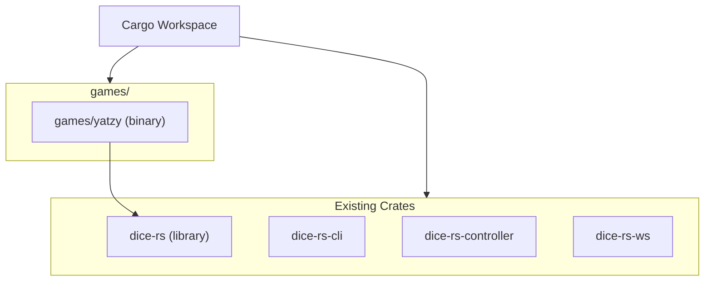
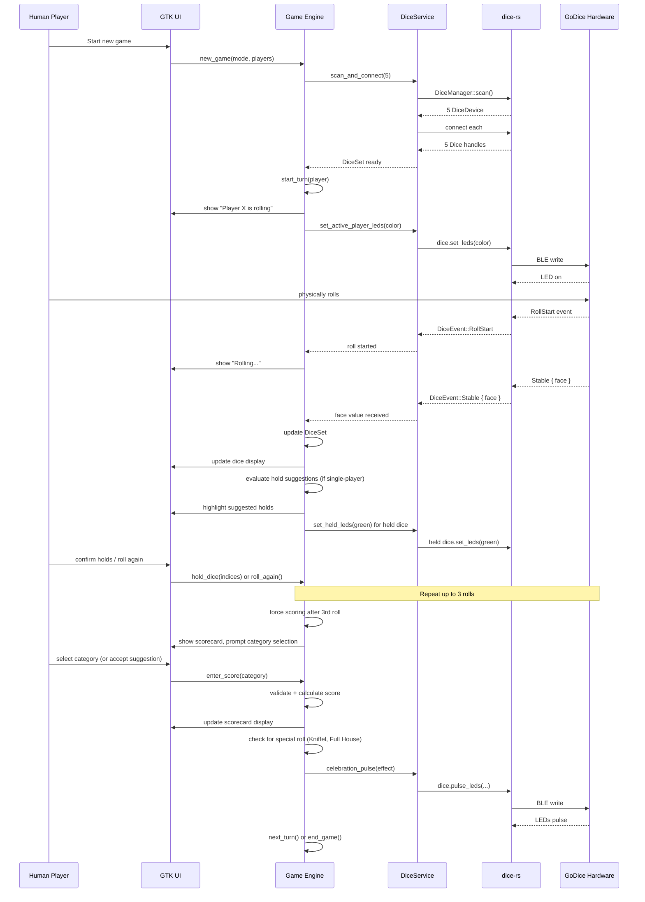
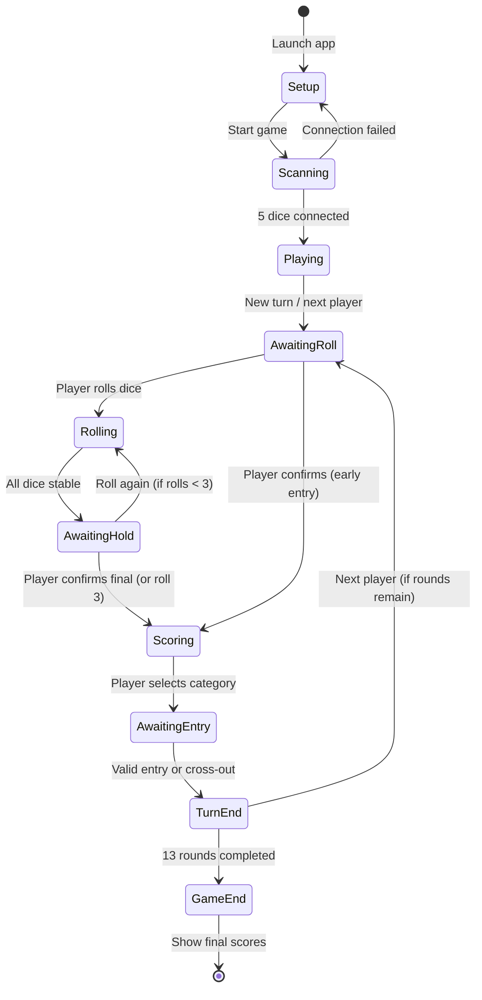
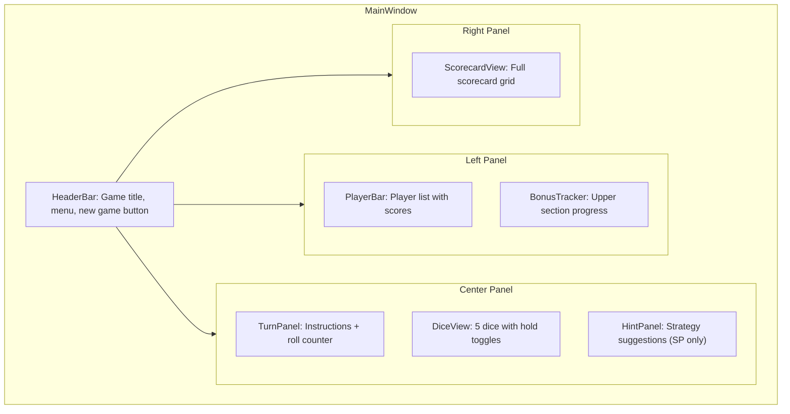

# Yatzy (Kniffel) Concept Paper

## Goal and Motivation

`games/yatzy` is a GTK 4 desktop implementation of the classic dice game
Kniffel (Yatzy), built on top of `dice-rs`. It serves as a **showcase
project** for the `dice-rs` library, demonstrating a complete, polished
end-user application that leverages physical GoDice for a hybrid gaming
experience.

### Motivation

- **Hybrid Gaming**: Players use real physical GoDice on the table while the
  digital engine handles scoring, validation, and game flow. Manual entry
  errors are eliminated entirely — the dice report their face values
  automatically via BLE.
- **Showcase for dice-rs**: The game exercises every major `dice-rs`
  capability: scanning, connecting, multi-dice management, roll/stable event
  handling, LED control, and battery monitoring.
- **Physical Feedback**: RGB LEDs on the GoDice provide tactile, visual
  feedback — held dice glow green, special rolls trigger celebration pulses,
  and the active player's dice light up.
- **Accessibility**: The computer opponent provides clear instructions to the
  human player, and the single-player mode includes real-time probability
  calculations and strategy hints.

### Scope

The game covers:

- Single-player mode vs. computer opponent
- Multi-player mode with multiple human players (pass-and-play)
- Full Kniffel scorecard with all 13 categories + upper section bonus
- Automatic roll detection and face value capture via `dice-rs`
- LED-based physical feedback (hold visualization, event effects, player
  indication)
- Rule validation and forced entry selection after the third roll
- Streich-Assistent (cross-out assistant) for minimizing score loss
- Real-time probability calculation and strategy hints (single-player mode)
- Bonus tracker for the upper section

Out of scope for the initial phases:

- Online/networked multiplayer
- AI opponent that rolls its own dice (the human rolls for the computer)
- Custom rule variants beyond standard Kniffel

### Target Users

- Casual board game players who own GoDice hardware
- Demonstrators of the `dice-rs` library capabilities
- Educators teaching probability and strategy through gameplay

---

## Game Rules Summary

Kniffel is played with 5 dice over 13 rounds. Each round, a player may roll
up to 3 times, choosing which dice to hold between rolls. After the third
roll (or earlier if desired), the player must enter the result into one
category on their scorecard.

### Scorecard Categories

#### Upper Section (Obere Hälfte)

| Category | Rule | Scoring |
|----------|------|---------|
| Einser | Only 1s count | Sum of all 1s |
| Zweier | Only 2s count | Sum of all 2s |
| Dreier | Only 3s count | Sum of all 3s |
| Vierer | Only 4s count | Sum of all 4s |
| Fünfer | Only 5s count | Sum of all 5s |
| Sechser | Only 6s count | Sum of all 6s |

**Upper Section Bonus**: If the upper section total reaches 63 or more, a
bonus of 35 points is awarded.

#### Lower Section (Untere Hälfte)

| Category | Rule | Scoring |
|----------|------|---------|
| Dreierpasch | At least 3 of a kind | Sum of all dice |
| Viererpasch | At least 4 of a kind | Sum of all dice |
| Full House | 3 of a kind + a pair | 25 points |
| Kleine Straße | 4 consecutive values | 30 points |
| Große Straße | 5 consecutive values | 40 points |
| Kniffel (Yatzy) | 5 of a kind | 50 points |
| Chance | Any combination | Sum of all dice |

**Kniffel Bonus**: If a player rolls a second Kniffel and the Kniffel box is
already filled with 50, a bonus of 100 points is added (standard variant).

If a category cannot be filled with a valid result, the player may cross it
out (score 0).

---

## Modes

### Single-Player Mode (vs. Computer)

The human player plays against a computer opponent. Since the computer
cannot physically roll dice, **the human player rolls on behalf of the
computer**. The game provides clear, step-by-step instructions:

1. "Computer ist an der Reihe. Bitte würfeln Sie für den Computer."
2. The active player's dice light up (computer's color, e.g. blue).
3. After each roll, the computer announces its hold/roll decision:
   "Computer behält Würfel 2, 4, 5. Bitte würfeln Sie erneut."
4. After the final roll, the computer selects a category automatically.
5. "Computer trägt 30 Punkte in 'Kleine Straße' ein."

The computer opponent uses an **optimal strategy** based on expected value
maximization (see [Computer Opponent Strategy](#computer-opponent-strategy)).

The human player receives **assistance features** (see
[Single-Player Assistance](#single-player-assistance)) that are not
available in multi-player mode.

### Multi-Player Mode (Pass and Play)

Multiple human players take turns. The active player's dice light up with
their assigned color. The game enforces:

- Clear turn indication via LED colors and on-screen prompts
- Pass-the-device confirmation between turns
- No strategy hints or probability calculations (fair play between humans)

---

## Architecture

### Workspace Integration

The game is a new crate in the existing workspace, placed under `games/yatzy`:



The `Cargo.toml` workspace `members` list is extended with `"games/yatzy"`.

### Crate Layout

```
games/yatzy/
├── Cargo.toml
├── src/
│   ├── main.rs              # Entry point, tokio + GTK bootstrap
│   ├── application.rs       # GTK Application setup, CSS provider
│   ├── window.rs            # MainWindow: top-level layout
│   ├── config/
│   │   ├── mod.rs
│   │   └── game_settings.rs # Game configuration (player count, mode)
│   ├── models/
│   │   ├── mod.rs
│   │   ├── category.rs      # ScoreCategory enum (13 categories)
│   │   ├── scorecard.rs     # Scorecard struct (per player)
│   │   ├── player.rs        # Player struct (name, color, score, type)
│   │   ├── player_type.rs   # PlayerType enum (Human, Computer)
│   │   ├── game_state.rs    # GameState: overall game state machine
│   │   ├── turn_phase.rs    # TurnPhase enum (Rolling, Holding, Scoring)
│   │   └── dice_set.rs      # DiceSet: 5 dice with hold/face state
│   ├── rules/
│   │   ├── mod.rs
│   │   ├── scoring.rs       # Category scoring logic
│   │   ├── validation.rs    # Roll result validation per category
│   │   └── cross_out.rs     # Streich-Assistent: optimal cross-out
│   ├── strategy/
│   │   ├── mod.rs
│   │   ├── expected_value.rs # Expected value calculation for holds
│   │   ├── computer_ai.rs    # Computer opponent decision engine
│   │   └── probability.rs    # Roll probability calculations
│   ├── services/
│   │   ├── mod.rs
│   │   ├── dice_service.rs   # Bridge to dice-rs DiceManager
│   │   └── led_service.rs    # LED effect orchestration
│   ├── widgets/
│   │   ├── mod.rs
│   │   ├── scorecard_view.rs  # Scorecard grid widget
│   │   ├── dice_view.rs       # Visual representation of 5 dice
│   │   ├── player_bar.rs      # Player list with scores
│   │   ├── turn_panel.rs      # Current turn info + instructions
│   │   ├── hint_panel.rs      # Strategy hints (single-player)
│   │   └── bonus_tracker.rs   # Upper section bonus progress
│   └── resources/
│       └── style.css          # GTK CSS for game styling
```

### Module Responsibilities

| Module | Responsibility |
|--------|---------------|
| `main` | Entry point, tokio runtime, GTK application launch |
| `application` | `gtk4::Application` setup, CSS provider, lifecycle |
| `window` | `MainWindow`: layout, signal wiring, screen transitions |
| `config::game_settings` | Persisted settings: mode, player count, colors |
| `models::category` | `ScoreCategory` enum: 13 Kniffel categories |
| `models::scorecard` | `Scorecard`: per-player score state, entry/cross-out |
| `models::player` | `Player`: name, LED color, type, scorecard reference |
| `models::player_type` | `PlayerType` enum: `Human` vs `Computer` |
| `models::game_state` | `GameState`: turn order, current player, round number |
| `models::turn_phase` | `TurnPhase`: `AwaitingRoll`, `Rolling`, `Holding`, `Scoring` |
| `models::dice_set` | `DiceSet`: 5 dice with face values and hold flags |
| `rules::scoring` | Calculate score for a given category and dice values |
| `rules::validation` | Check if a roll result is valid for a category |
| `rules::cross_out` | Streich-Assistent: find least-damaging category to zero |
| `strategy::expected_value` | EV calculation for hold decisions |
| `strategy::computer_ai` | Computer opponent: hold/roll and category selection |
| `strategy::probability` | Probability of achieving specific dice combinations |
| `services::dice_service` | Wraps `DiceManager`, maps dice to game slots |
| `services::led_service` | LED effects: hold, active player, celebration |
| `widgets::scorecard_view` | GTK grid showing all categories and scores |
| `widgets::dice_view` | Visual dice display with hold toggles |
| `widgets::player_bar` | Player list with names, colors, total scores |
| `widgets::turn_panel` | Instructions, roll counter, current player indicator |
| `widgets::hint_panel` | Strategy suggestions (single-player only) |
| `widgets::bonus_tracker` | Upper section progress bar toward 63-point bonus |

### Data Flow



### Game State Machine



---

## dice-rs Integration

### Dice Mapping

The game requires exactly 5 dice (standard Kniffel). The `DiceService`
manages the mapping between physical GoDice and game slots:

```rust
/// Maps 5 physical GoDice to game slots 0-4.
pub struct DiceService {
    manager: Arc<DiceManager>,
    dice: [Option<Dice>; 5],
    event_receivers: [Option<broadcast::Receiver<DiceEvent>>; 5],
}
```

Each dice is assigned a slot index (0-4). The mapping is established during
the scanning phase and persists for the game duration. If a dice disconnects
mid-game, the game pauses and prompts reconnection.

### Event Handling

The `DiceService` spawns a background task per dice that listens for
`DiceEvent` notifications and forwards them to the game engine via a
`tokio::sync::mpsc` channel:

```rust
/// Events forwarded from the dice service to the game engine.
pub enum GameDiceEvent {
    /// A dice started rolling (slot index).
    RollStart { slot: usize },
    /// A dice is stable with a face value (slot index, face).
    Stable { slot: usize, face: FaceValue },
    /// A dice disconnected (slot index).
    Disconnected { slot: usize },
}
```

The game engine processes these events on the GTK main loop via
`glib::idle_add_local`, ensuring UI updates happen on the correct thread.

### Roll Detection

The game distinguishes between roll phases using `DiceEvent` variants:

| Event | Game Interpretation |
|-------|-------------------|
| `RollStart` | Player has begun rolling; freeze hold toggles |
| `Stable` | Dice is flat and stable; record face value |
| `TiltStable` | Dice is stable but tilted; still valid, record face |
| `FakeStable` | Dice settled without a proper roll; ignore or re-prompt |
| `MoveStable` | Dice rotated in place; update face if changed |

A roll is considered **complete** when all 5 dice have reported a `Stable`
or `TiltStable` event since the last `RollStart`. A timeout (e.g. 10 seconds)
handles cases where a dice fails to settle.

### LED Control

The `LedService` orchestrates LED effects through `dice-rs`'s `set_leds`
and `pulse_leds` APIs:

| Effect | Trigger | LED Behavior |
|--------|---------|-------------|
| Active player | Turn starts | All 5 dice glow in player's color |
| Hold visualization | Player holds a die | Held dice glow green |
| Roll in progress | `RollStart` event | All dice LEDs off |
| Kniffel celebration | 5 of a kind detected | All dice pulse rainbow/gold |
| Full House celebration | Full House detected | All dice pulse in player's color |
| Große Straße | 5 consecutive | Sequential pulse across dice |
| Turn end | Score entered | Brief flash, then LEDs off |
| Game end | Final scores shown | Celebratory pulse pattern |

```rust
/// LED effect orchestrator for the Yatzy game.
pub struct LedService {
    dice: [Dice; 5],
}

impl LedService {
    /// Set all dice to a solid color (active player indication).
    pub async fn set_all(&self, color: LedColor) -> Result<()> { ... }

    /// Set held dice to green, others to off.
    pub async fn show_holds(&self, held: &[bool; 5]) -> Result<()> { ... }

    /// Pulse all dice for a celebration effect.
    pub async fn celebrate(&self, color: LedColor, pulses: u8) -> Result<()> { ... }

    /// Turn off all dice LEDs.
    pub async fn clear_all(&self) -> Result<()> { ... }
}
```

---

## Rule Validation & Game Management

### Forced Entry Selection

After the third roll, the game **blocks further roll attempts** until a
valid scorecard entry is made. The UI disables the "Roll" button and
highlights the scorecard, prompting the player to select a category.

If no category can score positive points, the player must cross out a
category (score 0). The Streich-Assistent recommends the optimal choice.

### Streich-Assistent (Cross-Out Assistant)

When no positive score is possible, the system calculates which category to
cross out with the **least negative impact** on the final game result:

1. For each empty category, compute the **expected future value** of that
   category given the remaining rounds and current game state.
2. The category with the lowest expected future value is recommended for
   cross-out.
3. The recommendation considers:
   - How likely the category is to be filled in a future round
   - The opportunity cost of losing the category
   - Upper section bonus implications (crossing out a high-value upper
     category may jeopardize the 35-point bonus)

```rust
/// Recommends the optimal category to cross out (score 0).
///
/// Called when no category can achieve a positive score with the
/// current dice values. Returns the category whose loss minimizes
/// the expected negative impact on the final game result.
pub fn recommend_cross_out(
    scorecard: &Scorecard,
    dice: &DiceSet,
    rounds_remaining: usize,
) -> ScoreCategory { ... }
```

### Score Validation

Each category entry is validated before commitment:

```rust
/// Validates whether a dice combination satisfies a category's requirements.
pub fn is_valid(category: ScoreCategory, dice: &DiceSet) -> bool { ... }

/// Calculates the score for a given category and dice combination.
/// Returns 0 if the combination does not satisfy the category.
pub fn calculate_score(category: ScoreCategory, dice: &DiceSet) -> u32 { ... }
```

---

## Single-Player Assistance

In single-player mode, the human player receives real-time strategic
assistance. These features are **disabled in multi-player mode** to ensure
fair play.

### Optimal Hold Suggestion

After the 1st and 2nd roll, the system calculates the **expected value
(EV)** of every possible hold combination across all remaining free
categories:

1. Enumerate all 2^5 = 32 possible hold/roll combinations.
2. For each combination, simulate all possible outcomes of re-rolling the
   non-held dice (6^k outcomes for k dice re-rolled).
3. For each outcome, compute the best achievable score across all free
   categories.
4. Average the best scores weighted by probability → expected value.
5. Recommend the hold combination with the highest EV.

The UI highlights the suggested dice to hold with a subtle glow, and the
physical dice LEDs flash green briefly on the recommended holds.

### Strategic Category Suggestions

After the 3rd roll, the system highlights the **most lucrative free
categories** on the scorecard:

- Categories are ranked by achievable score (descending).
- The top 3 categories are visually highlighted.
- A warning is shown if the player is about to cross out a high-value
  category (e.g. Kniffel, Große Straße).

### Bonus Tracker

A persistent widget shows the upper section bonus progress:

- **Soll (Target)**: 63 points
- **Ist (Current)**: Sum of filled upper section categories
- **Differenz**: Remaining points needed for the 35-point bonus
- Visual progress bar with color coding (red < 50%, yellow 50-80%, green
  ≥ 80%)

The tracker updates in real time as scores are entered.

---

## Computer Opponent Strategy

The computer opponent uses a **greedy expected-value strategy**:

### Hold/Roll Decisions

After each roll, the computer evaluates all 32 hold combinations (same
algorithm as the single-player hold suggestion) and selects the one with
the highest expected value. If the EV of holding all dice (no re-roll)
exceeds the EV of any re-roll combination, the computer stops rolling.

### Category Selection

After the final roll, the computer selects the category that maximizes:

```
score(category, dice) + future_value(category, scorecard, rounds_remaining)
```

Where `future_value` estimates the long-term impact of filling (or crossing
out) a given category, considering:

- Remaining empty categories
- Upper section bonus proximity
- Probability of achieving better results in future rounds

### Difficulty

The initial implementation uses a single difficulty level (optimal play).
Future phases may add adjustable difficulty by introducing suboptimal
decisions with configurable probability.

---

## UI Design

### Main Window Layout



### Scorecard View

The scorecard is a GTK `GridView` or custom `Grid` showing:

- Category names (rows)
- One column per player
- Current roll's potential score (gray, italic) for each empty category
- Entered scores (bold) for filled categories
- Crossed-out categories (strikethrough, gray)
- Highlighted suggested categories (single-player mode)

### Dice View

Each of the 5 dice is shown as a visual die face (pip pattern). Held dice
are visually distinguished (green border/glow). Clicking a die toggles its
hold state. The physical LED state mirrors the visual state.

### Turn Panel

Shows:
- Current player name and color indicator
- Roll count (1/3, 2/3, 3/3)
- Instructions from the computer (single-player mode) or turn prompts
- "Roll" button (disabled when not in `AwaitingRoll` phase)
- "Confirm" button to finalize holds or enter score

---

## Implementation Details

### Cargo.toml

```toml
[package]
name = "yatzy"
version = "0.1.0"
edition.workspace = true
rust-version = "1.88"
license.workspace = true
authors.workspace = true
repository.workspace = true
homepage.workspace = true
description = "Kniffel (Yatzy) game for GoDice, built with GTK 4 and dice-rs"
publish = false

[[bin]]
name = "yatzy"
path = "src/main.rs"

[dependencies]
dice-rs = { path = "../../dice-rs" }
gtk4 = { workspace = true }
glib = { workspace = true }
tokio = { workspace = true }
thiserror = { workspace = true }
miette = { workspace = true }
tracing = { workspace = true }
tracing-subscriber = { workspace = true }
serde = { workspace = true }
serde_json = { workspace = true }
```

### Threading Model

The game uses the same threading pattern as `dice-rs-controller`:

- **Main thread**: GTK event loop (`gtk4::Application::run()`)
- **Tokio runtime**: BLE I/O via `dice-rs` (background tasks)
- **Bridge**: `glib::idle_add_local` / `glib::timeout_add_local` to forward
  async events to the GTK main loop

```rust
use gtk4::prelude::*;
use std::sync::Arc;
use dice_rs::DiceManager;

fn main() -> miette::Result<()> {
    tracing_subscriber::fmt().init();

    let rt = tokio::runtime::Builder::new_multi_thread()
        .enable_all()
        .build()?;

    let manager = rt.block_on(async { DiceManager::new().await })?;
    let manager = Arc::new(manager);

    let app = gtk4::Application::builder()
        .application_id("io.github.smearor.dice-rs.yatzy")
        .build();

    let manager_clone = manager.clone();
    app.connect_activate(move |gtk_app| {
        let window = MainWindow::new(gtk_app, manager_clone.clone());
        window.present();
    });

    app.run();
    std::process::exit(0);
}
```

### Key Types

#### ScoreCategory

```rust
/// The 13 Kniffel scorecard categories.
#[derive(Debug, Clone, Copy, PartialEq, Eq, Hash)]
pub enum ScoreCategory {
    // Upper section
    Ones,
    Twos,
    Threes,
    Fours,
    Fives,
    Sixes,
    // Lower section
    ThreeOfAKind,
    FourOfAKind,
    FullHouse,
    SmallStraight,
    LargeStraight,
    Yatzy,
    Chance,
}

impl ScoreCategory {
    /// Returns all categories in scorecard order.
    pub fn all() -> [ScoreCategory; 13] { ... }

    /// Returns true if this category is in the upper section.
    pub fn is_upper(&self) -> bool { ... }
}
```

#### Scorecard

```rust
/// A player's scorecard tracking all 13 categories.
#[derive(Debug, Clone)]
pub struct Scorecard {
    entries: [Option<u32>; 13],
    yatzy_bonus: u32,
}

impl Scorecard {
    /// Enter a score into a category.
    pub fn enter(&mut self, category: ScoreCategory, score: u32) -> Result<()> { ... }

    /// Cross out a category (score 0).
    pub fn cross_out(&mut self, category: ScoreCategory) -> Result<()> { ... }

    /// Get the score for a category, or None if empty.
    pub fn get(&self, category: ScoreCategory) -> Option<u32> { ... }

    /// Upper section subtotal (without bonus).
    pub fn upper_subtotal(&self) -> u32 { ... }

    /// Upper section bonus (35 if subtotal >= 63).
    pub fn upper_bonus(&self) -> u32 { ... }

    /// Lower section subtotal.
    pub fn lower_subtotal(&self) -> u32 { ... }

    /// Grand total including bonus and Yatzy bonus.
    pub fn grand_total(&self) -> u32 { ... }

    /// Check if all categories are filled (game over for this player).
    pub fn is_complete(&self) -> bool { ... }
}
```

#### DiceSet

```rust
/// The 5 dice in the game with their current state.
#[derive(Debug, Clone)]
pub struct DiceSet {
    faces: [FaceValue; 5],
    held: [bool; 5],
}

impl DiceSet {
    /// Get the face values as a sorted array for scoring calculations.
    pub fn values(&self) -> [u8; 5] { ... }

    /// Toggle the hold state of a die.
    pub fn toggle_hold(&mut self, slot: usize) { ... }

    /// Set which dice are held.
    pub fn set_holds(&mut self, held: [bool; 5]) { ... }

    /// Count occurrences of each face value (1-6).
    pub fn counts(&self) -> [u8; 7] { ... }
}
```

#### GameState

```rust
/// Overall game state managing players, turns, and rounds.
pub struct GameState {
    players: Vec<Player>,
    current_player: usize,
    round: usize,
    phase: TurnPhase,
    rolls_used: usize,
    dice_set: DiceSet,
}

impl GameState {
    /// Start a new game with the given players.
    pub fn new(players: Vec<Player>) -> Self { ... }

    /// Advance to the next player's turn.
    pub fn next_turn(&mut self) { ... }

    /// Check if the game is over (13 rounds completed).
    pub fn is_game_over(&self) -> bool { ... }

    /// Get the winner(s) with the highest score.
    pub fn winners(&self) -> Vec<&Player> { ... }
}
```

### Scoring Implementation

```rust
/// Calculates the score for a category given the current dice values.
pub fn calculate_score(category: ScoreCategory, dice: &DiceSet) -> u32 {
    let values = dice.values();
    let counts = dice.counts();
    let sum: u32 = values.iter().map(|&v| v as u32).sum();

    match category {
        ScoreCategory::Ones => counts[1] as u32,
        ScoreCategory::Twos => counts[2] as u32 * 2,
        ScoreCategory::Threes => counts[3] as u32 * 3,
        ScoreCategory::Fours => counts[4] as u32 * 4,
        ScoreCategory::Fives => counts[5] as u32 * 5,
        ScoreCategory::Sixes => counts[6] as u32 * 6,
        ScoreCategory::ThreeOfAKind => {
            if counts.iter().any(|&c| c >= 3) { sum } else { 0 }
        }
        ScoreCategory::FourOfAKind => {
            if counts.iter().any(|&c| c >= 4) { sum } else { 0 }
        }
        ScoreCategory::FullHouse => {
            let has_three = counts.iter().any(|&c| c == 3);
            let has_two = counts.iter().any(|&c| c == 2);
            if has_three && has_two { 25 } else { 0 }
        }
        ScoreCategory::SmallStraight => {
            if has_straight(&values, 4) { 30 } else { 0 }
        }
        ScoreCategory::LargeStraight => {
            if has_straight(&values, 5) { 40 } else { 0 }
        }
        ScoreCategory::Yatzy => {
            if counts.iter().any(|&c| c == 5) { 50 } else { 0 }
        }
        ScoreCategory::Chance => sum,
    }
}
```

### Expected Value Calculation

The hold suggestion algorithm evaluates all 32 hold combinations:

```rust
/// Calculates the expected value of re-rolling non-held dice.
///
/// For each possible outcome of the re-rolled dice, computes the best
/// achievable score across all free categories, then averages weighted
/// by probability.
pub fn expected_value(
    held: &[bool; 5],
    current_faces: &[FaceValue; 5],
    free_categories: &[ScoreCategory],
) -> f64 {
    let reroll_indices: Vec<usize> = (0..5).filter(|&i| !held[i]).collect();
    let reroll_count = reroll_indices.len();

    if reroll_count == 0 {
        // No re-roll: return best current score
        return best_score(current_faces, free_categories) as f64;
    }

    // Enumerate all 6^reroll_count outcomes
    let total_outcomes = 6u32.pow(reroll_count as u32);
    let mut total_score: f64 = 0.0;

    for outcome in 0..total_outcomes {
        let mut faces = *current_faces;
        let mut temp = outcome;
        for &idx in &reroll_indices {
            let face = (temp % 6 + 1) as u8;
            faces[idx] = FaceValue::new(face);
            temp /= 6;
        }
        total_score += best_score(&faces, free_categories) as f64;
    }

    total_score / total_outcomes as f64
}

/// Finds the best hold combination by expected value.
pub fn best_hold(
    current_faces: &[FaceValue; 5],
    free_categories: &[ScoreCategory],
) -> [bool; 5] {
    let mut best_ev = f64::MIN;
    let mut best_hold = [false; 5];

    for mask in 0u8..32 {
        let held = [
            mask & 1 != 0, mask & 2 != 0, mask & 4 != 0,
            mask & 8 != 0, mask & 16 != 0,
        ];
        let ev = expected_value(&held, current_faces, free_categories);
        if ev > best_ev {
            best_ev = ev;
            best_hold = held;
        }
    }

    best_hold
}
```

---

## Phases

### Phase 1: Core Game Engine

- `models`: `ScoreCategory`, `Scorecard`, `Player`, `PlayerType`,
  `GameState`, `TurnPhase`, `DiceSet`
- `rules::scoring`: Full scoring logic for all 13 categories
- `rules::validation`: Category validity checks
- Unit tests for scoring and validation

### Phase 2: dice-rs Integration

- `services::dice_service`: Scan, connect, map 5 dice to slots
- `services::led_service`: LED effects (active player, holds, celebration)
- Event forwarding from BLE to game engine
- Roll detection and completion logic

### Phase 3: GTK UI

- `application`, `window`: Main window layout
- `widgets::scorecard_view`: Scorecard grid
- `widgets::dice_view`: Visual dice with hold toggles
- `widgets::player_bar`: Player list with scores
- `widgets::turn_panel`: Turn instructions and roll button
- CSS styling

### Phase 4: Game Flow & Rule Enforcement

- Full game state machine
- Forced entry selection after 3rd roll
- `rules::cross_out`: Streich-Assistent
- Turn management and round tracking
- Game end detection and winner display

### Phase 5: Single-Player Mode

- `strategy::probability`: Roll probability calculations
- `strategy::expected_value`: Hold EV calculation
- `strategy::computer_ai`: Computer opponent decision engine
- `widgets::hint_panel`: Strategy suggestions UI
- `widgets::bonus_tracker`: Upper section bonus progress
- Computer player instructions display

### Phase 6: Multi-Player Mode

- Player setup screen (name, color, count)
- Pass-and-play turn transitions
- LED color assignment per player
- Fair play (no hints in multi-player)

### Phase 7: Polish

- LED celebration effects for special rolls
- Game end screen with final scores and winner
- Settings persistence (player names, colors, mode)
- Error handling for dice disconnection mid-game
- Reconnection flow

---

## Limitations

- **5 dice required**: The game requires 5 active GoDice. A 6th dice
  (if available) serves as a spare for reconnection. Fewer than 5 dice
  cannot be substituted with virtual dice in the initial implementation.
- **Linux only**: Inherits the platform limitation from `dice-rs`
  (btleplug/BlueZ).
- **No networked multiplayer**: All players share the same physical
  device and dice.
- **Computer cannot roll**: The human player must physically roll for the
  computer opponent.
- **No custom rules**: Only standard Kniffel rules are supported initially.

---

## Resolved Questions

- **Dice color assignment**: Players may own arbitrary dice colors. The
  game supports both 5-dice and 6-dice sets (the 6th dice serves as a
  spare/replacement). Player colors are chosen in the UI independently of
  the physical GoDice colors — the mapping between physical dice and game
  slots is established during scanning, and LED colors are set
  programmatically to match the player's chosen color.
- **Yatzy bonus variant**: No joker rule. Standard Kniffel only.
- **Reconnection timeout**: 60 seconds. If a dice disconnects, the game
  pauses and waits up to 60 seconds for reconnection. If the player owns a
  6th dice (spare), it can be used as a replacement instead of waiting.
- **Performance of EV calculation**: No benchmark needed. The calculation
  is fast enough for real-time use.
